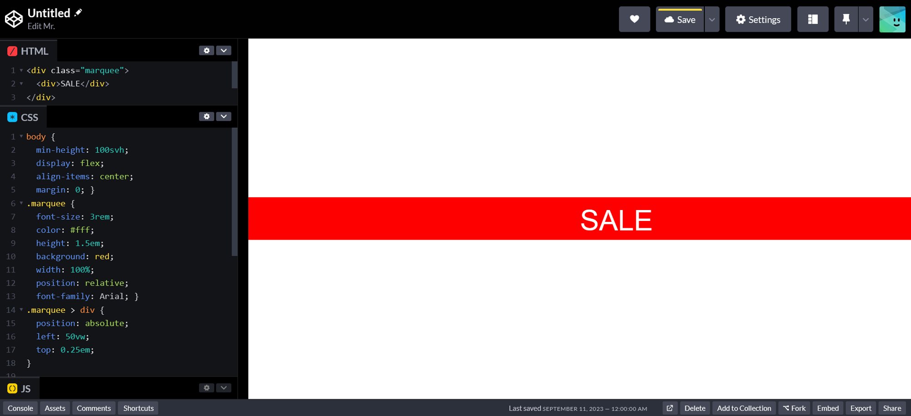
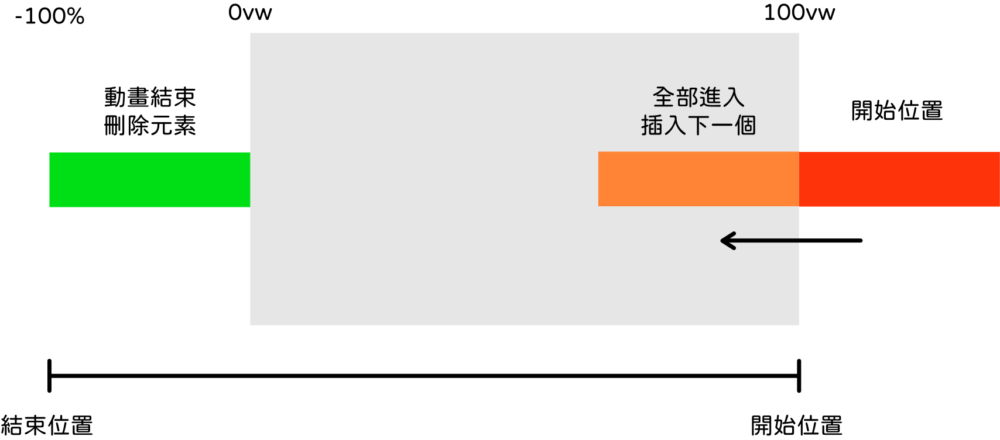
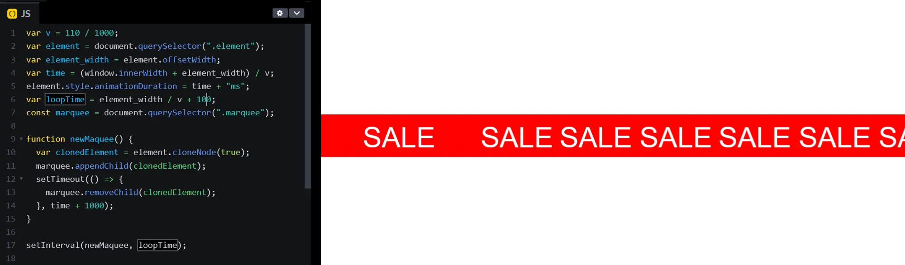
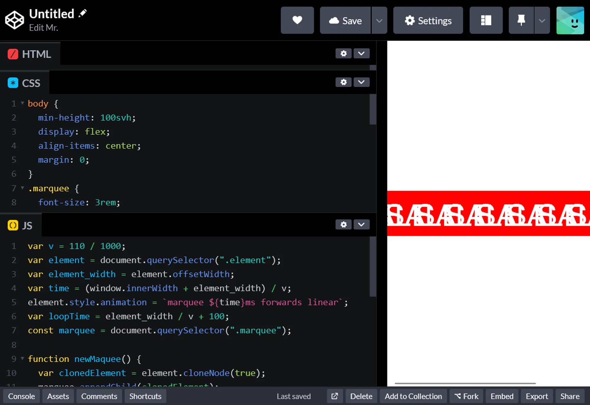
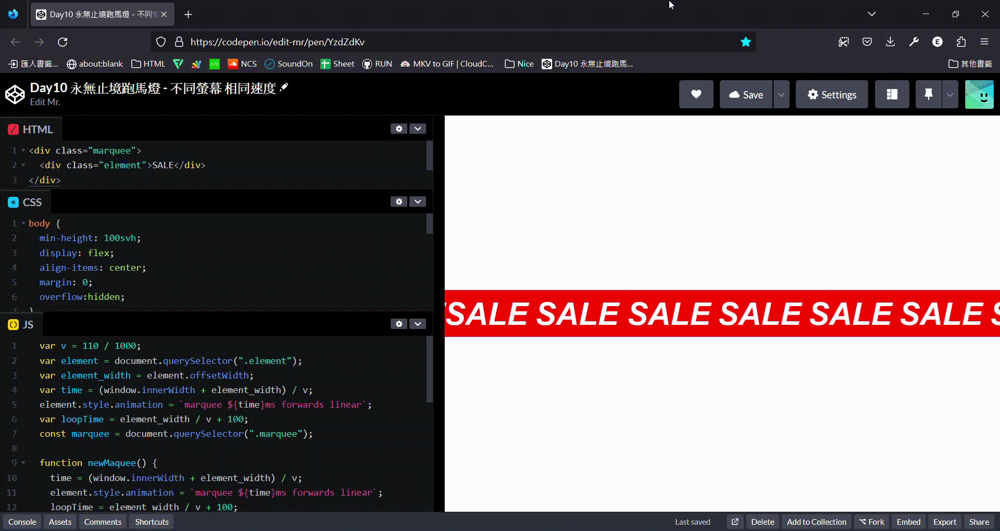

+++
author = "毛哥EM"
title = "Day10 永無止境跑馬燈 - 不同螢幕 相同速度"
date = "2023-09-24"
series = ["不用庫 也能酷 - 玩轉 CSS & Js 特效"]
tags = ["HTML", "CSS", "JS"]
categories = [""]
thumbnail = "https://emtech.cc/images/ironman2023.webp"
featureImage = "https://emtech.cc/images/ironman2023-banner.webp"
shareImage = "https://emtech.cc/images/ironman2023-banner.webp"
+++

> 這是我高一在學校吃肉蛋吐司時想到的做法，因此此篇文章假設你已熟悉國小數學。

<!--more-->

傳統跑馬燈雖然在現代乍看之下是一個又醜又過時的設計，但是如果應用的好的話其實是非常有質感且蠻有趣的。裝飾效果多大於實際用途。


這是我幫朋友製作的個人網頁，裡面使用跑馬燈搭配旋轉效果。卡頓是因為 GIF 的緣故，如果想看原始網頁可以到[這裡](https://furryart-tw.github.io/artist/Maple/)。

如果要你做跑馬燈你會怎麼做呢？如果你是一個有年紀的工程師的話應該使用過 `<marquee>` 吧，然而這是一個還沒正式啟用就已經被淘汰的語法，且能設定的屬性有限。如果你是一個現代的工程師應該有想過使用 `@keyframes` 動畫吧。但是這樣會遇到幾個問題。首先是跑完不會連續，會有一段空白的時間。但是如果說多疊幾個你怎麼知道需要幾個？萬一內容很短又在電競超長曲面螢幕怎麼辦？還有一個最大的問題，我們知道速率的公式是距離除以時間對吧？

$$
V=\frac{s}{t}
$$

那麼我們設定同樣的動畫長度(t)，如果螢幕寬度(s)變大速率就變快了對吧！所以讓我們再加上一些簡單的 Js 來製作能夠適應各種螢幕的跑馬燈吧！

## 切版

首先我們來切一個簡單的版面出來



```html
<div class="marquee">
  <div class="element">SALE</div>
</div>
```

```css
body {
  min-height: 100svh;
  display: flex;
  align-items: center;
  margin: 0;
}
.marquee {
  font-size: 3rem;
  color: #fff;
  height: 1.5em;
  background: red;
  width: 100%;
  position: relative;
  font-family: Arial;
}
.element {
  position: absolute;
  left: 0;
  top: 0.25em;
}
```

## CSS 動畫

接著我們來製作一個基本的 CSS 動畫。他會從螢幕的最右邊移動到最左邊整個跑馬燈消失為止。

```css
.element {
  position: absolute;
  left: 0;
  top: 0.25em;
  animation: marquee 2s forwards linear;
}

@keyframes marquee{
  from {
    transform: translateX(100vw)
  }
  to {
    transform: translateX(-100%)
  }
}
```

## 自動生成新的

我們什麼時候會需要一個新的跑馬燈呢？是在一個跑馬燈整條都出現在畫面上，要開始有空白的時候。我們只需要算好時間什麼時候需要插入新的，跑馬燈要跑多久才會跑，跑完之後把它刪掉就可以了（讓 Dom 乾淨一點，不要塞滿一堆撞在一起的殘骸）。



### 速率

先來計算速率吧，距離是螢幕寬度 `window.innerWidth` 加上元素寬度 `offsetWidth`。你可以設一個變數當作速率並嘗試調整，接者用舉例除以它就可以得到動畫長度 `animation_duration` 了

```jsx
var v = 100 / 1000;
var element = document.querySelector(".element");
var element_width = element.offsetWidth;
var time = (window.innerWidth + element_width) / v;
element.style.animationDuration = time + "ms";
var loopTime = element_width / v;
```

速率我除以1000是因為後面時間都要緩算成毫秒。因為 `v` 都是在除數所以除以1000就會變成乘1000。應該都懂吧…算了我還是寫一下…

$$
a\div(b\div c)=a\div \frac{b}{c}=a\times \frac{c}{b}=a\div b \times c
$$

### 新增頻率

我們有了速率和元素的寬度就可以算出從動畫開始到整根出現(紅色到橘色位置)的時間了。

```jsx
var v = 30;
var time = window.innerWidth / v;
var element = document.querySelector(".element");
var element_width = element.offsetWidth; //元素寬度
var loopTime = element_width / v; //每 delay 秒放入一個新的
```

### 結束刪除

我們知道運行的時間，只需要在動畫結束時刪除就可以了，我給他多加一秒延遲緩衝，避免有延遲還沒跑完就被刪除了。記得單位是毫秒

```jsx
setTimeout(() => {
        marquee.removeChild(marqueeBox);
      }, time * 1000 + 1000);
```

### 生成函式

完整生成函式如下。會在固定時間複製一個跑馬燈，放入 marquee，時間到刪除

```jsx
function newMaquee() {
  var clonedElement = element.cloneNode(true);
  marquee.appendChild(clonedElement);
  setTimeout(() => {
    marquee.removeChild(clonedElement);
  }, time + 1000);
}

setInterval(newMaquee, loopTime);
```

## Debug 時間!

有一個小問題就是元素之前沒有距離。我們只需要在 `setInterval` 把 loopTime 設定久一點就可以了



再一個問題，就是在速率算出來之前第一個已經先跑了幾步了，所以我們可以在計算完之後再開始動畫


```css
element.style.animation = `marquee ${time}ms forwards linear`;
```

最後一個問題，如果有人沒事更改視窗大小理論上時間要重算，不然會變這樣…



所以把速率計算都丟入函式內，整理一下樣式，完整程式碼如下。

https://codepen.io/edit-mr/pen/YzdZdKv



```html
<div class="marquee">
  <div class="element">SALE</div>
</div>
```

```css
body {
  min-height: 100svh;
  display: flex;
  align-items: center;
  margin: 0;
  overflow:hidden;
}
.marquee {
  font-size: 3rem;
  color: #fff;
  height: 1.5em;
  background: red;
  width: 100%;
  position: relative;
  font-family: Arial;
  font-weight:800;
  font-style: italic;
}
.element {
  position: absolute;
  left: 0;
  top: 0.2em;
}

@keyframes marquee{
  from {
    transform: translateX(100vw);
  }
  to {
    transform: translateX(-100%);
  }
}
```

```js
var v = 110 / 1000;
var element = document.querySelector(".element");
var element_width = element.offsetWidth;
var time = (window.innerWidth + element_width) / v;
element.style.animation = `marquee ${time}ms forwards linear`;
var loopTime = element_width / v + 100;
const marquee = document.querySelector(".marquee");

function newMaquee() {
  time = (window.innerWidth + element_width) / v;
  element.style.animation = `marquee ${time}ms forwards linear`;
  loopTime = element_width / v + 100;
  var clonedElement = element.cloneNode(true);
  marquee.appendChild(clonedElement);
  setTimeout(() => {
    marquee.removeChild(clonedElement);
  }, time + 1000);
}
marquee.removeChild(element); //第一個先移除，避免卡住
newMaquee(); //手動新增第一個
setInterval(newMaquee, loopTime); //之後自動
```

以上就是我今天的分享，歡迎將你得成品放在評論和大家分享，也歡迎在 [Instagram](https://www.instagram.com/emtech.cc) 和 [Google 新聞](https://news.google.com/publications/CAAqBwgKMKXLvgswsubVAw?ceid=TW:zh-Hant&oc=3)追蹤[毛哥EM資訊密技](https://emtech.cc/)，或訂閱我新開的[YouTube頻道：網棧](https://www.youtube.com/@webpallet)。

我是毛哥EM，讓我們明天再見。