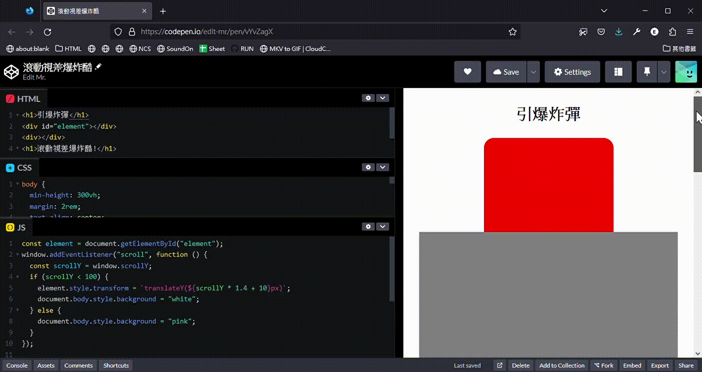
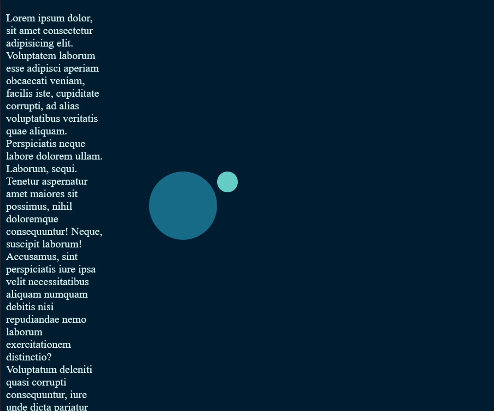

+++
author = "毛哥EM"
title = "Day12 Js 滾動視差 甚麼都能滾(ft. 國中數學)"
date = "2023-10-16"
series = ["不用庫 也能酷 - 玩轉 CSS & Js 特效"]
tags = ["HTML", "CSS", "JS"]
categories = [""]
thumbnail = "https://em-tec.github.io/images/ironman2023.webp"
featureImage = "https://em-tec.github.io/images/ironman2023-banner.webp"
shareImage = "https://em-tec.github.io/images/ironman2023-banner.webp"
+++

> 以下內容是我高一在上公民課時體悟的數學大道理，和網路上大多的做法都不太一樣。這篇文章假設你已學會國中直線方程式。如果不會的話…我也沒辦法。

你有逛過 Apple 產品介紹的網頁嗎？這應該是我最早接觸滾動視差的地方。也是到現在我都覺得做的數一數二好的網站。你會發現在滾動的時候並不是單純的往下滑而已，螢幕上的元素常常會以出乎你意料的方式移動、或者是變化。

<!--more-->

有的人會說滾動視差 **Parallax Scroll** 是在滾動的時候元素以不同的速度往上移動，但是我認為這個定義有點狹義。我認為只要滑鼠在滾的時候，只要元素不是隨著滾輪往上，有其他的移動路徑如平移、旋轉、甚至淡化都可以算是滾動視差。

> **Parallax** 大部分的時間是應用在天文，在不同的時間和地點能看到的星空都不太一樣。

## 原理

我們在製作滾動視差效果是會希望**一個元素的某一個屬性會隨著時間變化**。我們希望當我們輸入一個數字（也就是滾動的量）的時候得出一個計算結果。


這種東西取得兩個數值之間的關係叫做甚麼呢?沒錯我們要來建立一個函式。而最簡單且最常用的函式應該就是直線方程了。

$$
y=mx+b
$$

我們在製作滾動視差效果的時候元素會有一個起點與終點。我們只需要知道開始位置對應的屬性，以及結束的地方對應的屬性這兩個點就可以找出直線方程式了。

- 首先要算出斜率，斜率是 Y 變化量除以 X 變化量。
- 接著求出 Y 截距，就可以得出直線方程式。
- 因為通常到了終點之後，我們不會希望他還在繼續耗資源計算和定位到螢幕畫面千里之外。所以在起點前和終點後都不要再管它了。


希望這張圖能夠幫助你理解，如果不行的話國中數學課本翻一下。

## CSS

接下來是偏移的部分。偏移的方式我最常使用的屬性是 `transform:translate()` 。這樣可以佔據原本位置不影響排版。當然也可以使用 `top` 、 `left` 等屬性也是可以的，可以根據情況設定。

比如說我要一個元素往下移一點可以這樣打

```css
transform: translateX(10px);
transform: translate(10px, 0);
```

一個是單獨設定 X 偏移，另外是兩個一起設定。可以自己看情況應用。

### JS

JavaScript 只需要監聽滾動事件，並在距離範圍套入公式並修改 CSS 就可以了。

```jsx
const element = document.getElementById("element");
window.addEventListener("scroll", function () {
const scrollY = window.scrollY;
if(scrollY<100) element.style.transform = `translateY(${scrollY * 1.4 + 10}px)`;
        });
```

以下是一個簡單的範例。

https://codepen.io/edit-mr/pen/vYvZagX



```html
<h1>引爆炸彈</h1>
<div id="element"></div>
<div></div>
<h1>滾動視差爆炸酷!</h1>
```

```css
body {
  min-height: 300vh;
  margin: 2rem;
  text-align: center;
}

div {
  height: 300px;
  background: gray;
  position: relative;
}

#element {
  background: red;
  width: 50%;
  height: 200px;
  z-index: -1;
  left: 25%;
  border-radius: 20px 20px 0 0;
}
```

```jsx
const element = document.getElementById("element");
window.addEventListener("scroll", function () {
  const scrollY = window.scrollY;
  if (scrollY < 100) {
    element.style.transform = `translateY(${scrollY * 1.4 + 10}px)`;
    document.body.style.background = "white";
  } else {
    document.body.style.background = "pink";
  }
});
```

## 旋轉

有的時候使用 `position:fixed` 可以更好的去掌控元素位置。以下是一個圍繞旋轉的範例。

首先先簡單的切版。左邊的假文是為了讓你可以比較能感覺到往下滾動。



```html
<div></div>
<p>Lorem ipsum dolor, sit amet consectetur adipisicing elit. Voluptatem laborum esse adipisci aperiam obcaecati veniam, facilis iste, cupiditate corrupti, ad alias voluptatibus veritatis quae aliquam. Perspiciatis neque labore dolorem ullam.
  Laborum, sequi. Tenetur aspernatur amet maiores sit possimus, nihil doloremque consequuntur! Neque, suscipit laborum! Accusamus, sint perspiciatis iure ipsa velit necessitatibus aliquam numquam debitis nisi repudiandae nemo laborum exercitationem distinctio?
  Voluptatum deleniti quasi corrupti consequuntur, iure unde dicta pariatur blanditiis in officiis ab itaque iusto vero praesentium amet ipsa aperiam quo eligendi corporis nulla minus numquam veritatis rem! Nemo, fuga?
  Quos nulla quae numquam tempore perferendis tenetur, sequi magni iste odit, eius molestias sit enim, amet reiciendis laborum accusamus facere voluptatem! Delectus sit quia libero amet sint! Temporibus, fugiat distinctio!
  Ipsam, ullam placeat? Corporis exercitationem eius dolores, nulla enim temporibus amet repellendus accusantium suscipit esse non qui similique. Laboriosam sunt sapiente voluptate nihil voluptates rerum facilis itaque aspernatur, optio sint.</p>
```

```css
body {
  background: #001c30;
  color: #dafffb;
}
div,
div::after {
  background: #176b87;
  width: 100px;
  height: 100px;
  position: fixed;
  left: 30%;
  top: calc(50% - 50px);
  border-radius: 50%;
}

div::after {
  content: "";
  position: absolute;
  background: #64ccc5;
  width: 30px;
  height: 30px;
  left: 100%;
}
p {
  width: 20%;
}
```

我們想要滑鼠往下滾的同時往右移動，與旋轉。由於衛星是 div 內的偽元素所以外面轉裡面就會跟著轉。大概像這樣:

```css
transform: translateX(50vw) rotate(90deg);
```

最後寫上 JavaScript 來實現他。數值有點需要憑感覺，可以自己觀察移動距離和速度調整看看。

```jsx
const planet = document.querySelector("div");
window.addEventListener("scroll", function () {
  const scrollY = window.scrollY;
    planet.style.transform = `translateX(${scrollY * .3}vw) rotate(${scrollY * 3}deg)`;
});
```

這樣就完成了。來看看成果，十分有趣對吧!

https://codepen.io/edit-mr/pen/gOZRQex


能夠變的與玩的實在太多了，使用這個方法在每一個屬性都可以套用。歡迎在評論區留下你看到的好網站與你自己的創作。

以上就是我今天的分享，歡迎在 [Instagram](https://www.instagram.com/em.tec.blog) 和 [Google 新聞](https://news.google.com/publications/CAAqBwgKMKXLvgswsubVAw?ceid=TW:zh-Hant&oc=3)追蹤[毛哥EM資訊密技](https://em-tec.github.io/)，也歡迎訂閱我新開的[YouTube頻道：網棧](https://www.youtube.com/@webpallet)。

我是毛哥EM，讓我們明天再見。