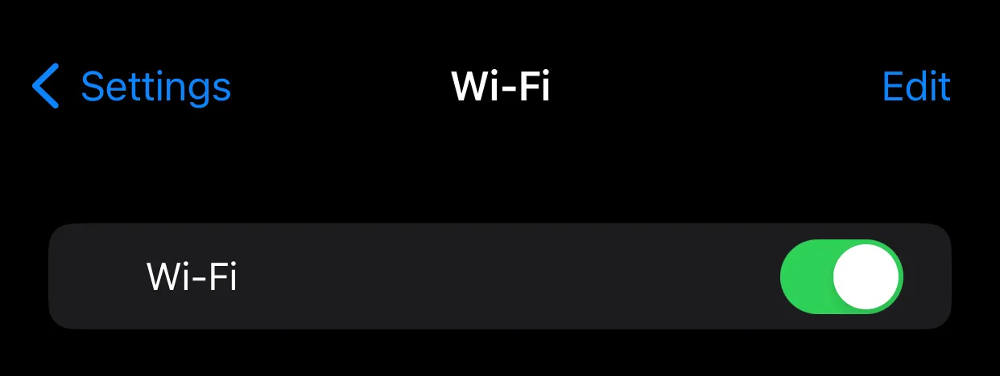
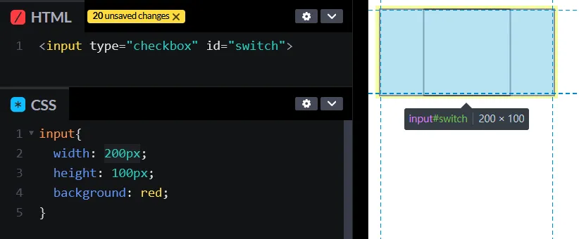
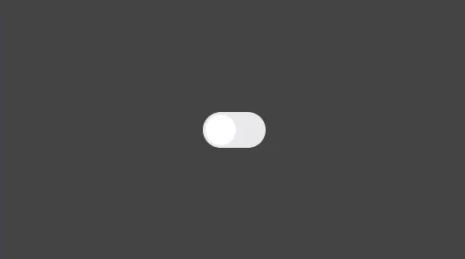

+++
author = "毛哥EM"
title = "Day15 今天我想來點… 純 CSS 的開關"
date = "2023-09-28"
series = ["不用庫 也能酷 - 玩轉 CSS & Js 特效"]
tags = ["HTML", "CSS", "JS"]
categories = [""]
thumbnail = "https://em-tec.github.io/images/ironman2023.webp"
featureImage = "https://em-tec.github.io/images/ironman2023-banner.webp"
shareImage = "https://em-tec.github.io/images/ironman2023-banner.webp"
+++
在手機開關的設定裡面通常不是 checkbox ，而是這種 toggle 開關。因為比較好看，且更有開關的感覺。



## 原理

開關本身還是 checkbox 勾選框，但是我們把原本勾勾的隱藏起來，然後用圓形開關代替。當被勾選時白色的圓形移動到右邊，而背景顏色漸變成綠色。

## 開始製作

寫 checkbox 的 CSS 時因為

* `input` 是插入一個元素，而不是一個範圍，所以不能使用 `::before` 和 `::after` 來做。
* checkbox 顯示一定是正方形，如果設置為其他長寬比塊白的地方還是可以點擊。
  
* checkbox 無法設定背景顏色

問題那麼多，因此我們只需要input幫我們掛名存狀態，然後把它藏在角落裡面就好了。

我們需要用其他元素來做開關的外觀。可以讓 checkbox 隱藏在 HTML 較前面的部分，然後用其他元素來控制 checkbox 的狀態。而能夠遠端遙控 checkbox 的元素叫做 `label` 。我們可以用 `label` 來控制 checkbox 的狀態。只需要點擊 `label` checkbox 也會感覺到。
HTML 如下，我想用這個開關來控制背景顏色。

```html
<input type="checkbox" id="switch">
<label class="toggle" for="switch"></label>
<div class="light"></div>
```

先簡單切版
```css
*,
label::after {
  margin: 0;
  padding: 0;
  transition: all 0.3s;
}
#switch {
  display: none;
}
label {
  width: 3.5rem;
  height: 2rem;
  background: #e9e9eb;
  border-radius: 1rem;
  position: relative;
}
body {
  display: flex;
  justify-content: center;
  align-items: center;
  min-height: 100svh;
}
.light {
  position: fixed;
  width: 100%;
  height: 100%;
  left: 0;
  top: 0;
  z-index: -1;
  background: #444444;
}
label::after {
  position: absolute;
  left: 0.15rem;
  top: 0.15rem;
  content: "";
  width: 1.7rem;
  height: 1.7rem;
  border-radius: 50%;
  background: #fff;
  pointer-events: none;
}
```



這樣你會得到一個非常簡單的版面。而按鈕是在整格綠色範圍都可以點選的。

接著我們讓按鈕被勾選時，背景顏色漸變成白色。我們為了讓元素可以抓到勾選框的狀況，`<input>`需要被放在所有元素的前面。因為我們有選擇器

```css
input:checked + label {
  background: #34c85a;
}
input:checked + label::after {
  left: 1.65rem;
}
input:checked ~ .light {
  background: #fff;
}
```


```css
以上就是我今天的分享，歡迎在 [Instagram](https://www.instagram.com/em.tec.blog) 和 [Google 新聞](https://news.google.com/publications/CAAqBwgKMKXLvgswsubVAw?ceid=TW:zh-Hant&oc=3)追蹤[毛哥EM資訊密技](https://em-tec.github.io/)，也歡迎訂閱我新開的[YouTube頻道：網棧](https://www.youtube.com/@webpallet)。

我是毛哥EM，讓我們明天再見。
