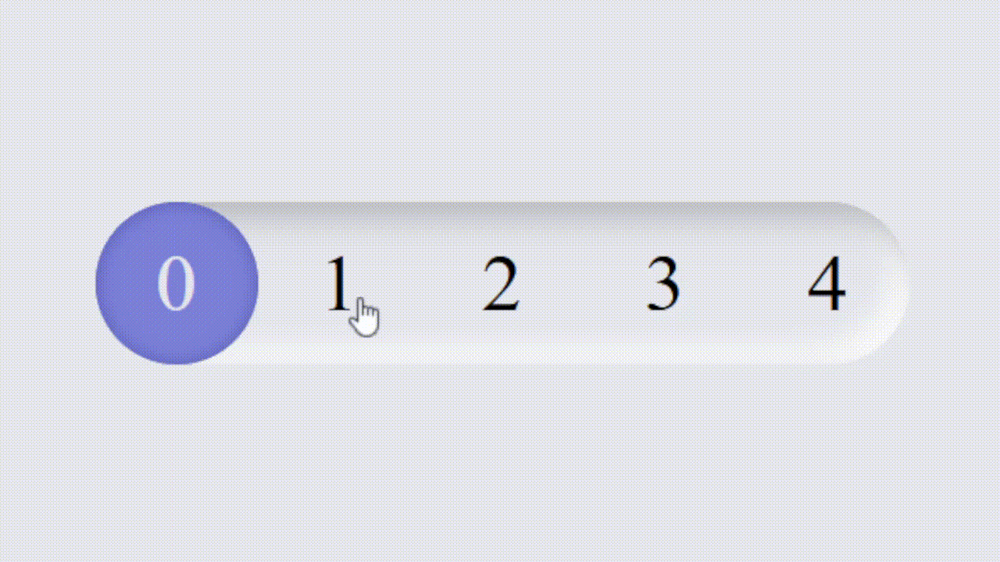

+++
author = "毛哥EM"
title = "Day15 今天我想來點...純CSS的並排選單"
date = "2023-09-29"
series = ["不用庫 也能酷 - 玩轉 CSS & Js 特效"]
tags = ["HTML", "CSS", "JS"]
categories = [""]
thumbnail = "https://em-tec.github.io/images/ironman2023.webp"
featureImage = "https://em-tec.github.io/images/ironman2023-banner.webp"
shareImage = "https://em-tec.github.io/images/ironman2023-banner.webp"
+++

昨天我們做了一個開關，那麼我們今天就來做一個選單吧！

<!--more-->




這個雖然是一種 `radio` 選單，但對於選擇數字這種有連續性，或著是比較短的文字，使用這種風格都是一種不錯的選擇，可以讓版面更乾淨。比下拉式選單或著是傳統的radio都更方便操作。重點是不用寫一行 JavaScript，只要純 CSS 就可以完成。

## 原理

和昨天的類似，不過今天不需要 `<label>`。點擊透明的 `<input>` 之後後面的一個圓形 `<div>` 就會跑過來。最上面用一層 `<div>` 疊上去數字即可，當然你要使用 `<label>` 也是可以的。

## 開始做吧!

照剛才原理寫出 HTML，然後加上 CSS 即可。

### HTML

```html
<div class="hope-container">
  <input type="radio" name="hope" value="0">
  <input type="radio" name="hope" value="1">
  <input type="radio" name="hope" value="2" checked="">
  <input type="radio" name="hope" value="3">
  <input type="radio" name="hope" value="4">
  <div class="hope-selected"></div>
  <div class="hope-label">
    <div>0</div>
    <div>1</div>
    <div>2</div>
    <div>3</div>
    <div>4</div>
  </div>
</div>
```

### 新擬物化設計 Neumorphism 的介面

CSS 的部分我想要製作使用新擬物化設計 Neumorphism，或是說 Soft UI 的風格。有點像 iPhone3 擬物化設計跟 iPhone5 之後現代扁平化設計結合。有很明顯得陰影但又很有質感。


來源: [Payment App (Neumorphism)](https://codepen.io/sdbrannum/pen/PowKRGj)

基本外框如下

```css
* {
  padding: 0;
  margin: 0;
  transition: all .2s;
}
body {
  display: flex;
  justify-content: center;
  align-items: center;
  min-height: 100svh;
  background: #e6e7ee;
}
.hope-container {
  height: 2rem;
  border-radius: 2rem;
  position: relative;
  display: flex;
  box-shadow: 3px 3px 6px #b8b9be inset, -3px -3px 6px #fff inset;
  background-color: #e6e7ee;
}
```
### 選擇框

裡面看不到的輸入框

```css
.hope-container input {
  width: 2rem;
  height: 2rem;
  display: block;
  opacity: 0;
  cursor: pointer;
}
```

### 顯示數字

上面疊數字。為了讓數字對齊每個都寬度設為2rem再致中。

```css
.hope-label {
  position: absolute;
  left: 0;
  pointer-events: none;
  display: flex;
  align-items: center;
  justify-content: space-between;
  width: 100%;
  height: 2rem;
}

.hope-label > div {
  width: 2rem;
  text-align: center;
}
```

### 小球

最後是選擇，並會左右移動圓形。設定 `position: absolute` 並用 `left` 屬性來移動他的位置。這樣就可以做到左右移動的效果。

```css
.hope-selected {
  width: 2rem;
  height: 2rem;
  position: absolute;
  left: 0;
  border-radius: 50px;
  background: #7a85dc;
  pointer-events: none;
  box-shadow: 0 0 3px #545fb6 inset;
}
```

### 移動小球

根據選擇的值來移動小球。這邊使用 `nth-child` 來選擇第幾個元素。如果被勾選就會觸發CSS移動球到對應的位置。

```css
.hope-container input:nth-child(2):checked ~ .hope-selected {
  left: 2rem;
}

.hope-container input:nth-child(3):checked ~ .hope-selected {
  left: 4rem;
}

.hope-container input:nth-child(4):checked ~ .hope-selected {
  left: 6rem;
}

.hope-container input:nth-child(5):checked ~ .hope-selected {
  left: 8rem;
}
```
裡面的數字變色一下，不然紫色實在太暗了

```css
.hope-container input:nth-child(1):checked ~ .hope-label > div:nth-child(1) {
  color: #e6e7ee;
}

.hope-container input:nth-child(2):checked ~ .hope-label > div:nth-child(2) {
  color: #e6e7ee;
}

.hope-container input:nth-child(3):checked ~ .hope-label > div:nth-child(3) {
  color: #e6e7ee;
}

.hope-container input:nth-child(4):checked ~ .hope-label > div:nth-child(4) {
  color: #e6e7ee;
}

.hope-container input:nth-child(5):checked ~ .hope-label > div:nth-child(5) {
  color: #e6e7ee;
}
```
好啦，這樣就做完了!

https://codepen.io/edit-mr/pen/LYMmQOE


以上就是我今天的分享，你可以根據你的喜好增加陰影或其他動畫效果。歡迎在 [Instagram](https://www.instagram.com/em.tec.blog) 和 [Google 新聞](https://news.google.com/publications/CAAqBwgKMKXLvgswsubVAw?ceid=TW:zh-Hant&oc=3)追蹤[毛哥EM資訊密技](https://em-tec.github.io/)，也歡迎訂閱我新開的[YouTube頻道：網棧](https://www.youtube.com/@webpallet)。

我是毛哥EM，讓我們明天再見。