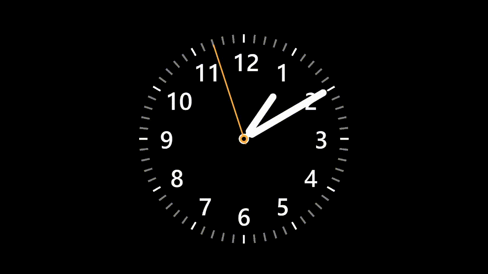
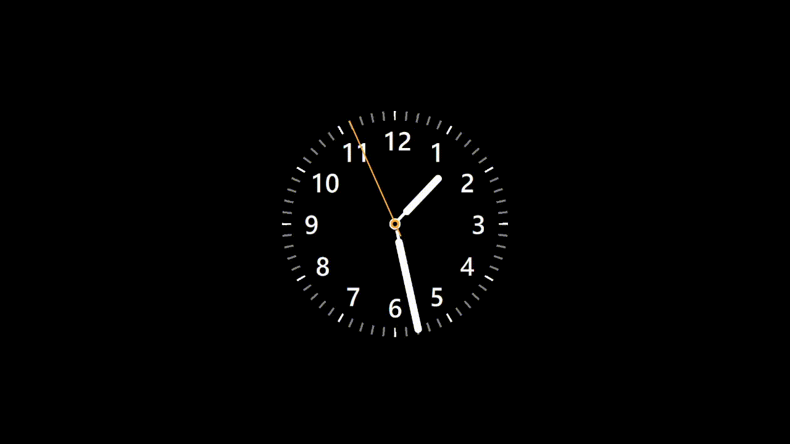

+++
author = "毛哥EM"
title = "今天我想來...欸現在幾點? - CSS畫時鐘"
date = "2023-10-16"
series = ["不用庫 也能酷 - 玩轉 CSS & Js 特效"]
tags = ["HTML", "CSS", "JS"]
categories = [""]
thumbnail = "https://em-tec.github.io/images/ironman2023.webp"
featureImage = "https://em-tec.github.io/images/ironman2023-banner.webp"
shareImage = "https://em-tec.github.io/images/ironman2023-banner.webp"
+++

# 切版
```html
<div class="clock">
  <div class="hour-hand"></div>
  <div class="minute-hand"></div>
  <div class="second-hand"></div>
  <div class="clockCenter"></div>
  <div class="clockCenterCenter"></div>
  <div class="digit" style="--deg: 0;" data-digit="12"></div>
  <div class="digit" style="--deg: 30;" data-digit="1"></div>
  <div class="digit" style="--deg: 60;" data-digit="2"></div>
  <div class="digit" style="--deg: 90;" data-digit="3"></div>
  <div class="digit" style="--deg: 120;" data-digit="4"></div>
  <div class="digit" style="--deg: 150;" data-digit="5"></div>
  <div class="digit" style="--deg: 180;" data-digit="6"></div>
  <div class="digit" style="--deg: 210;" data-digit="7"></div>
  <div class="digit" style="--deg: 240;" data-digit="8"></div>
  <div class="digit" style="--deg: 270;" data-digit="9"></div>
  <div class="digit" style="--deg: 300;" data-digit="10"></div>
  <div class="digit" style="--deg: 330;" data-digit="11"></div>
</div>
```

```css
body {
  display: flex;
  align-items: center;
  justify-content: center;
  min-height: 100svh;
  background: #000;
  font-family: system-ui;
  font-weight: 800;
}
.clock {
  width: 300px;
  height: 300px;
  background: radial-gradient(#000 65%, transparent 10%),
    repeating-conic-gradient(from -0.5deg, #fff 0 1deg, transparent 0deg 30deg),
    repeating-conic-gradient(from -0.5deg, gray 0 1deg, transparent 0deg 6deg);
  border-radius: 50%;
  position: relative;
}
.digit::before {
  content: attr(data-digit);
  display: block;
  transform: rotate(calc(var(--deg) * -1deg));
  text-align: center;
}
.digit {
  position: absolute;
  top: calc(50% - 15px);
  left: calc(50% - 16px);
  width: 1em;
  height: 1em;
  font-size: 2em;
  color: #fff;
  transform: rotate(calc(var(--deg) * 1deg)) translateY(-115px);
  transform-origin: center center;
}
.clockCenter,
.clockCenterCenter {
  position: absolute;
  top: 50%;
  left: 50%;
  transform: translate(-50%, -50%);
  width: 12px;
  height: 12px;
  background: #ffaf3f;
  border: 0.1em solid #fff;
  border-radius: 50%;
  display: block;
}
.clockCenterCenter {
  background: #000;
  border: none;
  width: 6px;
  height: 6px;
  z-index: 10;
}
.hour-hand,
.minute-hand,
.second-hand {
  position: absolute;
  top: 50%;
  left: 50%;
  background-color: #fff;
  transform-origin: top center;
}
.hour-hand,
.minute-hand {
  width: 10px;
  height: 70px;
  margin-left: -5px;
  border-radius: 5px;
}
.minute-hand {
  height: 128px;
}
.hour-hand::after,
.minute-hand::after {
  transform: translateY(-0.7em);
  display: block;
  content: "";
  width: 4px;
  margin-left: 33.333333%;
  height: 50px;
  background-color: #fff;
}
.second-hand {
  width: 2px;
  height: 168px;
  margin-left: -0.7px;
  background-color: #ffaf3f;
  border-radius: 2px 2px 0 0;
  transition: transform 0.2s;
}
```



```js
const hourHand = document.querySelector(".hour-hand");
const minuteHand = document.querySelector(".minute-hand");
const secondHand = document.querySelector(".second-hand");
function updateClock() {
  const now = new Date();
  const hours = now.getHours();
  const minutes = now.getMinutes();
  const seconds = now.getSeconds();
  const hourRotation =
    ((hours % 12) * 360) / 12 + ((minutes / 60) * 360) / 12 + 180;
  const minuteRotation =
    ((minutes % 60) * 360) / 60 +
    ((seconds / 60) * 360) / 60 +
    180 +
    hours * 360;
  const secondRotation =
    ((seconds % 60) * 360) / 60 + 180 + hours * minutes * 360;
  hourHand.style.transform = `rotate(${hourRotation}deg) translateY(18px)`;
  minuteHand.style.transform = `rotate(${minuteRotation}deg) translateY(20px)`;
  secondHand.style.transform = `rotate(${secondRotation}deg) translateY(-18px)`;
}

setInterval(updateClock, 1000);
updateClock();
```

https://codepen.io/edit-mr/pen/wvRXMLG

