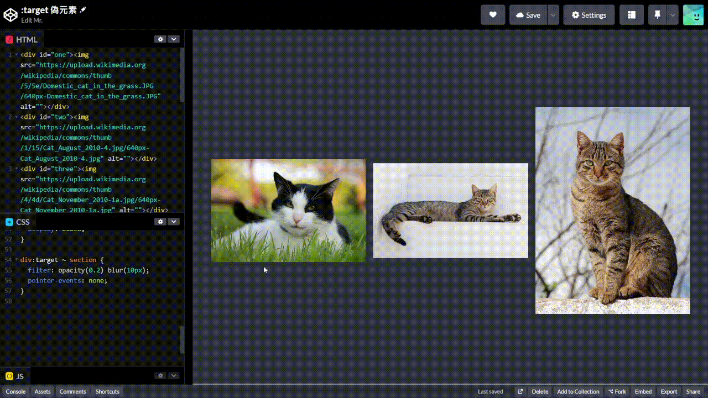

+++
author = "毛哥EM"
title = "Day19 純 CSS 做出 Lightbox"
date = "2023-10-03"
series = ["不用庫 也能酷 - 玩轉 CSS & Js 特效"]
tags = ["HTML", "CSS", "JS"]
categories = [""]
thumbnail = "https://em-tec.github.io/images/ironman2023.webp"
featureImage = "https://em-tec.github.io/images/ironman2023-banner.webp"
shareImage = "https://em-tec.github.io/images/ironman2023-banner.webp"
+++

今天我們要來認識 CSS 選擇器 `:target` 並做出以下效果



Lightbox 我認為只適合拿來展示照片。因為他會打亂整個你滾動的方向，必須要去找那個叉叉。要顯示更多文字有太多更好的做法了，比如說展開摺疊或著是滑動到另外一個位置。不過今天的作法你想要展示甚麼都可以。

## 認識 :taget

:target 是一個虛擬類別（pseudo-class） 選擇器。他選擇的是超連結連結到的錨點（anchor）。直接上範例你就懂了。

```html
<a href="#one">One</a>
<a href="#two">Two</a>
<a href="#">no</a>
<div id="one">One</div>
<div id="two">Two</div>
```

```css
div:target{
  background: yellow;
}
```


## 實作

那我們就裝飾一下這個版面和 Lightbox 就好啦!先從維基共享資源抓幾張圖片。

```html
<div id="one"></div>
<div id="two"></div>
<div id="three"></div>
<section>
  <a href="#one"></a>
  <a href="#two"></a>
  <a href="#three"></a>
</section>
<a href="#" id="close">✖</a>
```

連結有點亂我簡化一下，架構長這樣。

```html
<div id="one"></div>
<div id="two"></div>
<div id="three"></div>
<section>
  <a href="#one"></a>
  <a href="#two"></a>
  <a href="#three"></a>
</section>
<a href="#" id="close">✖</a>
```

簡單 CSS 裝飾，顏色使用 [Nord 的 Polar Night 配色](https://www.nordtheme.com/docs/colors-and-palettes)

```css
body {
  background: #2e3440;
  text-align: center;
  color: #eceff4;
  font-size: system-ui;
}
section {
  display: flex;
  justify-content: center;
  align-items: center;
  gap: 1rem;
}
a img {
  width: 30vw;
  display: block;
}
```
接下來來設計 Lightbox。我們希望他能置中並且背景有些許的模糊。因此設定在 `:target` 時背景使用 `filter` 來 blur 以及不透明度降低。而 Lightbox 本身則是使用 `transform` 來置中。

```css
div:target > img {
  opacity: 1;
}
div > img {
  position: fixed;
  top: 50%;
  left: 50%;
  transform: translate(-50%, -50%);
  opacity: 0;
  pointer-events: none;
  width: 90vw;
  height: calc(100vh - 6rem);
  object-fit: contain;
  z-index: 2;
}

div:target ~ #close {
  display: block;
}

div:target ~ section {
  filter: opacity(0.2) blur(10px);
}
```

關閉按鈕就放到右上角即可。

```css
#close {
  display: none;
  position: fixed;
  right: 1em;
  top: 1em;
  color: #fff;
  text-decoration: none;
  font-size: 2rem;
}
```
針對幾個可能有疑惑的 CSS 補充說明一下

* `pointer-events: none` 這個屬性可以讓滑鼠事件穿透，也就是讓滑鼠點不到他。因為如果使用 `display: none` 隱藏顯示就不會有淡入淡出效果。
* `object-fit: contain` 這個屬性可以讓圖片維持比例並且完整顯示在容器內。設定 `width` 和 `height` 等於是限定範圍，圖片會盡量放到最大但是不會超出。
* `z-index` 這個屬性可以設定元素的疊層順序，數字越大越在上面。因為我們希望 Lightbox 在最上面，所以設定為 2。
* `calc()` 這個函式可以讓你做數學運算，這邊是為了讓圖片寬度和高度稍微比螢幕小一點。
* `position: fixed` 這個屬性可以讓元素固定在螢幕上，不會隨著滾動而移動。方便我們定位原色到正中間。


最後加上一點動畫讓整體看起來更順暢。為了方便我就這樣寫，不過平常少用 `*` 會比較好，因為塞太多容易影響到效能。

```css
* {
  transition: all 0.3s;
}
```

## 成果

最終成果如下:
https://codepen.io/edit-mr/pen/jOXpJXX


```html
<div id="one"></div>
<div id="two"></div>
<div id="three"></div>
<section>
  <a href="#one"></a>
  <a href="#two"></a>
  <a href="#three"></a>
</section>
<a href="#" id="close">✖</a>
```

```css
* {
  transition: all 0.3s;
}
body {
  background: #2e3440;
  text-align: center;
  color: #eceff4;
  font-size: system-ui;
  display: flex;
  align-items: center;
  min-height: 100svh;
  justify-content: center;
  overflow: hidden;
}
section {
  display: flex;
  justify-content: center;
  align-items: center;
  gap: 1rem;
}
a img {
  width: 30vw;
  display: block;
}

div:target > img {
  opacity: 1;
}
div > img {
  position: fixed;
  top: 50%;
  left: 50%;
  transform: translate(-50%, -50%);
  opacity: 0;
  pointer-events: none;
  width: 90vw;
  height: calc(100vh - 6rem);
  object-fit: contain;
  z-index: 2;
}
#close {
  display: none;
  position: fixed;
  right: 1em;
  top: 1em;
  color: #fff;
  text-decoration: none;
  font-size: 2rem;
}
div:target ~ #close {
  display: block;
}

div:target ~ section {
  filter: opacity(0.2) blur(10px);
  pointer-events: none;
}
```

以上就是我今天的分享，歡迎在 [Instagram](https://www.instagram.com/em.tec.blog) 和 [Google 新聞](https://news.google.com/publications/CAAqBwgKMKXLvgswsubVAw?ceid=TW:zh-Hant&oc=3)追蹤[毛哥EM資訊密技](https://em-tec.github.io/)，也歡迎訂閱我新開的[YouTube頻道：網棧](https://www.youtube.com/@webpallet)。