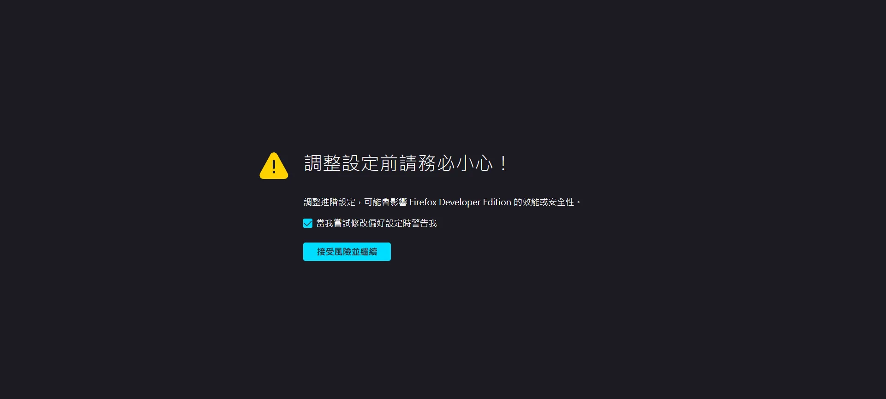
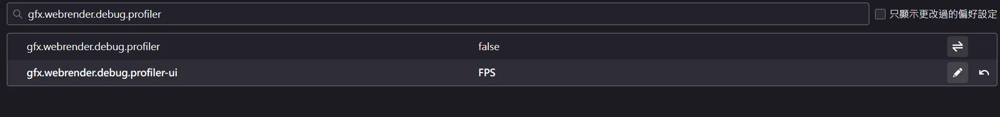
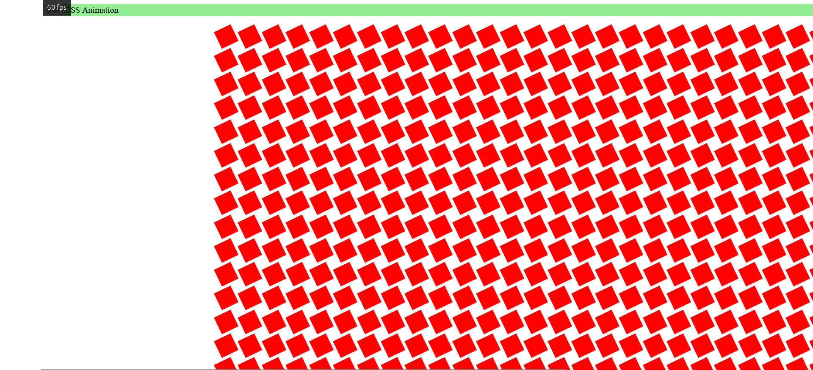
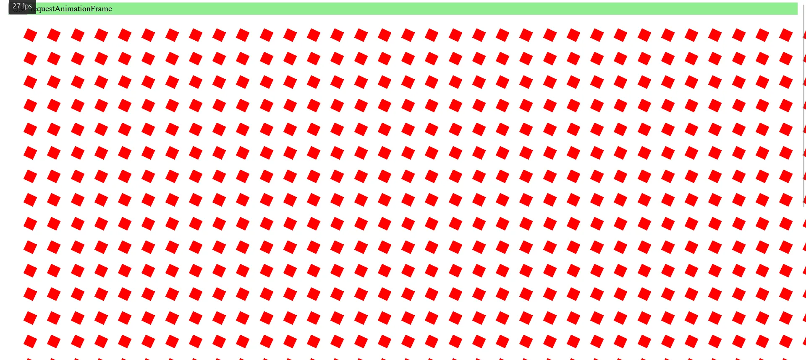

+++
author = "毛哥EM"
title = "Day21 就是要對決 - CSS 和 JS 動畫，哪個更絲滑？"
date = "2023-10-05"
series = ["不用庫 也能酷 - 玩轉 CSS & Js 特效"]
tags = ["HTML", "CSS", "JS"]
categories = [""]
thumbnail = "https://emtech.cc/images/ironman2023.webp"
featureImage = "https://emtech.cc/images/ironman2023-banner.webp"
shareImage = "https://emtech.cc/images/ironman2023-banner.webp"
+++

今天是第二十一天，已經走完2/3的路程，我媽還以為我早被淘汰了。這個系列明明是叫【不用庫 也能酷 - 玩轉 CSS & Js 特效】，但 Js 出現了幾篇?有五篇嗎?難道 JavaScript 是來湊關鍵字的嗎?今天就來聊聊為甚麼使用純 CSS 做效果如此吸引人。

## 對手進場

### CSS `transition` 和 `@keyframes`

就性能上來說兩者基本上沒有區別，所以我們都歸於 CSS 動畫。你可以根據使用情境來選擇使用哪一種。比如說滑鼠互動可以使用 `transition`，出場動畫可以使用 `@keyframes`。

>　複習：[Day4 自己動! @keyframes 與 Transition](https://ithelp.ithome.com.tw/articles/10321376)

### JavaScript `requestAnimationFrame()`

`requestAnimationFrame()` 會在瀏覽器畫下一幀繪制之前調用。因此比設定固定時間重繪的 `setTimeout()` 或 `setInterval()`效率高得多。開發人員可以通過簡單地改變元素的樣式（或者更新畫布繪制等等）來創建動畫。

> 備註: 不管是 CSS 動畫還是 JavaScript 動畫，如果你離開當前頁面，動畫就會停止。比如說 [Day10 永無止境跑馬燈 - 不同螢幕 相同速度](https://ithelp.ithome.com.tw/articles/10326819) 的跑馬燈就是如此。
> 
> 如果你想要在背景執行動畫，可以使用 [Web Worker](https://developer.mozilla.org/zh-TW/docs/Web/API/Web_Workers_API/Using_web_workers)。

## 就是要對決

我這裡使用 FireFox Developer Edition 來測試，因為它在 CSS Debug 有很多很棒的功能。而今天我們要讓他幫助我們看到動畫的 FPS。

> 用 Firefox 還有一個原因是他在隱私權保護方面抓得很緊，所以在 Firefox 上面能用基本上 Chromium 都不會有太大問題。

首先請你先到<about:config>，他很貼心請你要小心，選擇接受風險並繼續即可。




請你搜尋gfx.webrender.debug.profiler-ui

*  `gfx.webrender.debug.profiler-ui` 設為 `FPS`，
*  `gfx.webrender.debug.profiler-ui` 設為 `true` (點擊加號)。

> 記得先設成 `FPS` 再設成 `true`，不然整個畫面會被資訊轟炸，比 Minecraft 的 F3 還要誇張好幾倍。



接下來是暖暖包時間，我們要來翻滾1000個 `<div>` 正方形。你可以自行貼上以下程式碼，或是用[我的](https://emtech.cc/post/2023ironman-21/test.html)。然後點擊切換按鈕來切換動畫方式。

```html
<div id="header">
  <button id="toggle-button">切换</button>
  <span id="type">CSS Animation</span>
</div>
<div id="box-container"></div>
```

```css
#header {
  position: sticky;
  top: 0.5rem;
  margin: 0 0.5rem;
  z-index: 100;
  background-color: lightgreen;
}

#box-container {
  margin-top: 1.5rem;
  display: grid;
  grid-template-columns: repeat(40, 1fr);
  gap: 15px;
}

.box {
  width: 30px;
  height: 30px;
  background-color: red;
}

.css-animation {
  animation: animate 6s linear 0s infinite alternate;
}

@keyframes animate {
  0% {
    transform: translateX(0) rotate(0deg) scale(0.6);
  }
  100% {
    transform: translateX(500px) rotate(360deg) scale(1.4);
  }
}
```
```js
const boxes = [];
const button = document.getElementById("toggle-button");
const boxContainer = document.getElementById("box-container");
const animationType = document.getElementById("type");

// create boxes
for (let i = 0; i < 1000; i++) {
  const div = document.createElement("div");
  div.classList.add("css-animation");
  div.classList.add("box");
  boxContainer.appendChild(div);
  boxes.push(div.style);
}

let toggleStatus = true;
let rafId;
button.addEventListener("click", () => {
  if (toggleStatus) {
    animationType.textContent = " requestAnimationFrame";
    for (const child of boxContainer.children) {
      child.classList.remove("css-animation");
    }
    rafId = window.requestAnimationFrame(animate);
  } else {
    window.cancelAnimationFrame(rafId);
    animationType.textContent = " CSS animation";
    for (const child of boxContainer.children) {
      child.classList.add("css-animation");
    }
  }
  toggleStatus = !toggleStatus;
});

const duration = 6000;
const translateX = 500;
const rotate = 360;
const scale = 1.4 - 0.6;
let start;
function animate(time) {
  if (!start) {
    start = time;
    rafId = window.requestAnimationFrame(animate);
    return;
  }

  const progress = (time - start) / duration;
  if (progress < 2) {
    let x = progress * translateX;
    let transform;
    if (progress >= 1) {
      x = (2 - progress) * translateX;
      transform = `translateX(${x}px) rotate(${
        (2 - progress) * rotate
      }deg) scale(${0.6 + (2 - progress) * scale})`;
    } else {
      transform = `translateX(${x}px) rotate(${progress * rotate}deg) scale(${
        0.6 + progress * scale
      })`;
    }

    for (const box of boxes) {
      box.transform = transform;
    }
  } else {
    start = null;
  }
  rafId = window.requestAnimationFrame(animate);
}
```

### CSS `transition` 和 `@keyframes`

可以看到 FPS 穩定在 60 左右。



### JavaScript `requestAnimationFrame()`

可以看到 FPS 掉到 30 左右。



## なに？為甚麼？

原因就是使用 CSS 動畫的時候他 Call out 給 GPU 幫忙做硬體加速。而使用 JavaScript 動畫的時候他只能靠 CPU。

> 複習: [Day20 GPU! 啟動! - 淺談 CSS3 硬體加速](https://ithelp.ithome.com.tw/articles/10333947)


JavaScript 的 `requestAnimationFrame()` 會引起 reflow（重新布局），整個流程需要再跑一次。而 CSS 的 `transition` 和 `@keyframes` 只需要單獨稍微調整一下動畫的圖層就好了。

你可以測試一下，關閉硬體加速功能(不用拔顯卡，到 config 關就可以了)之後兩者的 FPS 理論上就會差不多了。

## JavaScript: 我存在的意義是甚麼?

雖然 CSS3 十分強大，但還是有很多效果是只能透過 JavaScript 實現，或著是使用 JavaScript 實現會更加方便。如果是有複雜的數學邏輯或著是需要互動的動畫，使用 JavaScript 都會比較簡單。

明天我們就來玩玩 JavaScript 的特效吧。

以上就是我今天的分享，歡迎在 [Instagram](https://www.instagram.com/emtech.cc) 和 [Google 新聞](https://news.google.com/publications/CAAqBwgKMKXLvgswsubVAw?ceid=TW:zh-Hant&oc=3)追蹤[毛哥EM資訊密技](https://emtech.cc/)，也歡迎訂閱我新開的[YouTube頻道：網棧](https://www.youtube.com/@webpallet)。

我是毛哥EM，讓我們明天再見。