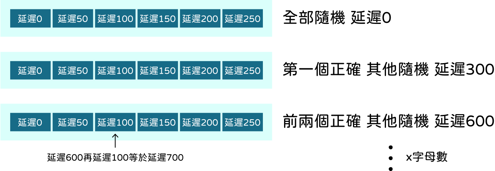

+++
author = "毛哥EM"
title = "Day 22 JavaScript 乱薍覼釠亂碼效果"
date = "2023-10-6"
series = ["不用庫 也能酷 - 玩轉 CSS & Js 特效"]
tags = ["HTML", "CSS", "JS"]
categories = [""]
thumbnail = "https://em-tec.github.io/images/ironman2023.webp"
featureImage = "https://em-tec.github.io/images/ironman2023-banner.webp"
shareImage = "https://em-tec.github.io/images/ironman2023-banner.webp"
+++

今天我們要來做一些乱薍覼釠亂碼效果。

<!--more-->


效過在手，氣氛要有。

## 基本版面

### HTML

一個標題，一個 `<div>` 放亂碼，一個 `<span>` 拿來測長寬，稍後用到。

```html
<h1>ITHOME</h1>
<div>LDHELDMEW...</div>
<span>a</span>
```

### CSS

抓個 Google Font 來用，我用的是 [Space Mono](https://fonts.google.com/specimen/Space+Mono?query=space)。

```css
@import url("https://fonts.googleapis.com/css2?family=Space+Mono:wght@700&display=swap");

body {
  background: #000;
  height: 100svh;
  overflow: hidden;
  color: #fff;
}

h1 {
  font-size: 4em;
  font-family: "Space Mono", monospace;
  position: absolute;
  top: 50%;
  left: 50%;
  transform: translate(-50%, -100%);
}
div {
  width: 100%;
  word-wrap: break-word;
}
```

`word-wrap: break-word;` 這個屬性是讓文字超出邊界時，自動換行。

## 有趣的 JavaScript

一步一步來

### 亂碼

來做個亂碼函式，輸入一個數字，就會回傳那麼多個亂碼。

一個變數 `box` 放著所有可能的字元，

```js
const box = "ABCDEFGHIJKLMNOPQRSTUVWXYZ0123456789"
```

`Math.random()` 會回傳一個 0 到 1 之間的數字

```js
Math.random()
// 0.946621565811897
```

`Math.random()*5` 會回傳一個 0 到 4 之間的數字

```js
Math.random()*5
//4.603685644684928
```

`Math.floor()` 會無條件捨去小數點

```js
Math.floor(4.603685644684928)
//4
```

這樣就有隨機取數了😯

我們把它乘上 `box.length`，就會得到一個 0 到 `box.length` 之間的數字，再用 `Math.floor()` 取整數，就會得到一個 0 到 `box.length - 1` 之間的數字，這個數字就是 `box` 的索引，我們就可以從 `box` 裡面隨機取出一個字元。

```js
box[Math.floor(Math.random() * box.length)];
//A
```

寫一個函式，輸入一個數字，就會用迴圈回傳那麼多個亂碼。

```js
const box = "ABCDEFGHIJKLMNOPQRSTUVWXYZ0123456789";

const randomText = (amount) => {
  var a = "";
  for (var i = 0; i < amount; i++)
    a += box[Math.floor(Math.random() * box.length)];
  return a;
};
```

測試一下

```js
randomText(10)
//"XVDBHCCQ39" 
```
喔~😯

### 需要幾個

螢幕有大有小，字體大小又都不一樣。沒關係，量一下就好了。

`<span>` 裡面有一個字母a。量螢幕大小除以字母大小就是大約需要多少個字母
```js
const singleText = document.querySelector("span");
const total =
  window.innerWidth * window.innerHeight /
  singleText.offsetWidth / singleText.offsetHeight;
//2736
```

喔~😯

### 解碼效果


`settimeout`可以讓函式延遲執行

```js
console.log("never gonna give you up")
window.setTimeout(function () {
  console.log("never gonna let you down")
}, 2000);

  //never gonna give you up
  //(過了兩秒)
  //never gonna let you down
```

一個雙層迴圈，每6次洗牌多顯示一個字。直到最後6個字都顯示完畢。

```js
  for (let j = 0; j <= titleText.length; j++) {
    window.setTimeout(function () {
      var current = j;
      for (let k = 0; k <= 5; k++) {
        window.setTimeout(function () {
          var correct = titleText.slice(0, current);
          correct += randomText(titleText.length - current);
          title.innerText = correct;
        }, 50 * k);
      }
    }, 300 * j);
  }
  ```

迴圈的延遲邏輯大概是這樣。



喔~😯

### 滑鼠位置

偵測滑鼠移動

```js
document.onmousemove = (e) => console.log(e);
// mousemove { target: html, buttons: 0, clientX: 1004, clientY: 242, layerX: 1004, layerY: 242 }
```

改成執行我們的函式

```js
document.onmousemove = (e) => bluh(e);
```

我們把讀到的滑鼠位置，放進 CSS 屬性 `--x` 和 `--y` 裡面。讓遮罩來定位。

```js
  bg.style.setProperty("--x", `${e.clientX}px`);
  bg.style.setProperty("--y", `${e.clientY}px`);
```
完整函式

```js
const bluh = (e) => {
  const bg = document.querySelector("div");
  const singleText = document.querySelector("span");
  const total =
    (window.innerWidth * window.innerHeight) /
    singleText.offsetWidth /
    singleText.offsetHeight;
  bg.innerText = randomText(total);
  bg.style.setProperty("--x", `${e.clientX}px`);
  bg.style.setProperty("--y", `${e.clientY}px`);
};

document.onmousemove = (e) => bluh(e);
bluh();
```
喔~😯


### 遮罩 CSS 了解一下

```css
div {
  --x: -100vw;
  --y: -100vh;
  width: 100%;
  word-wrap: break-word;
  -webkit-mask-image: radial-gradient(
    circle at var(--x) var(--y),
    #fff,
    #ffffff44 15em
  );
}
```

遮罩設置成一個圓形漸層，並定位到 `--x` 和 `--y` 的位置。

## 成果

https://codepen.io/edit-mr/pen/bGOxLoV


```html
<h1>ITHOME</h1>
<div></div>
<span>a</span>
```

```css
@import url("https://fonts.googleapis.com/css2?family=Space+Mono:wght@700&display=swap");

body {
  background: #000;
  height: 100svh;
  overflow: hidden;
  color: #fff;
}

h1 {
  font-size: 4em;
  color: #fff;
  font-family: "Space Mono", monospace;
  position: absolute;
  top: 50%;
  left: 50%;
  transform: translate(-50%, -100%);
}
div {
  --x: -100vw;
  --y: -100vh;
  width: 100%;
  word-wrap: break-word;
  -webkit-mask-image: radial-gradient(
    circle at var(--x) var(--y),
    #fff,
    #ffffff44 15em
  );
}
```

```js
const title = document.querySelector("h1");

const titleText = "ITHOME";

setInterval(function () {
  for (let j = 0; j <= titleText.length; j++) {
    window.setTimeout(function () {
      var current = j;
      for (let k = 0; k <= 5; k++) {
        window.setTimeout(function () {
          var correct = titleText.slice(0, current);
          correct += randomText(titleText.length - current);
          title.innerText = correct;
        }, 50 * k);
      }
    }, 300 * j);
  }
}, 5000);

const box = "ABCDEFGHIJKLMNOPQRSTUVWXYZ0123456789";

const randomText = (amount) => {
  var a = "";
  for (var i = 0; i < amount; i++)
    a += box[Math.floor(Math.random() * box.length)];
  return a;
};

const bluh = (e) => {
  const bg = document.querySelector("div");
  const singleText = document.querySelector("span");
  const total =
    (window.innerWidth * window.innerHeight) /
    singleText.offsetWidth /
    singleText.offsetHeight;
  bg.innerText = randomText(total);
  bg.style.setProperty("--x", `${e.clientX}px`);
  bg.style.setProperty("--y", `${e.clientY}px`);
};

document.onmousemove = (e) => bluh(e);
bluh();
```


以上就是我今天的分享，歡迎在 [Instagram](https://www.instagram.com/em.tec.blog) 和 [Google 新聞](https://news.google.com/publications/CAAqBwgKMKXLvgswsubVAw?ceid=TW:zh-Hant&oc=3)追蹤[毛哥EM資訊密技](https://em-tec.github.io/)，也歡迎訂閱我新開的[YouTube頻道：網棧](https://www.youtube.com/@webpallet)。

我是毛哥EM，讓我們明天再見。