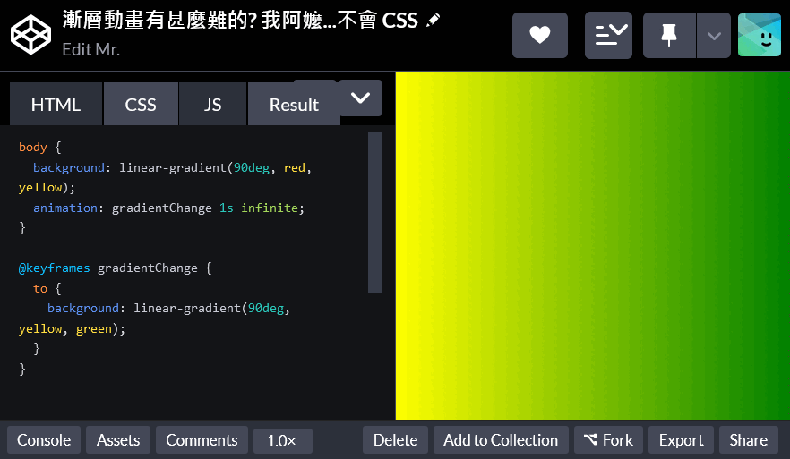
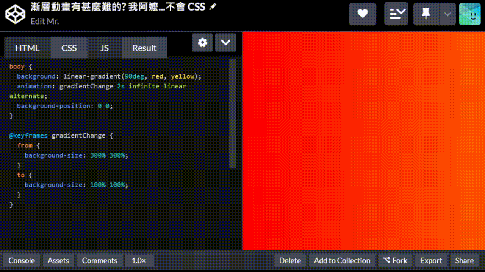
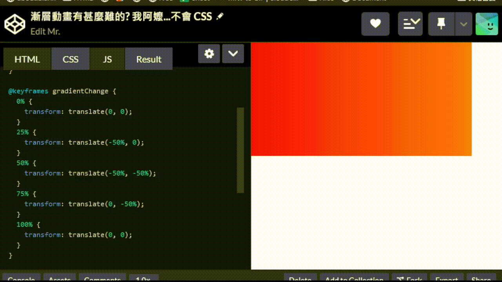

+++
author = "毛哥EM"
title = "Day23 優雅的漸層動畫 - 隨機而有秩序"
date = "2023-10-07"
series = ["不用庫 也能酷 - 玩轉 CSS & Js 特效"]
tags = ["HTML", "CSS", "JS"]
categories = [""]
thumbnail = "https://emtech.cc/images/ironman2023.webp"
featureImage = "https://emtech.cc/images/ironman2023-banner.webp"
shareImage = "https://emtech.cc/images/ironman2023-banner.webp"
+++

今天我們會提到幾個不同的原理。你可以像生菜沙拉一樣自己條配。

漸層動畫有甚麼難的? 我阿嬤...不會 CSS

```css
body {
  background: linear-gradient(90deg, red, yellow);
  animation: gradientChange 1s infinite;
}

@keyframes gradientChange {
  to {
    background: linear-gradient(90deg, yellow, green);
  }
}

```



額，只有層，沒有漸。這是因為漸層是屬於 `background-image`，你要他怎麼漸圖片?

## 自己動

我們今天要用到的第一個方式是放大縮小，以及移動一個漸層，這樣就能做出類似於漸層的動畫。

### `background-position`

我們先把圖片拉長到兩倍，然後移動 `background-position` 來做出動畫。


```css
body {
  background: linear-gradient(90deg, red, yellow);
  background-size: 200% 100%;
  background-position: 0 0;
  animation: gradientChange 2s infinite linear alternate;
}

@keyframes gradientChange {
  from {
    background-position: 0 0;
  }
  to {
    background-position: 100% 0;
  }
}
```

### `background-size`

 `background-size` 如果不搭配 `background-position` 的會可以做出這種左邊維持不動，右邊比例不同漸層的效果。

 

```css
body {
  background: linear-gradient(90deg, red, yellow);
  animation: gradientChange 2s infinite linear alternate;
}

@keyframes gradientChange {
  from {
    background-size: 300% 300%;
  }
  to {
    background-size: 100% 100%;
  }
}
```

> 如果把 `background-position` 移到最右邊就會變成右邊固定。

```css
background-position: 100% 0;
```

### `transform`

和 `background-position` 一樣，`transform` 也可以做出類似的效果。不過記得我們在 [Day20 GPU! 啟動! - 淺談 CSS3 硬體加速](https://ithelp.ithome.com.tw/articles/10333947) 有提到 `transform` 會啟動硬體加速，可以讓動畫更流暢，你的 CPU 也會感謝你。



再把大小調到兩倍大即可。我稍微修改了顏色讓你看得更清楚。


```html
<div></div>
```

```css
body {
  margin: 0;
  overflow: hidden;
}
div {
  background: linear-gradient(45deg, red, yellow, blue);
  animation: gradientChange 4s infinite linear;
  height: 200vh;
  width: 200vw;
}

@keyframes gradientChange {
  0% {
    transform: translate(0, 0);
  }
  25% {
    transform: translate(-50%, 0);
  }
  50% {
    transform: translate(-50%, -50%);
  }
  75% {
    transform: translate(0, -50%);
  }
  100% {
    transform: translate(0, 0);
  }
}

```

### filter

`filter` 濾鏡隨便給你開。

> 複習: [Day7 幫我開濾鏡 filter ](https://ithelp.ithome.com.tw/articles/10323423)


```css
body {
  margin: 0;
}
div {
  background: linear-gradient(45deg, red, yellow);
  animation: gradientChange 3s infinite;
  min-height: 100vh;
  filter: hue-rotate(50deg);
}

@keyframes gradientChange {
  0 {
    filter: hue-rotate(0);
  }
  100% {
    filter: hue-rotate(360deg);
  }
}
```

你可以狂加讓他群魔亂舞起來。

https://codepen.io/edit-mr/pen/mdaabzQ?editors=1100


```css
body {
  margin: 0;
}
div {
  background: linear-gradient(45deg, red, yellow);
  animation: gradientChange 3s infinite linear alternate;
  min-height: 100vh;
  filter: hue-rotate(50deg);
}

@keyframes gradientChange {
  0 {
    filter: hue-rotate(0) contrast(1000%) invert(0%);
  }
  100% {
    filter: hue-rotate(360deg) contrast(300%) invert(100%);
  }
}
```

好的有點噁心，今天的漸層夠了，歡迎在 [Instagram](https://www.instagram.com/emtech.cc) 和 [Google 新聞](https://news.google.com/publications/CAAqBwgKMKXLvgswsubVAw?ceid=TW:zh-Hant&oc=3)追蹤[毛哥EM資訊密技](https://emtech.cc/)，也歡迎訂閱我新開的[YouTube頻道：網棧](https://www.youtube.com/@webpallet)。

我是毛哥EM，讓我們明天再見。