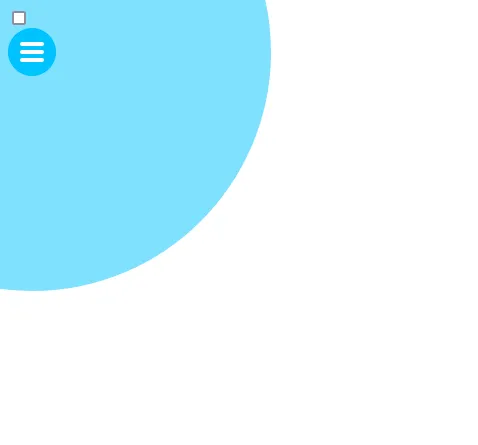
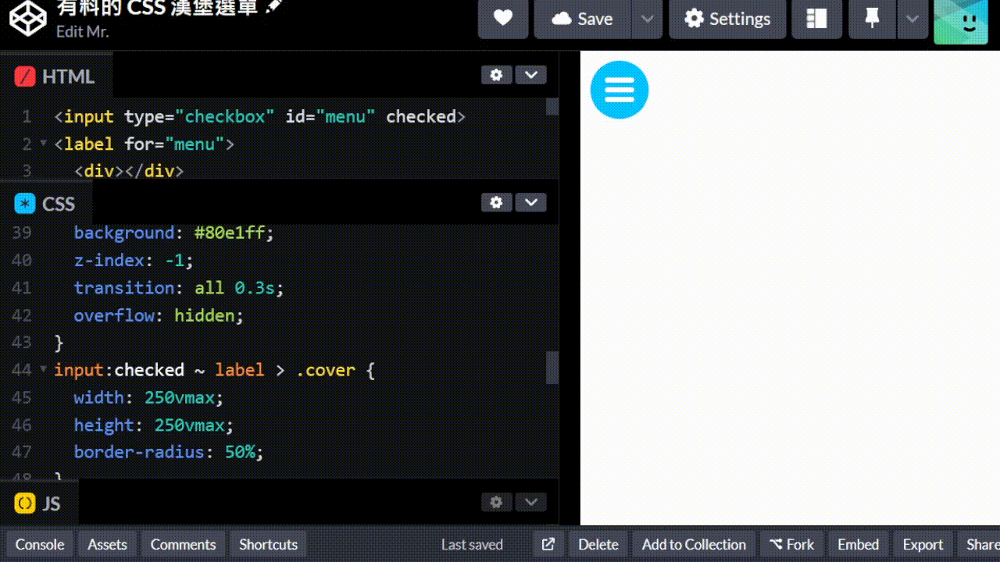
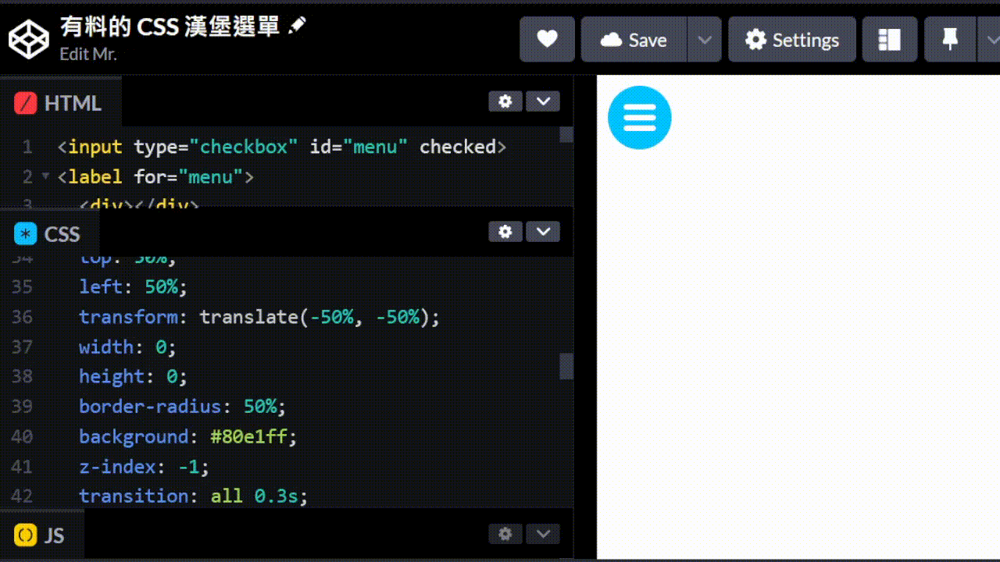
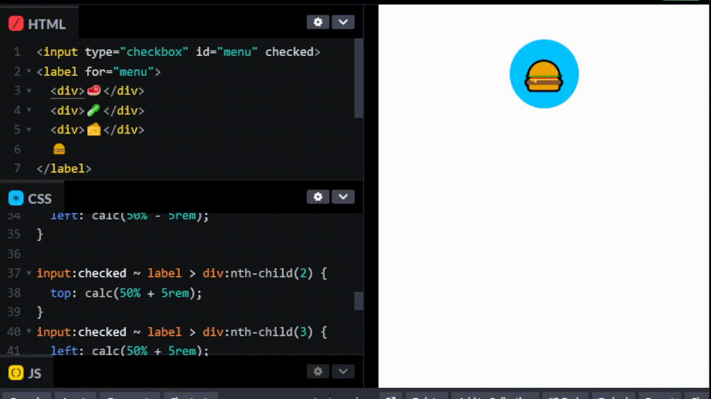
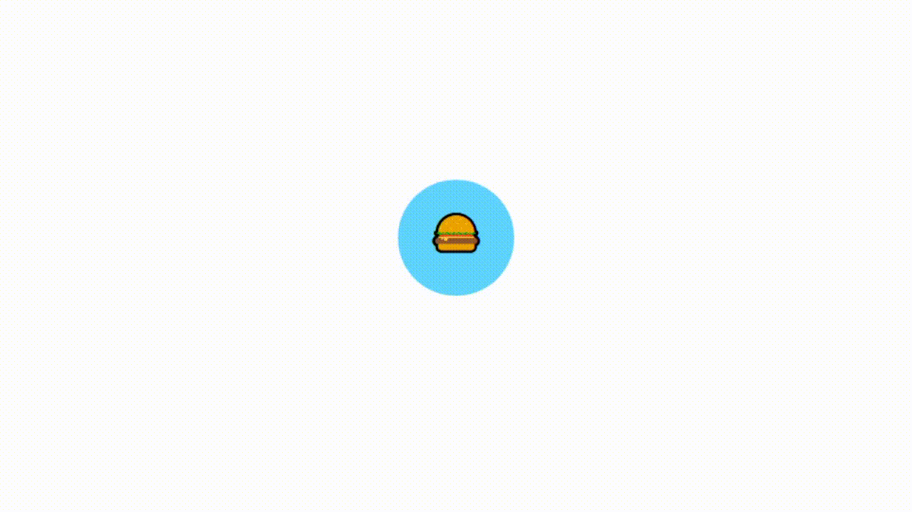

+++
author = "毛哥EM"
title = "Day25 有料的 CSS 漢堡選單"
date = "2023-10-09"
series = ["不用庫 也能酷 - 玩轉 CSS & Js 特效"]
tags = ["HTML", "CSS", "JS"]
categories = [""]
thumbnail = "https://em-tec.github.io/images/ironman2023.webp"
featureImage = "https://em-tec.github.io/images/ironman2023-banner.webp"
shareImage = "https://em-tec.github.io/images/ironman2023-banner.webp"
+++

我們今天要來做幾份漢堡選單。

原理和 [Day14 今天我想來點… 純 CSS 的開關](https://ithelp.ithome.com.tw/articles/10329983) 一樣，都是用 `input` 的 `checkbox` 來儲存狀態好讓其他元素可以抓到。而他本身的狀態使用 `label` 來遠端遙控。

我先不要一次跳太多步驟。這是一個基本還未完成的版面。



```html
<input type="checkbox" id="menu">
<label for="menu">
  <div></div>
  <div></div>
  <div></div>
  <span class="cover"></span>
</label>
```
```css
label {
  width: 3rem;
  height: 3rem;
  background: #00c3ff;
  display: block;
  border-radius: 50%;
  display: flex;
  flex-direction: column;
  align-items: center;
  justify-content: center;
  gap: 0.25em;
  position: relative;
}

label div {
  width: 1.5rem;
  height: 0.25rem;
  background: #fff;
  border-radius: 0.25rem;
}
.cover {
  position: absolute;
  display: block;
  top: 50%;
  left: 50%;
  transform: translate(-50%, -50%);
  width: 100vmax;
  height: 100vmax;
  border-radius: 50%;
  background: #80e1ff;
  z-index: -1;
}
```
可以看到我們已經有了漢堡選單的樣子。`<label>` 使用 flex 來垂直排列並且置中，`gap` 來設定間距，並設定 `position: relative` 來讓 `position: absolute` 的 `.cover` 可以定位到相同位置。

> 如果已經看不懂的話可以複習:
> * [Day3 用 Flex 切遍天下](https://ithelp.ithome.com.tw/articles/10320146)
> * [Day6 你怎在這? 攻克 Position](https://ithelp.ithome.com.tw/articles/10322719)

藍色圓形我們希望能夠填滿整個畫面，所以我們使用 `100vmax` 來選擇 `vw` 和 `vh` 之間比較大的值，這樣可以確保能夠蓋滿畫面但是長寬還是依樣來保持圓形。你會發現只有蓋住螢幕一半是因為我們把她往左上角移動了一半，所以只有一半的圓形在畫面上。沒關係我們為了安全起見設定大一點。最後使用 `z-index` 來讓他在最底層。

把原本的勾選框隱藏起來再加上內文。漢堡選單裡面當然就是要放漢堡配料，效果如下


```html
<input type="checkbox" id="menu" checked>
<label for="menu">
  <div></div>
  <div></div>
  <div></div>
  <span class="cover">
    <ul>
      <li>麵包</li>
      <li>肉排</li>
      <li>青菜</li>
      <li>麵包</li>
    </ul>
  </span>
</label>
```
```css
body {
  overflow: hidden;
  font-family: system-ui;
}
input[type="checkbox"] {
  display: none;
}
label {
  width: 3rem;
  height: 3rem;
  background: #00c3ff;
  display: block;
  border-radius: 50%;
  display: flex;
  flex-direction: column;
  align-items: center;
  justify-content: center;
  gap: 0.25em;
  position: relative;
  cursor: pointer;
}

label div {
  width: 1.5rem;
  height: 0.25rem;
  background: #fff;
  border-radius: 0.25rem;
  transition: all 0.3s;
}
.cover {
  position: absolute;
  display: block;
  top: 50%;
  left: 50%;
  transform: translate(-50%, -50%);
  width: 0;
  height: 0;
  border-radius: 50%;
  background: #80e1ff;
  z-index: -1;
  transition: all 0.3s;
  overflow: hidden;
}
input:checked ~ label > .cover {
  width: 250vmax;
  height: 250vmax;
  border-radius: 50%;
}

ul {
  position: absolute;
  top: 50%;
  left: 50%;
  width: 100vw;
  color: #fff;
  font-size: 3em;
  list-style: none;
  font-weight: 700;
}
```

最後是漢堡動畫，這裡就要發揮你自己的創意了。原理不難，這裡提供一個我現在想到的做法。我想要最上面的和最下面的旋轉 45 度，中間的變短到消失。所以我們先把中間的設定 `width: 0; height: 0;` ，然後我們把最上面的和最下面的設定 `transform: rotate(45deg);`，這樣就會旋轉 45 度了。這樣能夠做出一個箭頭:



```css
input:checked ~ label > div:first-child {
  transform: rotate(-45deg);
}
input:checked ~ label > div:nth-child(2) {
  width: 0;
}
input:checked ~ label > div:nth-child(3) {
  transform: rotate(45deg);
}
```

再來做一個也很常見的打叉，為了方便我們乾脆全部使用 absolute 定位。成果如下:

https://codepen.io/edit-mr/pen/zYyyEgz



```css
body {
  overflow: hidden;
  font-family: system-ui;
}
input[type="checkbox"] {
  display: none;
}
label {
  width: 3rem;
  height: 3rem;
  background: #00c3ff;
  display: block;
  border-radius: 50%;
  position: relative;
  cursor: pointer;
}

label div {
  position: absolute;
  width: 1.5rem;
  height: 0.25rem;
  background: #fff;
  border-radius: 0.25rem;
  transition: all 0.3s;
  top: 50%;
  left: 50%;
  transform: translate(-50%, -50%);
}
.cover {
  position: absolute;
  display: block;
  top: 50%;
  left: 50%;
  transform: translate(-50%, -50%);
  width: 0;
  height: 0;
  border-radius: 50%;
  background: #80e1ff;
  z-index: -1;
  transition: all 0.3s;
  overflow: hidden;
}
input:checked ~ label > .cover {
  width: 250vmax;
  height: 250vmax;
  border-radius: 50%;
}

ul {
  position: absolute;
  top: 50%;
  left: 50%;
  width: 100vw;
  color: #fff;
  font-size: 3em;
  list-style: none;
  font-weight: 700;
}
input:checked ~ label div:first-child {
  left: 25%;
  top: 50%;
  transform: rotate(45deg);
}
input:checked ~ label div:nth-child(2) {
  width: 0;
}
input:checked ~ label div:nth-child(3) {
  left: 25%;
  top: 50%;
  transform: rotate(-45deg);
}
label > div:first-child {
  top: calc(50% - 0.5rem);
}
label > div:nth-child(3) {
  top: calc(50% + 0.5rem);
}
```

你以為這樣就結束了? 還記得我們昨天講的 [Day24 CSS 相融黏滯效果](https://ithelp.ithome.com.tw/articles/10336425) 嗎? 我們可以把他加上去讓他更有質感。

這是一個會四處噴射漢堡選單



```html
<input type="checkbox" id="menu" checked>
<label for="menu">
  <div>🥩</div>
  <div>🥬</div>
  <div>🧀</div>
  🍔
</label>
```

```css
body {
  overflow: hidden;
  font-family: system-ui;
}

input[type="checkbox"] {
  display: none;
}

label {
  width: 5rem;
  height: 5rem;
  background: #00c3ff;
  display: block;
  border-radius: 50%;
  position: relative;
  cursor: pointer;
  margin: 1em auto;
}

div {
  position: absolute;
  top: 50%;
  left: 50%;
  transform: translate(-50%, -50%);
  width: 3rem;
  height: 3rem;
  border-radius: 50%;
  background: #00c3ff;
  z-index: -1;
  transition: all 0.3s;
  overflow: hidden;
}

input:checked ~ label > div:nth-child(1) {
  left: calc(50% - 5rem);
}

input:checked ~ label > div:nth-child(2) {
  top: calc(50% + 5rem);
}
input:checked ~ label > div:nth-child(3) {
  left: calc(50% + 5rem);
}

label,
div {
  display: flex;
  align-items: center;
  justify-content: center;
  font-size: 2.5rem;
  user-select: none;
}

div {
  font-size: 1.5rem;
}
```
> `user-select: none;` 可以讓使用者無法選取文字，這樣就不會在點擊時有文字被選取的問題了。

加上昨天的相黏效果，變得更可愛了。

https://codepen.io/edit-mr/pen/NWeeYRq



```css
body {
  overflow: hidden;
  font-family: system-ui;
  min-height: 100svh;
}
input[type="checkbox"] {
  display: none;
}
label {
  width: 5rem;
  height: 5rem;
  display: block;
  position: absolute;
  cursor: pointer;
  left: 50%;
  transform: translate(-50%, -50%);
}
.box div {
  width: 4rem;
  height: 4rem;
}
.box div,
label {
  top: 50%;
  border-radius: 50%;
  background: #00c3ff;
}
.box div,
.food,
.food div {
  position: absolute;
  left: 50%;
  transform: translate(-50%, -50%);
  transition: 0.3s;
}
input:checked ~ .box div:first-child,
input:checked ~ .food div:first-child {
  left: calc(50% - 4rem);
}
input:checked ~ .box div:nth-child(2),
input:checked ~ .food div:nth-child(2) {
  top: calc(50% + 4rem);
}
input:checked ~ .box div:nth-child(3),
input:checked ~ .food div:nth-child(3) {
  left: calc(50% + 4rem);
}
.box div,
label {
  user-select: none;
  filter: blur(10px);
}
.box {
  background: #fff;
  filter: contrast(20) hue-rotate(45deg);
  height: 100svh;
}
.food,
.food div {
  top: 50.3%;
  user-select: none;
  pointer-events: none;
}
input:checked ~ .food div {
  font-size: 1.5rem;
}
.food div {
  font-size: 0rem;
}
.food div:last-child {
  font-size: 2rem;
}
```

> 手機版的淘寶之前有使用過類似的效果製作分享選單喔~

因為相黏效果有先模糊，裡面的 Emoji 文字也會被模糊，所以我們在後面又做一個只有文字的 `.food` 來顯示文字。設定 `pointer-events: none` 就可以讓他不會被點擊到了，直接穿透去點擊下面的 `label`。

背景顏色一定要記得設定，不然只會糊再一起沒有相黏效果。這是我 debug 半小時之後才想到的...

以上就是我今天的分享，歡迎在 [Instagram](https://www.instagram.com/em.tec.blog) 和 [Google 新聞](https://news.google.com/publications/CAAqBwgKMKXLvgswsubVAw?ceid=TW:zh-Hant&oc=3)追蹤[毛哥EM資訊密技](https://em-tec.github.io/)，也歡迎訂閱我新開的[YouTube頻道：網棧](https://www.youtube.com/@webpallet)。

我是毛哥EM，讓我們明天再見。