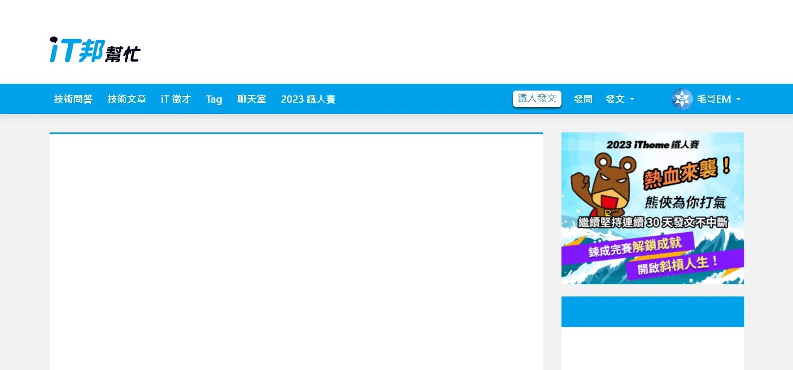

+++
author = "毛哥EM"
title = "Day 27 iT 邦幫忙::一起幫忙製作導覽列，拯救第27天"
date = "2023-10-16"
series = ["不用庫 也能酷 - 玩轉 CSS & Js 特效"]
tags = ["HTML", "CSS", "JS"]
categories = [""]
thumbnail = "https://em-tec.github.io/images/ironman2023.webp"
featureImage = "https://em-tec.github.io/images/ironman2023-banner.webp"
shareImage = "https://em-tec.github.io/images/ironman2023-banner.webp"
+++

今天我們要來製作 iT 邦幫忙首頁的導覽列。我們先來看看原本的網站。


呃好喔...晚點再看看...

沒事我有先截圖。


你有注意到嗎?第二排的導覽列在往下滾之後會固定在上方，並顯示出縮小版的 Logo。我覺得蠻可愛的，一個好的 UI 就事要有這種平常不會注意但讓體驗很順暢舒服的小巧思。我們來搭配昨天的 Animate On Scroll 原理來製作吧。

> 複習: [Day26 不要躲在下面動! Animate On Scroll 自己做](https://ithelp.ithome.com.tw/articles/10337575)

## 基本版面

首先我們先做一個類似於 iT 邦幫忙首頁的版面。這應該是這個系列最多的 HTML 了。



```html
<main>
  <header class="header">
    <div>
      
    </div>
  </header>
  <nav>
    <div>
      <li>技術問答</li>
      <li>技術文章</li>
      <li>iT 徵才</li>
      <li>Tag</li>
      <li>聊天室</li>
      <li>2023 鐵人賽</li>
      </ul>
      <ul class="right">
        <li><i class="fa-solid fa-magnifying-glass"></i></li>
        <li><button>鐵人發文</button></li>
        <li>發問</li>
        <li>發文 <span class="caret"></span></li>
        <li><i class="fa fa-commenting fa-fw button"></i></li>
        <li><i class="fa fa-bell fa-fw button"></i></li>
        <li class="pro">毛哥EM<span class="caret"></span></li>
      </ul>
    </div>
  </nav>
  <div>
    <section></section>
    <aside></aside>
  </div>
</main>
```
```css
* {
  margin: 0;
  padding: 0;
  box-sizing: border-box;
}
body {
  background: #f2f2f2;
  font-family: system-ui;
}
header > div,
nav > div,
main > div {
  padding: 15px;
  max-width: 1170px;
  margin: 0 auto;
}
header {
  background: #fff;
}
header img {
  width: 14%;
  margin-top: 45px;
  margin-bottom: 16px;
  padding-right: 10px;
}
.fixedNav {
  margin-bottom: 50px;
}

nav {
  width: 100%;
  background-color: #00a0e9;
  box-shadow: 0 3px 12px rgba(0, 0, 0, 0.1);
}
nav > div {
  min-height: 50px;
  display: flex;
  align-items: center;
  color: #fff;
  font-weight: 700;
  padding: 0 10px;
}
li {
  display: inline-block;
  padding: 0 12px;
  display: flex;
  align-items: center;
  gap: 6px;
}
i {
  font-size: 1.2em;
}
.button {
  color: #0f6b95;
  font-size: 1em;
}
.caret {
  display: inline-block;
  margin-left: 2px;
  border-top: 4px solid;
  border-right: 4px solid transparent;
  border-left: 4px solid transparent;
}
ul {
  display: flex;
  align-items: center;
}
button {
  font-family: system-ui;
  display: block;
  padding: 2px 8px 5px;
  box-shadow: 0px 2px 1px 1px #00637d;
  background-color: #ffffff;
  color: #1b79a2;
  border-radius: 6px;
  font-size: 16px;
  outline: none;
  border: none;
}
.right {
  justify-content: flex-end;
  flex-grow: 1;
}
.right li {
  padding: 0 10px;
}

li img {
  border-radius: 50%;
  width: 36px;
  height: 36px;
}
aside {
  width: 300px;
}
aside,
section {
  background: #fff;
  height: 200vh;
}
main > div {
  display: flex;
  gap: 30px;
  padding-top: 30px;
}
section {
  flex-grow: 1;
  border-top: 3px solid #00a0e9;
}
aside {
  background: linear-gradient(
    #f2f2f2 270px,
    #00a0e9 270px,
    #00a0e9 320px,
    #fff 320px
  );
}
```

大概講幾個有趣的點:

* 圖片來源是 [Font Awesome](https://fontawesome.com/)
* `<aside>` 裡面的背景是用 `linear-gradient` 做的。先是背景灰色，然後是藍色、白色。感覺像是分成不同元素但為了方便就用一個漸層充當。
* 設定 `max-width: 1170px` 再加上 `margin: 0 auto` 來讓版面置中。

其他的沒什麼特別的。如果看不懂的話可以複習 [Day3 用 Flex 切遍天下](https://em-tec.github.io/post/2023ironman-3/)

## JavaScript

接下來寫 JavaScript，先抓白底標題元素。

```js
const white = document.querySelector("header");
```

滾動時，如果導覽列底部超出視窗，就給藍色選單加上 `.fixedNav` 這個 class。如果沒有就會移除。

```js
document.addEventListener("scroll", () =>
  white.classList.toggle("fixedNav", white.getBoundingClientRect().bottom < 0)
);
```
> `element.classList.toggle` 會在 class 存在時移除，不存在時加上。如果填寫兩個參數，第一個是要添加或移除的 class；第二個參數是布林值，會在布林值為 true 時加上，false 時移除。

## 滾動效果

### 固定導覽列

ok 最後來補上一點 CSS。先是讓導覽列固定在最上方。

```css
.fixedNav + nav {
  position: fixed;
  top: 0;
  left: 0;
}
```

然後因為導覽列固定在上方，原本的空間會被往上移導致被遮住。所以要白色標題底下加上 `margin-bottom` 來填滿原本的空間。

```
.fixedNav {
  margin-bottom: 50px;
}
```

### 滑出圖片

HTML 加上圖片

```html
<!-- ... -->
  <nav>
    <div>
        
      <ul class="left">
<!-- ... -->
```

iT 邦幫忙的作法是把右邊的選單用 `transform:translate()` 往左平移遮住它。我把上面的選單設成半透明讓你看。


這個方法很不錯，但我今天想和你分享另外一個做法。就是直接使用 width 控制。

```css
nav > div > img {
  width: 0px;
  transition: width 0.2s linear;
  object-fit: cover;
  object-position: left;
  height: 24px;
}
.fixedNav + nav > div > img {
  width: 109px;
}
```

`object-fit` 可以讓圖片填滿容器，而不會變形。`object-position` 可以讓圖片往左對齊而不是中間。這樣就可以做到圖片從左邊滑出來的效果。

## 成果

成果如下

https://codepen.io/edit-mr/pen/WNLPYON


以上就是我今天的分享，歡迎在 [Instagram](https://www.instagram.com/em.tec.blog) 和 [Google 新聞](https://news.google.com/publications/CAAqBwgKMKXLvgswsubVAw?ceid=TW:zh-Hant&oc=3)追蹤[毛哥EM資訊密技](https://em-tec.github.io/)，也歡迎訂閱我新開的[YouTube頻道：網棧](https://www.youtube.com/@webpallet)。

我是毛哥EM，讓我們明天再見。