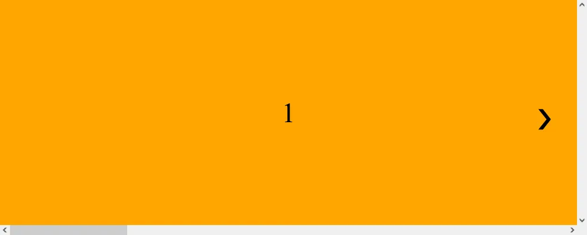
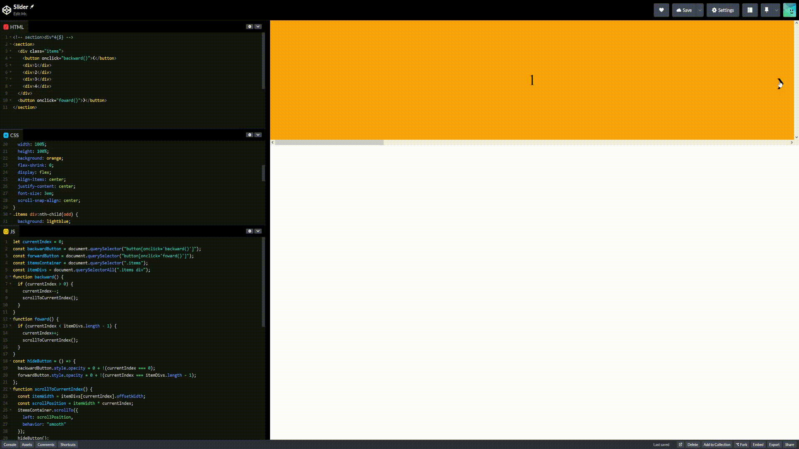

+++
author = "毛哥EM"
title = "Day28 純 JavaScript Slider (ft.  CSS scroll-snap-type)"
date = "2023-10-12"
series = ["不用庫 也能酷 - 玩轉 CSS & Js 特效"]
tags = ["HTML", "CSS", "JS"]
categories = [""]
thumbnail = "https://em-tec.github.io/images/ironman2023.webp"
featureImage = "https://em-tec.github.io/images/ironman2023-banner.webp"
shareImage = "https://em-tec.github.io/images/ironman2023-banner.webp"
+++
今天我們要來製作Slider效果。不過要用一個你應該沒有看過有人這樣做但卻很簡單的方法。

應用應該不用我多說，不管是公司網站展示產品，學校輪播榮譽榜，還是業界案例輪播介紹都會使用到slider。而我今天忙到晚上九點半才開始寫文章是因為白天在做這個心理測驗，左右滑動效果也是使用slider。


不過想到要定位、還要偵測各種滑鼠點擊、移動、手機點擊就十分麻煩。你寫 code 累 debug 累瀏覽器也累要一直監聽…歸剛欸…

這時 CSS 又出現了。向你介紹：` scroll-snap-type`。

##  scroll-snap-type

這個屬性可以讓元素上下或左右滑動時一滑就是整頁。我覺得最讚的是可以在筆電上面的觸控板直接往右滾，而且因為是內建語法所以非常順暢。使用用法如下:

```css
/* 不開 */
scroll-snap-type: none;

/* 開 */
scroll-snap-type: x;
scroll-snap-type: y;
scroll-snap-type: block;
scroll-snap-type: inline;
scroll-snap-type: both;

/* 縮寫，加上 強制 | 接近 設定 */
/* mandatory | proximity */
scroll-snap-type: x mandatory;
scroll-snap-type: y proximity;
scroll-snap-type: both mandatory;
```
建議設定成 `mandatory`比較能確保有被吸附到。

我的用法如下，外元素設定`scroll-snap-type: x mandatory`，內元素設定對齊位置`  scroll-snap-align: center`置中。完整版面如下:



```html
<section>
  <div class="items">
    <button onclick="backward()">❮</button>
    <div>1</div>
    <div>2</div>
    <div>3</div>
    <div>4</div>
  </div>
  <button onclick="foward()">❯</button>
</section>
```
```css
* {
  padding: 0;
  margin: 0;
  box-sizing: border-box;
}
body {
  overflow: hidden;
}
section {
  position: relative;
}
.items {
  display: flex;
  height: 400px;
  width: 100%;
  overflow: scroll;
  scroll-snap-type: x mandatory;
}
.items div {
  width: 100%;
  height: 100%;
  background: orange;
  flex-shrink: 0;
  display: flex;
  align-items: center;
  justify-content: center;
  font-size: 3em;
  scroll-snap-align: center;
}
.items div:nth-child(odd) {
  background: lightblue;
}
button {
  position: absolute;
  top: 50%;
  left: 1em;
  transform: translate(-50%, -50%);
  outline: transparent;
  border: none;
  background: transparent;
  font-size: 3em;
  transition: transform 0.3s;
  cursor: pointer;
}
section button:last-child {
  left: unset;
  right: 1em;
}
section button:last-child:hover {
  transform: translate(-20%, -50%);
}
section button:first-child:hover {
  transform: translate(-80%, -50%);
}
```

我還加上了往左右的按鈕，這樣用滑鼠點擊或是滑動，就這麼簡單。最後來加上 JavaScript，讓按鈕可以點擊。


##  JavaScript

先用變數用來追蹤當前顯示的圖片的索引。一開始它被設定為0，代表第一張圖片。

```js
let currentIndex = 0
```

接下來是往左右的函式。在滾動之前，它會檢查是否可以向前或向後查看圖片。如果可以，就會增加或減少 currentIndex，然後調用 `scrollToCurrentIndex()` 函式。

```js
function backward() {
  if (currentIndex > 0) {
    currentIndex--;
    scrollToCurrentIndex();
  }
}
function foward() {
  if (currentIndex < itemDivs.length - 1) {
    currentIndex++;
    scrollToCurrentIndex();
  }
}
```

來寫滾動的函式。它會計算當前圖片的寬度，然後根據 currentIndex 的值來滾動 itemsContainer 到正確的位置，使用平滑的滾動效果。然後它呼叫 `hideButton()` 函式來控制按鈕的可見度，讓按鈕在滾動到最左邊或最右邊時隱藏。

```js
function scrollToCurrentIndex() {
  const itemWidth = itemDivs[currentIndex].offsetWidth;
  const scrollPosition = itemWidth * currentIndex;
  itemsContainer.scrollTo({
    left: scrollPosition,
    behavior: "smooth"
  });
  hideButton();
}
```

來寫一個函式來控制按鈕的可見度。如果 currentIndex 為0，表示目前是第一張圖片。因為 `false` 是 0 所以我們直接把透明度設為 0+false，這樣可以少寫兩行 if else。如果 currentIndex 等於最後一張圖片的索引，就會隱藏向前按鈕。因為"是"第一章圖片是 true 所以加上 `!` 變成 false，透明度就是 `0+false=0`。如果不是第一張圖片就是 true，透明度就是 `0+true=1`。

```js
const hideButton = () => {
  backwardButton.style.opacity = 0 + !(currentIndex === 0);
  forwardButton.style.opacity = 0 + !(currentIndex === itemDivs.length - 1);
};
```

對了如果用觸控板滾動也要確認一下位置，來正確顯示按鈕。

```js
itemsContainer.addEventListener("scroll", function () {
  currentIndex = Math.round(
    itemsContainer.scrollLeft / itemDivs[0].offsetWidth
  );
  hideButton();
});
```

完整的 JavaScript 如下:

```
let currentIndex = 0;
const backwardButton = document.querySelector("button[onclick='backward()']");
const forwardButton = document.querySelector("button[onclick='foward()']");
const itemsContainer = document.querySelector(".items");
const itemDivs = document.querySelectorAll(".items div");
function backward() {
  if (currentIndex > 0) {
    currentIndex--;
    scrollToCurrentIndex();
  }
}
function foward() {
  if (currentIndex < itemDivs.length - 1) {
    currentIndex++;
    scrollToCurrentIndex();
  }
}
const hideButton = () => {
  backwardButton.style.opacity = 0 + !(currentIndex === 0);
  forwardButton.style.opacity = 0 + !(currentIndex === itemDivs.length - 1);
};
function scrollToCurrentIndex() {
  const itemWidth = itemDivs[currentIndex].offsetWidth;
  const scrollPosition = itemWidth * currentIndex;
  itemsContainer.scrollTo({
    left: scrollPosition,
    behavior: "smooth"
  });
  hideButton();
}
scrollToCurrentIndex();
itemsContainer.addEventListener("scroll", function () {
  currentIndex = Math.round(
    itemsContainer.scrollLeft / itemDivs[0].offsetWidth
  );
  hideButton();
});
```
## 成果

> 因為我今天是用桌機所以沒有觸控板給我滾。如果你不喜觀滾動條的話可以用 CSS 隱藏。
> 
 ```css
  /* Hide scrollbar for Chrome, Safari and Opera */
.example::-webkit-scrollbar {
  display: none;
}

/* Hide scrollbar for IE, Edge and Firefox */
.example {
  -ms-overflow-style: none;  /* IE and Edge */
  scrollbar-width: none;  /* Firefox */
} 
```

https://codepen.io/edit-mr/pen/dywrReK




以上就是我今天的分享，我們使用少許的程式碼就做出這個性能十分不錯的陽春 slider。你可以再加上一點裝飾，比如在底下放上顯示當前圖片的小圓點，或是加上自動播放。如果你有興趣可以自己試試看，抓取個數、移動的距離、以及移動的函數上面都有提供。 *也需這個系列出書之後就會提到呢!* 歡迎在 [Instagram](https://www.instagram.com/em.tec.blog) 和 [Google 新聞](https://news.google.com/publications/CAAqBwgKMKXLvgswsubVAw?ceid=TW:zh-Hant&oc=3)追蹤[毛哥EM資訊密技](https://em-tec.github.io/)，也歡迎訂閱我新開的[YouTube頻道：網棧](https://www.youtube.com/@webpallet)。

我是毛哥EM，讓我們明天再見。