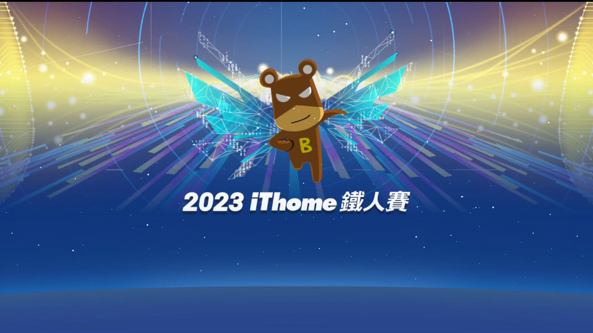
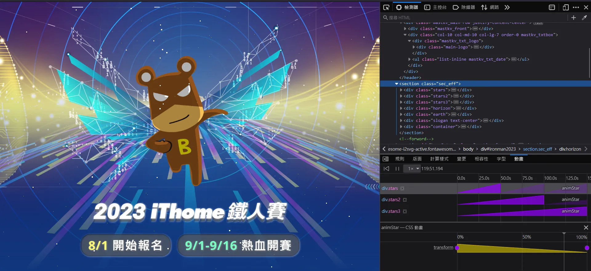

+++
author = "毛哥EM"
title = "Day 29 鐵人賽太空粒子的例子"
date = "2023-10-13"
series = ["不用庫 也能酷 - 玩轉 CSS & Js 特效"]
tags = ["HTML", "CSS", "JS"]
categories = [""]
thumbnail = "https://em-tec.github.io/images/ironman2023.webp"
featureImage = "https://em-tec.github.io/images/ironman2023-banner.webp"
shareImage = "https://em-tec.github.io/images/ironman2023-banner.webp"
+++
相信大家對於這個頁面都不陌生吧。這是我們2023 iThome 鐵人賽的首頁。我覺得他的粒子特效和地球很酷，所以我們今天就來看看怎麼做吧。


以下是今天我們的目標。為了版面乾淨我省略了上面的文字，只留下熊俠、標題、粒子特效、和地球。且為了讓他不要太長我有稍微縮小了一點。



## HTML 架構

上面 header 我們放了兩張圖片，一個是熊俠，一個是標題。下面的 section 我們放了五個 div，它們分別是

* 粒子特效
* 粒子特效
* 粒子特效
* 光線
* 地球

```html
<header>
  
  
</header>
<section class="sec_eff">
  <div class="stars"></div>
  <div class="stars2"></div>
  <div class="stars3"></div>
  <div class="horizon">
    <div class="glow"></div>
  </div>
  <div class="earth"></div>
  </div>
</section>
```

## header 版面

裡面兩張圖片用 `flex` 置中。背景放圖片上面疊上一層漸層。大小設為 cover 確保圖片有填滿。最後再調整一下上方的 padding 讓它看起來比較好看。

>　背景圖片寫前面的會疊在上面，寫後面的會疊在下面。

> 官網在背景圖片設定 `background-size` 時因為被 `background` 屬性預設的 `auto` 值影響，所以使用了 `!important`，不過其實只需要打在後面就可以了。

```css
header {
  display: flex;
  justify-content: center;
  align-items: center;
  flex-direction: column;
  height: 60vh;
  background: linear-gradient(
      to bottom,
      rgba(17, 55, 126, 0) 0%,
      rgba(17, 55, 126, 0) 35%,
      rgba(17, 55, 126, 1) 100%
    ),
    url(https://ithelp.ithome.com.tw/static/2023ironman/img/kv_bg.jpg) no-repeat
      center;
  background-size: cover;
  padding-top: 3.5rem;
}
header img {
  width: 37%;
}
```

## 宇宙

我們先弄一個宇宙

```css
  background: #11377e;
  min-height: 40vh;
  position: relative;
```

然後做一束高光，並進行定位。原理是先搞一個橢圓形


```css
.horizon {
  position: absolute;
  width: 160%;
  height: 70%;
  background: #038bff;
  left: -30%;
  bottom: -20%;
  border-radius: 100%/100%;
}
```

然後再模糊一下


```css
filter: blur(30px);
```

關於置中我們之前有提到，可以把 `left` 設為 `(寬度-100)/2`，這樣就不需要再用 `transform` 或是 `margin-left` 來調整位置了。

> 複習: [Day17 css.wav - 純 CSS 波浪進度條](https://ithelp.ithome.com.tw/articles/10332433)

再多加幾個光點

```css
.horizon:before {
  content: "";
  position: absolute;
  width: 81.25%;
  height: 70%;
  background: #51afff;
  -webkit-filter: blur(30px);
  opacity: 0.6;
  margin-left: 9.375%;
  border-radius: 100%/100%;
}

.horizon:after {
  content: " ";
  position: absolute;
  width: 32%;
  height: 20%;
  border-radius: 650px/350px;
  background: #b0daff;
  -webkit-filter: blur(30px);
  opacity: 0.5;
  margin-left: 34%;
  border-radius: 100%/100%;
}

.horizon .glow {
  position: absolute;
  width: 100%;
  height: 100%;
  background: #215496;
  -webkit-filter: blur(200px);
  opacity: 0.7;
  top: -10%;
  border-radius: 100%/100%;
}
```
## 地球

加上一點內陰影讓他看起來更有立體感。

```css
.earth {
  position: absolute;
  width: 200%;
  height: 100%;
  background: #2c4790;
  left: -50%;
  bottom: -50%;
  border-radius: 100%/100%;
  box-shadow: inset 0px 0px 62px 20px rgba(60, 105, 138, 0.85);
}
```

## 星空

星空效果 iThome 沒有使用什麼 [particles.js](https://vincentgarreau.com/particles.js/)。我們打開 FireFox Dev Tools 的動畫分頁可以看出原來這是一個長150秒的往上移動 CSS 動畫。



```css
@keyframes animStar {
  from {
    transform: translateY(0px);
  }

  to {
    transform: translateY(-2000px);
  }
}
```

而裡面是使用陰影製作放入一堆星星座標，這些點點會隨著動畫往上移動。我們放三個 div 來做三層星空，而裡面再使用 `::before` 和 `::after` 來做更多的星星。以下是一個星星大概的樣子。

```css
.stars {
  width: 1px;
  height: 1px;
  background: transparent;
  box-shadow: 1665px 905px #fff, 1973px 1300px #fff, 873px 1598px #fff,
    1380px 1879px #fff, 1694px 73px #fff, 84px 1196px #fff, 64px 203px #fff,
    1153px 637px #fff, 1123px 586px #fff, 1522px 1014px #fff, 585px 991px #fff...
}
```

好啦結合在一起完成了，我們來看看成果吧。

https://codepen.io/edit-mr/pen/OJrGmyW


```html
<header>
  
  
</header>
<section class="sec_eff">
  <div class="stars"></div>
  <div class="stars2"></div>
  <div class="stars3"></div>
  <div class="horizon">
    <div class="glow"></div>
  </div>
  <div class="earth"></div>
  </div>
</section>
```

```css
* {
  padding: 0;
  margin: 0;
  box-sizing: border-box;
}
body {
  overflow: hidden;
}
header {
  display: flex;
  justify-content: center;
  align-items: center;
  flex-direction: column;
  height: 60vh;
  background: linear-gradient(
      to bottom,
      rgba(17, 55, 126, 0) 0%,
      rgba(17, 55, 126, 0) 35%,
      rgba(17, 55, 126, 1) 100%
    ),
    url(https://ithelp.ithome.com.tw/static/2023ironman/img/kv_bg.jpg) no-repeat
      center;
  background-size: cover;
  padding-top: 3.5rem;
}
header img {
  width: 37%;
}
section {
  padding: 0;
  background: #11377e;
  height: 40vh;
  position: relative;
}

.stars {
  width: 1px;
  height: 1px;
  background: transparent;
  box-shadow: 1665px 905px #fff, 1973px 1300px #fff, 873px 1598px #fff,
    1380px 1879px #fff, 1694px 73px #fff, 84px 1196px #fff, 64px 203px #fff,
    1153px 637px #fff, 1123px 586px #fff, 1522px 1014px #fff, 585px 991px #fff,
    919px 475px #fff, 1304px 1012px #fff, 41px 405px #fff, 413px 1035px #fff,
    964px 1719px #fff, 1297px 1968px #fff, 921px 313px #fff, 1672px 1797px #fff,
    1936px 1414px #fff, 1330px 1893px #fff, 137px 1968px #fff, 650px 80px #fff,
    1010px 164px #fff, 1812px 1531px #fff, 932px 1391px #fff, 1866px 1791px #fff,
    448px 709px #fff, 1197px 361px #fff, 598px 1716px #fff, 201px 1385px #fff,
    619px 1008px #fff, 399px 594px #fff, 1920px 400px #fff, 1191px 1610px #fff,
    38px 1305px #fff, 1585px 1996px #fff, 82px 1248px #fff, 1718px 1511px #fff,
    1911px 1385px #fff, 432px 429px #fff, 877px 1753px #fff, 1942px 1041px #fff,
    1179px 1237px #fff, 803px 873px #fff, 1349px 1953px #fff, 716px 396px #fff,
    945px 785px #fff, 727px 1451px #fff, 1609px 1074px #fff, 729px 1982px #fff,
    1600px 263px #fff, 1759px 1512px #fff, 1647px 1963px #fff, 476px 567px #fff,
    1233px 1450px #fff, 409px 289px #fff, 868px 635px #fff, 1742px 961px #fff,
    1667px 530px #fff, 219px 1025px #fff, 441px 380px #fff, 418px 154px #fff,
    1481px 1171px #fff, 1356px 1389px #fff, 1542px 1527px #fff, 820px 562px #fff,
    1550px 1619px #fff, 1844px 862px #fff, 1251px 274px #fff, 1813px 1213px #fff,
    188px 1861px #fff, 374px 680px #fff, 9px 1554px #fff, 241px 77px #fff,
    759px 1856px #fff, 763px 968px #fff, 1430px 304px #fff, 265px 559px #fff,
    1780px 1729px #fff, 1818px 78px #fff, 1332px 1435px #fff, 1949px 1900px #fff,
    521px 21px #fff, 1552px 106px #fff, 756px 764px #fff, 783px 1985px #fff,
    1431px 776px #fff, 1320px 211px #fff, 784px 461px #fff, 1012px 1314px #fff,
    1632px 1042px #fff, 813px 1963px #fff, 1391px 1922px #fff,
    1929px 1748px #fff, 777px 1088px #fff, 1462px 1982px #fff, 210px 123px #fff,
    155px 1187px #fff, 1451px 1023px #fff, 1172px 1449px #fff, 934px 1741px #fff,
    942px 607px #fff, 387px 1425px #fff, 987px 255px #fff, 278px 1531px #fff,
    372px 1977px #fff, 379px 710px #fff, 1219px 468px #fff, 1243px 898px #fff,
    154px 1255px #fff, 1798px 1264px #fff, 1481px 401px #fff, 338px 1887px #fff,
    171px 1488px #fff, 802px 685px #fff, 1px 906px #fff, 378px 1993px #fff,
    1432px 1237px #fff, 425px 350px #fff, 1369px 244px #fff, 109px 797px #fff,
    1851px 522px #fff, 1987px 1805px #fff, 270px 1738px #fff, 1004px 776px #fff,
    671px 13px #fff, 61px 1461px #fff, 1846px 65px #fff, 383px 1457px #fff,
    861px 945px #fff, 1429px 145px #fff, 784px 1077px #fff, 78px 1226px #fff,
    285px 1185px #fff, 1933px 1295px #fff, 735px 981px #fff, 1714px 1944px #fff,
    1443px 1623px #fff, 1176px 1887px #fff, 773px 680px #fff, 1829px 1191px #fff,
    1154px 1509px #fff, 1005px 1941px #fff, 165px 1152px #fff, 968px 519px #fff,
    1066px 1787px #fff, 793px 1313px #fff, 688px 1287px #fff, 462px 970px #fff,
    1401px 959px #fff, 616px 386px #fff, 239px 1679px #fff, 1894px 575px #fff,
    1721px 894px #fff, 410px 1883px #fff, 434px 1714px #fff, 1190px 663px #fff,
    857px 1661px #fff, 969px 201px #fff, 987px 1321px #fff, 774px 1403px #fff,
    416px 759px #fff, 1740px 1727px #fff, 180px 1776px #fff, 1222px 1208px #fff,
    1628px 1226px #fff, 1626px 25px #fff, 1490px 403px #fff, 971px 228px #fff,
    1968px 566px #fff, 642px 1329px #fff, 1190px 707px #fff, 1654px 1781px #fff,
    570px 856px #fff, 1598px 1631px #fff, 1945px 1078px #fff, 452px 322px #fff,
    854px 953px #fff, 117px 939px #fff, 147px 233px #fff, 1731px 1954px #fff,
    1792px 1077px #fff, 979px 1290px #fff, 558px 1357px #fff, 26px 1194px #fff,
    1781px 366px #fff, 1187px 1547px #fff, 1096px 1628px #fff, 1286px 275px #fff,
    718px 728px #fff, 402px 968px #fff, 1568px 389px #fff, 602px 1986px #fff,
    347px 260px #fff, 1319px 790px #fff, 49px 118px #fff, 1405px 1009px #fff,
    1190px 794px #fff, 1080px 943px #fff, 488px 1273px #fff, 602px 521px #fff,
    172px 1277px #fff, 899px 1474px #fff, 1501px 1252px #fff, 1930px 565px #fff,
    1281px 696px #fff, 1859px 63px #fff, 717px 797px #fff, 435px 557px #fff,
    1703px 1909px #fff, 1243px 1573px #fff, 1088px 100px #fff, 575px 1207px #fff,
    1544px 1619px #fff, 1387px 1643px #fff, 794px 144px #fff, 542px 1224px #fff,
    1451px 1206px #fff, 1592px 380px #fff, 478px 1121px #fff, 1487px 1294px #fff,
    32px 823px #fff, 1982px 527px #fff, 482px 1527px #fff, 488px 852px #fff,
    1393px 1932px #fff, 1931px 1506px #fff, 558px 299px #fff, 677px 1152px #fff,
    1473px 1639px #fff, 1949px 515px #fff, 1353px 982px #fff, 594px 1517px #fff,
    10px 1896px #fff, 512px 1217px #fff, 1738px 973px #fff, 614px 640px #fff,
    86px 231px #fff, 1567px 850px #fff, 1601px 218px #fff, 1979px 276px #fff,
    654px 922px #fff, 400px 1552px #fff, 706px 1483px #fff, 930px 882px #fff,
    1651px 1636px #fff, 732px 1662px #fff, 1069px 1105px #fff, 1304px 561px #fff,
    193px 1671px #fff, 906px 1141px #fff, 380px 1301px #fff, 146px 24px #fff,
    133px 522px #fff, 1645px 502px #fff, 719px 1320px #fff, 1702px 1031px #fff,
    792px 1457px #fff, 1668px 907px #fff, 1149px 175px #fff, 1017px 1718px #fff,
    554px 524px #fff, 1705px 1905px #fff, 1082px 450px #fff, 1895px 848px #fff,
    738px 689px #fff, 381px 501px #fff, 1018px 1607px #fff, 298px 499px #fff,
    38px 142px #fff, 339px 1859px #fff, 731px 1198px #fff, 485px 768px #fff,
    636px 1676px #fff, 768px 435px #fff, 702px 195px #fff, 1921px 5px #fff,
    761px 1840px #fff, 552px 35px #fff, 1607px 1610px #fff, 1406px 1483px #fff,
    1056px 672px #fff, 1564px 1621px #fff, 714px 1408px #fff, 1246px 1449px #fff,
    186px 1871px #fff, 861px 1109px #fff, 1285px 1601px #fff, 1446px 279px #fff,
    1526px 1055px #fff, 1277px 1963px #fff, 474px 343px #fff, 968px 1803px #fff,
    14px 50px #fff, 1730px 1656px #fff, 1765px 1521px #fff, 1352px 375px #fff,
    476px 1313px #fff, 52px 1780px #fff, 1502px 1264px #fff, 503px 965px #fff,
    1134px 1713px #fff, 1978px 939px #fff, 1051px 1208px #fff, 249px 1302px #fff,
    246px 1055px #fff, 1575px 1616px #fff, 138px 1501px #fff, 330px 667px #fff,
    1516px 1155px #fff, 1972px 1487px #fff, 333px 341px #fff, 1895px 1578px #fff,
    1176px 664px #fff, 454px 1200px #fff, 845px 1459px #fff, 913px 1051px #fff,
    1642px 1485px #fff, 1652px 1038px #fff, 1530px 1160px #fff,
    172px 1145px #fff, 1311px 1476px #fff, 1509px 937px #fff, 102px 1820px #fff,
    1868px 1916px #fff, 1592px 1062px #fff, 1326px 46px #fff, 343px 1594px #fff,
    1829px 1180px #fff, 1583px 786px #fff, 1359px 759px #fff, 307px 284px #fff,
    1652px 1360px #fff, 1433px 886px #fff, 1893px 708px #fff, 1728px 352px #fff,
    1121px 606px #fff, 1213px 540px #fff, 1581px 978px #fff, 1264px 1589px #fff,
    1477px 600px #fff, 497px 209px #fff, 315px 1061px #fff, 1420px 1210px #fff,
    420px 1765px #fff, 1653px 64px #fff, 822px 1625px #fff, 279px 1733px #fff,
    1702px 964px #fff, 596px 1341px #fff, 901px 920px #fff, 1673px 781px #fff,
    726px 1958px #fff, 141px 1661px #fff, 847px 853px #fff, 22px 1618px #fff,
    1048px 131px #fff, 1212px 1058px #fff, 641px 1931px #fff, 223px 1919px #fff,
    1127px 49px #fff, 154px 1429px #fff, 619px 481px #fff, 1297px 826px #fff,
    599px 1788px #fff, 988px 1997px #fff, 1558px 563px #fff, 1822px 763px #fff,
    1263px 1022px #fff, 1743px 1143px #fff, 759px 1320px #fff, 1146px 153px #fff,
    329px 343px #fff, 776px 424px #fff, 988px 958px #fff, 732px 1349px #fff,
    1262px 1329px #fff, 1970px 1937px #fff, 1485px 220px #fff,
    1642px 1851px #fff, 967px 1320px #fff, 1976px 834px #fff, 831px 1727px #fff,
    1247px 575px #fff, 914px 1639px #fff, 745px 609px #fff, 1620px 1933px #fff,
    812px 1503px #fff, 18px 798px #fff, 669px 189px #fff, 1927px 332px #fff,
    1084px 330px #fff, 1569px 1651px #fff, 1843px 1392px #fff, 985px 1337px #fff,
    228px 260px #fff, 1115px 1455px #fff, 1489px 1404px #fff, 300px 1470px #fff,
    1480px 567px #fff, 103px 1131px #fff, 902px 499px #fff, 1254px 1008px #fff,
    1545px 1498px #fff, 698px 11px #fff, 1794px 1178px #fff, 1331px 984px #fff,
    1311px 1813px #fff, 1166px 600px #fff, 353px 64px #fff, 1881px 1215px #fff,
    70px 223px #fff, 124px 1287px #fff, 489px 758px #fff, 515px 1073px #fff,
    925px 288px #fff, 341px 853px #fff, 67px 821px #fff, 497px 692px #fff,
    1063px 401px #fff, 1900px 1380px #fff, 212px 1516px #fff, 369px 1477px #fff,
    259px 674px #fff, 167px 1283px #fff, 1217px 1546px #fff, 1752px 1666px #fff,
    1318px 605px #fff, 1015px 466px #fff, 1794px 1552px #fff, 367px 1003px #fff,
    1459px 283px #fff, 849px 689px #fff, 1894px 79px #fff, 698px 1136px #fff,
    550px 32px #fff, 1437px 1747px #fff, 1613px 1305px #fff, 561px 65px #fff,
    742px 452px #fff, 890px 777px #fff, 1246px 293px #fff, 1207px 423px #fff,
    373px 1772px #fff, 400px 360px #fff, 827px 1859px #fff, 1711px 579px #fff,
    1815px 493px #fff, 1659px 180px #fff, 821px 293px #fff, 1958px 754px #fff,
    575px 1385px #fff, 346px 478px #fff, 1632px 1059px #fff, 1841px 1840px #fff,
    813px 899px #fff, 963px 48px #fff, 1357px 120px #fff, 594px 1608px #fff,
    797px 16px #fff, 1372px 1261px #fff, 1205px 1624px #fff, 1777px 1519px #fff,
    55px 232px #fff, 1416px 1668px #fff, 65px 494px #fff, 636px 639px #fff,
    1166px 376px #fff, 863px 1606px #fff, 32px 160px #fff, 162px 1992px #fff,
    282px 838px #fff, 712px 1613px #fff, 752px 126px #fff, 1809px 1834px #fff,
    551px 775px #fff, 1832px 1796px #fff, 426px 399px #fff, 1032px 1571px #fff,
    379px 1453px #fff, 1186px 1504px #fff, 1529px 1867px #fff, 667px 1442px #fff,
    140px 1797px #fff, 857px 1938px #fff, 1760px 1655px #fff, 880px 742px #fff,
    1674px 1773px #fff, 1718px 776px #fff, 439px 1401px #fff, 1002px 1741px #fff,
    1251px 772px #fff, 570px 215px #fff, 1903px 844px #fff, 1598px 95px #fff,
    660px 1679px #fff, 934px 395px #fff, 561px 1650px #fff, 357px 1790px #fff,
    565px 474px #fff, 1682px 1789px #fff, 805px 988px #fff, 822px 1438px #fff,
    881px 896px #fff, 1909px 1729px #fff, 1307px 875px #fff, 1286px 273px #fff,
    484px 340px #fff, 1136px 742px #fff, 682px 23px #fff, 842px 1920px #fff,
    144px 519px #fff, 1738px 1091px #fff, 1918px 1267px #fff, 227px 1061px #fff,
    21px 168px #fff, 435px 1977px #fff, 674px 430px #fff, 262px 750px #fff,
    1693px 323px #fff, 723px 1818px #fff, 1562px 1459px #fff, 335px 973px #fff,
    801px 1301px #fff, 1319px 1975px #fff, 514px 1767px #fff, 727px 1414px #fff,
    549px 1046px #fff, 1875px 995px #fff, 1671px 1727px #fff, 1084px 1149px #fff,
    1893px 1598px #fff, 1670px 1491px #fff, 963px 64px #fff, 304px 398px #fff,
    7px 1926px #fff, 1725px 421px #fff, 356px 1055px #fff, 302px 1760px #fff,
    1604px 504px #fff, 985px 545px #fff, 800px 1492px #fff, 1787px 449px #fff,
    1467px 627px #fff, 454px 966px #fff, 851px 491px #fff, 149px 1643px #fff,
    705px 1305px #fff, 1995px 726px #fff, 381px 1345px #fff, 1079px 498px #fff,
    835px 299px #fff, 1573px 236px #fff, 1918px 1261px #fff, 1094px 871px #fff,
    1814px 954px #fff, 1123px 183px #fff, 1329px 1692px #fff, 400px 578px #fff,
    32px 180px #fff, 488px 653px #fff, 1598px 1956px #fff, 60px 215px #fff,
    677px 187px #fff, 1916px 301px #fff, 1568px 9px #fff, 1288px 744px #fff,
    379px 131px #fff, 676px 181px #fff, 1152px 1560px #fff, 60px 444px #fff,
    273px 417px #fff, 1905px 1728px #fff, 292px 1031px #fff, 1169px 675px #fff,
    253px 1946px #fff, 1980px 566px #fff, 1919px 1554px #fff, 1257px 112px #fff,
    375px 1784px #fff, 872px 546px #fff, 1478px 643px #fff, 1617px 1383px #fff,
    434px 1720px #fff, 1432px 383px #fff, 544px 1041px #fff, 1305px 1662px #fff,
    837px 1942px #fff, 1003px 1239px #fff, 1620px 1263px #fff, 34px 1965px #fff,
    910px 649px #fff, 517px 1192px #fff, 380px 1986px #fff, 998px 1217px #fff,
    1907px 1336px #fff, 1553px 905px #fff, 787px 1618px #fff, 1821px 1220px #fff,
    879px 924px #fff, 461px 1082px #fff, 355px 1521px #fff, 1525px 544px #fff,
    973px 773px #fff, 1769px 1168px #fff, 1944px 865px #fff, 963px 426px #fff,
    749px 1869px #fff, 1297px 1077px #fff, 1383px 429px #fff, 762px 1953px #fff,
    545px 313px #fff, 1852px 1012px #fff, 792px 465px #fff, 1901px 172px #fff,
    1419px 1071px #fff, 846px 1524px #fff, 1060px 438px #fff, 700px 481px #fff,
    1916px 575px #fff, 612px 914px #fff, 682px 1849px #fff, 1402px 235px #fff,
    347px 1728px #fff, 1727px 569px #fff, 1028px 502px #fff, 1259px 498px #fff,
    533px 470px #fff, 23px 1264px #fff, 1063px 1847px #fff, 1604px 1186px #fff,
    1344px 1048px #fff, 1940px 580px #fff, 1383px 954px #fff, 867px 685px #fff,
    1937px 1817px #fff, 1854px 1462px #fff, 1542px 744px #fff, 42px 1194px #fff,
    1606px 411px #fff, 1162px 1787px #fff, 1262px 1133px #fff, 990px 42px #fff,
    776px 1810px #fff, 1620px 1919px #fff, 1182px 1125px #fff, 112px 874px #fff,
    468px 1881px #fff, 1681px 127px #fff, 853px 416px #fff, 661px 1038px #fff,
    1875px 218px #fff, 883px 1792px #fff, 537px 386px #fff, 763px 1013px #fff,
    558px 862px #fff, 1766px 1106px #fff, 826px 70px #fff, 1785px 1216px #fff,
    27px 1710px #fff, 1226px 416px #fff, 835px 1570px #fff, 346px 63px #fff,
    1217px 611px #fff, 1265px 879px #fff, 1276px 840px #fff, 817px 1228px #fff,
    83px 674px #fff, 685px 766px #fff, 1945px 554px #fff, 697px 691px #fff,
    332px 115px #fff, 770px 758px #fff, 1739px 757px #fff, 1417px 825px #fff,
    928px 1369px #fff, 579px 905px #fff, 1862px 1695px #fff, 1991px 880px #fff,
    1501px 415px #fff, 1319px 347px #fff, 713px 930px #fff, 1317px 1131px #fff,
    1034px 1871px #fff, 760px 134px #fff, 724px 656px #fff, 1380px 1623px #fff,
    383px 1183px #fff, 5px 953px #fff, 1614px 1248px #fff, 1510px 1350px #fff,
    255px 217px #fff, 544px 1096px #fff, 1818px 413px #fff, 1165px 255px #fff,
    1372px 1813px #fff, 1173px 1888px #fff, 1970px 1388px #fff, 1032px 87px #fff;
  animation: animStar 50s linear infinite;
}

.stars:after {
  content: " ";
  position: absolute;
  top: 2000px;
  width: 1px;
  height: 1px;
  background: transparent;
  box-shadow: 1665px 905px #fff, 1973px 1300px #fff, 873px 1598px #fff,
    1380px 1879px #fff, 1694px 73px #fff, 84px 1196px #fff, 64px 203px #fff,
    1153px 637px #fff, 1123px 586px #fff, 1522px 1014px #fff, 585px 991px #fff,
    919px 475px #fff, 1304px 1012px #fff, 41px 405px #fff, 413px 1035px #fff,
    964px 1719px #fff, 1297px 1968px #fff, 921px 313px #fff, 1672px 1797px #fff,
    1936px 1414px #fff, 1330px 1893px #fff, 137px 1968px #fff, 650px 80px #fff,
    1010px 164px #fff, 1812px 1531px #fff, 932px 1391px #fff, 1866px 1791px #fff,
    448px 709px #fff, 1197px 361px #fff, 598px 1716px #fff, 201px 1385px #fff,
    619px 1008px #fff, 399px 594px #fff, 1920px 400px #fff, 1191px 1610px #fff,
    38px 1305px #fff, 1585px 1996px #fff, 82px 1248px #fff, 1718px 1511px #fff,
    1911px 1385px #fff, 432px 429px #fff, 877px 1753px #fff, 1942px 1041px #fff,
    1179px 1237px #fff, 803px 873px #fff, 1349px 1953px #fff, 716px 396px #fff,
    945px 785px #fff, 727px 1451px #fff, 1609px 1074px #fff, 729px 1982px #fff,
    1600px 263px #fff, 1759px 1512px #fff, 1647px 1963px #fff, 476px 567px #fff,
    1233px 1450px #fff, 409px 289px #fff, 868px 635px #fff, 1742px 961px #fff,
    1667px 530px #fff, 219px 1025px #fff, 441px 380px #fff, 418px 154px #fff,
    1481px 1171px #fff, 1356px 1389px #fff, 1542px 1527px #fff, 820px 562px #fff,
    1550px 1619px #fff, 1844px 862px #fff, 1251px 274px #fff, 1813px 1213px #fff,
    188px 1861px #fff, 374px 680px #fff, 9px 1554px #fff, 241px 77px #fff,
    759px 1856px #fff, 763px 968px #fff, 1430px 304px #fff, 265px 559px #fff,
    1780px 1729px #fff, 1818px 78px #fff, 1332px 1435px #fff, 1949px 1900px #fff,
    521px 21px #fff, 1552px 106px #fff, 756px 764px #fff, 783px 1985px #fff,
    1431px 776px #fff, 1320px 211px #fff, 784px 461px #fff, 1012px 1314px #fff,
    1632px 1042px #fff, 813px 1963px #fff, 1391px 1922px #fff,
    1929px 1748px #fff, 777px 1088px #fff, 1462px 1982px #fff, 210px 123px #fff,
    155px 1187px #fff, 1451px 1023px #fff, 1172px 1449px #fff, 934px 1741px #fff,
    942px 607px #fff, 387px 1425px #fff, 987px 255px #fff, 278px 1531px #fff,
    372px 1977px #fff, 379px 710px #fff, 1219px 468px #fff, 1243px 898px #fff,
    154px 1255px #fff, 1798px 1264px #fff, 1481px 401px #fff, 338px 1887px #fff,
    171px 1488px #fff, 802px 685px #fff, 1px 906px #fff, 378px 1993px #fff,
    1432px 1237px #fff, 425px 350px #fff, 1369px 244px #fff, 109px 797px #fff,
    1851px 522px #fff, 1987px 1805px #fff, 270px 1738px #fff, 1004px 776px #fff,
    671px 13px #fff, 61px 1461px #fff, 1846px 65px #fff, 383px 1457px #fff,
    861px 945px #fff, 1429px 145px #fff, 784px 1077px #fff, 78px 1226px #fff,
    285px 1185px #fff, 1933px 1295px #fff, 735px 981px #fff, 1714px 1944px #fff,
    1443px 1623px #fff, 1176px 1887px #fff, 773px 680px #fff, 1829px 1191px #fff,
    1154px 1509px #fff, 1005px 1941px #fff, 165px 1152px #fff, 968px 519px #fff,
    1066px 1787px #fff, 793px 1313px #fff, 688px 1287px #fff, 462px 970px #fff,
    1401px 959px #fff, 616px 386px #fff, 239px 1679px #fff, 1894px 575px #fff,
    1721px 894px #fff, 410px 1883px #fff, 434px 1714px #fff, 1190px 663px #fff,
    857px 1661px #fff, 969px 201px #fff, 987px 1321px #fff, 774px 1403px #fff,
    416px 759px #fff, 1740px 1727px #fff, 180px 1776px #fff, 1222px 1208px #fff,
    1628px 1226px #fff, 1626px 25px #fff, 1490px 403px #fff, 971px 228px #fff,
    1968px 566px #fff, 642px 1329px #fff, 1190px 707px #fff, 1654px 1781px #fff,
    570px 856px #fff, 1598px 1631px #fff, 1945px 1078px #fff, 452px 322px #fff,
    854px 953px #fff, 117px 939px #fff, 147px 233px #fff, 1731px 1954px #fff,
    1792px 1077px #fff, 979px 1290px #fff, 558px 1357px #fff, 26px 1194px #fff,
    1781px 366px #fff, 1187px 1547px #fff, 1096px 1628px #fff, 1286px 275px #fff,
    718px 728px #fff, 402px 968px #fff, 1568px 389px #fff, 602px 1986px #fff,
    347px 260px #fff, 1319px 790px #fff, 49px 118px #fff, 1405px 1009px #fff,
    1190px 794px #fff, 1080px 943px #fff, 488px 1273px #fff, 602px 521px #fff,
    172px 1277px #fff, 899px 1474px #fff, 1501px 1252px #fff, 1930px 565px #fff,
    1281px 696px #fff, 1859px 63px #fff, 717px 797px #fff, 435px 557px #fff,
    1703px 1909px #fff, 1243px 1573px #fff, 1088px 100px #fff, 575px 1207px #fff,
    1544px 1619px #fff, 1387px 1643px #fff, 794px 144px #fff, 542px 1224px #fff,
    1451px 1206px #fff, 1592px 380px #fff, 478px 1121px #fff, 1487px 1294px #fff,
    32px 823px #fff, 1982px 527px #fff, 482px 1527px #fff, 488px 852px #fff,
    1393px 1932px #fff, 1931px 1506px #fff, 558px 299px #fff, 677px 1152px #fff,
    1473px 1639px #fff, 1949px 515px #fff, 1353px 982px #fff, 594px 1517px #fff,
    10px 1896px #fff, 512px 1217px #fff, 1738px 973px #fff, 614px 640px #fff,
    86px 231px #fff, 1567px 850px #fff, 1601px 218px #fff, 1979px 276px #fff,
    654px 922px #fff, 400px 1552px #fff, 706px 1483px #fff, 930px 882px #fff,
    1651px 1636px #fff, 732px 1662px #fff, 1069px 1105px #fff, 1304px 561px #fff,
    193px 1671px #fff, 906px 1141px #fff, 380px 1301px #fff, 146px 24px #fff,
    133px 522px #fff, 1645px 502px #fff, 719px 1320px #fff, 1702px 1031px #fff,
    792px 1457px #fff, 1668px 907px #fff, 1149px 175px #fff, 1017px 1718px #fff,
    554px 524px #fff, 1705px 1905px #fff, 1082px 450px #fff, 1895px 848px #fff,
    738px 689px #fff, 381px 501px #fff, 1018px 1607px #fff, 298px 499px #fff,
    38px 142px #fff, 339px 1859px #fff, 731px 1198px #fff, 485px 768px #fff,
    636px 1676px #fff, 768px 435px #fff, 702px 195px #fff, 1921px 5px #fff,
    761px 1840px #fff, 552px 35px #fff, 1607px 1610px #fff, 1406px 1483px #fff,
    1056px 672px #fff, 1564px 1621px #fff, 714px 1408px #fff, 1246px 1449px #fff,
    186px 1871px #fff, 861px 1109px #fff, 1285px 1601px #fff, 1446px 279px #fff,
    1526px 1055px #fff, 1277px 1963px #fff, 474px 343px #fff, 968px 1803px #fff,
    14px 50px #fff, 1730px 1656px #fff, 1765px 1521px #fff, 1352px 375px #fff,
    476px 1313px #fff, 52px 1780px #fff, 1502px 1264px #fff, 503px 965px #fff,
    1134px 1713px #fff, 1978px 939px #fff, 1051px 1208px #fff, 249px 1302px #fff,
    246px 1055px #fff, 1575px 1616px #fff, 138px 1501px #fff, 330px 667px #fff,
    1516px 1155px #fff, 1972px 1487px #fff, 333px 341px #fff, 1895px 1578px #fff,
    1176px 664px #fff, 454px 1200px #fff, 845px 1459px #fff, 913px 1051px #fff,
    1642px 1485px #fff, 1652px 1038px #fff, 1530px 1160px #fff,
    172px 1145px #fff, 1311px 1476px #fff, 1509px 937px #fff, 102px 1820px #fff,
    1868px 1916px #fff, 1592px 1062px #fff, 1326px 46px #fff, 343px 1594px #fff,
    1829px 1180px #fff, 1583px 786px #fff, 1359px 759px #fff, 307px 284px #fff,
    1652px 1360px #fff, 1433px 886px #fff, 1893px 708px #fff, 1728px 352px #fff,
    1121px 606px #fff, 1213px 540px #fff, 1581px 978px #fff, 1264px 1589px #fff,
    1477px 600px #fff, 497px 209px #fff, 315px 1061px #fff, 1420px 1210px #fff,
    420px 1765px #fff, 1653px 64px #fff, 822px 1625px #fff, 279px 1733px #fff,
    1702px 964px #fff, 596px 1341px #fff, 901px 920px #fff, 1673px 781px #fff,
    726px 1958px #fff, 141px 1661px #fff, 847px 853px #fff, 22px 1618px #fff,
    1048px 131px #fff, 1212px 1058px #fff, 641px 1931px #fff, 223px 1919px #fff,
    1127px 49px #fff, 154px 1429px #fff, 619px 481px #fff, 1297px 826px #fff,
    599px 1788px #fff, 988px 1997px #fff, 1558px 563px #fff, 1822px 763px #fff,
    1263px 1022px #fff, 1743px 1143px #fff, 759px 1320px #fff, 1146px 153px #fff,
    329px 343px #fff, 776px 424px #fff, 988px 958px #fff, 732px 1349px #fff,
    1262px 1329px #fff, 1970px 1937px #fff, 1485px 220px #fff,
    1642px 1851px #fff, 967px 1320px #fff, 1976px 834px #fff, 831px 1727px #fff,
    1247px 575px #fff, 914px 1639px #fff, 745px 609px #fff, 1620px 1933px #fff,
    812px 1503px #fff, 18px 798px #fff, 669px 189px #fff, 1927px 332px #fff,
    1084px 330px #fff, 1569px 1651px #fff, 1843px 1392px #fff, 985px 1337px #fff,
    228px 260px #fff, 1115px 1455px #fff, 1489px 1404px #fff, 300px 1470px #fff,
    1480px 567px #fff, 103px 1131px #fff, 902px 499px #fff, 1254px 1008px #fff,
    1545px 1498px #fff, 698px 11px #fff, 1794px 1178px #fff, 1331px 984px #fff,
    1311px 1813px #fff, 1166px 600px #fff, 353px 64px #fff, 1881px 1215px #fff,
    70px 223px #fff, 124px 1287px #fff, 489px 758px #fff, 515px 1073px #fff,
    925px 288px #fff, 341px 853px #fff, 67px 821px #fff, 497px 692px #fff,
    1063px 401px #fff, 1900px 1380px #fff, 212px 1516px #fff, 369px 1477px #fff,
    259px 674px #fff, 167px 1283px #fff, 1217px 1546px #fff, 1752px 1666px #fff,
    1318px 605px #fff, 1015px 466px #fff, 1794px 1552px #fff, 367px 1003px #fff,
    1459px 283px #fff, 849px 689px #fff, 1894px 79px #fff, 698px 1136px #fff,
    550px 32px #fff, 1437px 1747px #fff, 1613px 1305px #fff, 561px 65px #fff,
    742px 452px #fff, 890px 777px #fff, 1246px 293px #fff, 1207px 423px #fff,
    373px 1772px #fff, 400px 360px #fff, 827px 1859px #fff, 1711px 579px #fff,
    1815px 493px #fff, 1659px 180px #fff, 821px 293px #fff, 1958px 754px #fff,
    575px 1385px #fff, 346px 478px #fff, 1632px 1059px #fff, 1841px 1840px #fff,
    813px 899px #fff, 963px 48px #fff, 1357px 120px #fff, 594px 1608px #fff,
    797px 16px #fff, 1372px 1261px #fff, 1205px 1624px #fff, 1777px 1519px #fff,
    55px 232px #fff, 1416px 1668px #fff, 65px 494px #fff, 636px 639px #fff,
    1166px 376px #fff, 863px 1606px #fff, 32px 160px #fff, 162px 1992px #fff,
    282px 838px #fff, 712px 1613px #fff, 752px 126px #fff, 1809px 1834px #fff,
    551px 775px #fff, 1832px 1796px #fff, 426px 399px #fff, 1032px 1571px #fff,
    379px 1453px #fff, 1186px 1504px #fff, 1529px 1867px #fff, 667px 1442px #fff,
    140px 1797px #fff, 857px 1938px #fff, 1760px 1655px #fff, 880px 742px #fff,
    1674px 1773px #fff, 1718px 776px #fff, 439px 1401px #fff, 1002px 1741px #fff,
    1251px 772px #fff, 570px 215px #fff, 1903px 844px #fff, 1598px 95px #fff,
    660px 1679px #fff, 934px 395px #fff, 561px 1650px #fff, 357px 1790px #fff,
    565px 474px #fff, 1682px 1789px #fff, 805px 988px #fff, 822px 1438px #fff,
    881px 896px #fff, 1909px 1729px #fff, 1307px 875px #fff, 1286px 273px #fff,
    484px 340px #fff, 1136px 742px #fff, 682px 23px #fff, 842px 1920px #fff,
    144px 519px #fff, 1738px 1091px #fff, 1918px 1267px #fff, 227px 1061px #fff,
    21px 168px #fff, 435px 1977px #fff, 674px 430px #fff, 262px 750px #fff,
    1693px 323px #fff, 723px 1818px #fff, 1562px 1459px #fff, 335px 973px #fff,
    801px 1301px #fff, 1319px 1975px #fff, 514px 1767px #fff, 727px 1414px #fff,
    549px 1046px #fff, 1875px 995px #fff, 1671px 1727px #fff, 1084px 1149px #fff,
    1893px 1598px #fff, 1670px 1491px #fff, 963px 64px #fff, 304px 398px #fff,
    7px 1926px #fff, 1725px 421px #fff, 356px 1055px #fff, 302px 1760px #fff,
    1604px 504px #fff, 985px 545px #fff, 800px 1492px #fff, 1787px 449px #fff,
    1467px 627px #fff, 454px 966px #fff, 851px 491px #fff, 149px 1643px #fff,
    705px 1305px #fff, 1995px 726px #fff, 381px 1345px #fff, 1079px 498px #fff,
    835px 299px #fff, 1573px 236px #fff, 1918px 1261px #fff, 1094px 871px #fff,
    1814px 954px #fff, 1123px 183px #fff, 1329px 1692px #fff, 400px 578px #fff,
    32px 180px #fff, 488px 653px #fff, 1598px 1956px #fff, 60px 215px #fff,
    677px 187px #fff, 1916px 301px #fff, 1568px 9px #fff, 1288px 744px #fff,
    379px 131px #fff, 676px 181px #fff, 1152px 1560px #fff, 60px 444px #fff,
    273px 417px #fff, 1905px 1728px #fff, 292px 1031px #fff, 1169px 675px #fff,
    253px 1946px #fff, 1980px 566px #fff, 1919px 1554px #fff, 1257px 112px #fff,
    375px 1784px #fff, 872px 546px #fff, 1478px 643px #fff, 1617px 1383px #fff,
    434px 1720px #fff, 1432px 383px #fff, 544px 1041px #fff, 1305px 1662px #fff,
    837px 1942px #fff, 1003px 1239px #fff, 1620px 1263px #fff, 34px 1965px #fff,
    910px 649px #fff, 517px 1192px #fff, 380px 1986px #fff, 998px 1217px #fff,
    1907px 1336px #fff, 1553px 905px #fff, 787px 1618px #fff, 1821px 1220px #fff,
    879px 924px #fff, 461px 1082px #fff, 355px 1521px #fff, 1525px 544px #fff,
    973px 773px #fff, 1769px 1168px #fff, 1944px 865px #fff, 963px 426px #fff,
    749px 1869px #fff, 1297px 1077px #fff, 1383px 429px #fff, 762px 1953px #fff,
    545px 313px #fff, 1852px 1012px #fff, 792px 465px #fff, 1901px 172px #fff,
    1419px 1071px #fff, 846px 1524px #fff, 1060px 438px #fff, 700px 481px #fff,
    1916px 575px #fff, 612px 914px #fff, 682px 1849px #fff, 1402px 235px #fff,
    347px 1728px #fff, 1727px 569px #fff, 1028px 502px #fff, 1259px 498px #fff,
    533px 470px #fff, 23px 1264px #fff, 1063px 1847px #fff, 1604px 1186px #fff,
    1344px 1048px #fff, 1940px 580px #fff, 1383px 954px #fff, 867px 685px #fff,
    1937px 1817px #fff, 1854px 1462px #fff, 1542px 744px #fff, 42px 1194px #fff,
    1606px 411px #fff, 1162px 1787px #fff, 1262px 1133px #fff, 990px 42px #fff,
    776px 1810px #fff, 1620px 1919px #fff, 1182px 1125px #fff, 112px 874px #fff,
    468px 1881px #fff, 1681px 127px #fff, 853px 416px #fff, 661px 1038px #fff,
    1875px 218px #fff, 883px 1792px #fff, 537px 386px #fff, 763px 1013px #fff,
    558px 862px #fff, 1766px 1106px #fff, 826px 70px #fff, 1785px 1216px #fff,
    27px 1710px #fff, 1226px 416px #fff, 835px 1570px #fff, 346px 63px #fff,
    1217px 611px #fff, 1265px 879px #fff, 1276px 840px #fff, 817px 1228px #fff,
    83px 674px #fff, 685px 766px #fff, 1945px 554px #fff, 697px 691px #fff,
    332px 115px #fff, 770px 758px #fff, 1739px 757px #fff, 1417px 825px #fff,
    928px 1369px #fff, 579px 905px #fff, 1862px 1695px #fff, 1991px 880px #fff,
    1501px 415px #fff, 1319px 347px #fff, 713px 930px #fff, 1317px 1131px #fff,
    1034px 1871px #fff, 760px 134px #fff, 724px 656px #fff, 1380px 1623px #fff,
    383px 1183px #fff, 5px 953px #fff, 1614px 1248px #fff, 1510px 1350px #fff,
    255px 217px #fff, 544px 1096px #fff, 1818px 413px #fff, 1165px 255px #fff,
    1372px 1813px #fff, 1173px 1888px #fff, 1970px 1388px #fff, 1032px 87px #fff;
}

.stars2 {
  width: 2px;
  height: 2px;
  background: transparent;
  box-shadow: 197px 1147px #fff, 1881px 971px #fff, 31px 834px #fff,
    898px 1518px #fff, 1701px 1126px #fff, 467px 1034px #fff, 1360px 983px #fff,
    1687px 1784px #fff, 1739px 29px #fff, 145px 993px #fff, 1187px 722px #fff,
    527px 910px #fff, 1491px 715px #fff, 1173px 1910px #fff, 755px 1917px #fff,
    1830px 1185px #fff, 1663px 583px #fff, 543px 1875px #fff, 490px 1340px #fff,
    987px 547px #fff, 158px 409px #fff, 1011px 1813px #fff, 1860px 534px #fff,
    322px 1560px #fff, 835px 1698px #fff, 1838px 685px #fff, 1622px 1913px #fff,
    441px 738px #fff, 899px 1509px #fff, 416px 1186px #fff, 130px 1103px #fff,
    1554px 1736px #fff, 906px 1867px #fff, 1776px 340px #fff, 632px 1394px #fff,
    1861px 601px #fff, 1578px 200px #fff, 1500px 560px #fff, 1187px 1553px #fff,
    1443px 1685px #fff, 1417px 1211px #fff, 1305px 808px #fff, 1418px 779px #fff,
    1938px 1205px #fff, 1320px 595px #fff, 501px 3px #fff, 1315px 381px #fff,
    778px 264px #fff, 327px 1252px #fff, 1692px 753px #fff, 41px 41px #fff,
    1775px 1273px #fff, 1995px 314px #fff, 293px 1048px #fff, 509px 1092px #fff,
    34px 375px #fff, 533px 664px #fff, 538px 469px #fff, 856px 589px #fff,
    1077px 1850px #fff, 280px 1938px #fff, 1130px 1300px #fff, 847px 1652px #fff,
    1777px 806px #fff, 999px 1869px #fff, 701px 1483px #fff, 1803px 762px #fff,
    1530px 254px #fff, 1153px 1277px #fff, 1397px 1096px #fff, 1676px 873px #fff,
    1671px 244px #fff, 1979px 668px #fff, 1266px 1192px #fff, 1968px 43px #fff,
    1110px 1896px #fff, 1666px 203px #fff, 1025px 1577px #fff, 1840px 193px #fff,
    996px 525px #fff, 1023px 1083px #fff, 1809px 1247px #fff, 546px 391px #fff,
    813px 801px #fff, 398px 1228px #fff, 1699px 1495px #fff, 96px 381px #fff,
    1238px 98px #fff, 1870px 94px #fff, 1715px 241px #fff, 415px 1345px #fff,
    1867px 506px #fff, 624px 453px #fff, 1200px 1662px #fff, 1889px 790px #fff,
    613px 1546px #fff, 1884px 462px #fff, 163px 227px #fff, 1527px 66px #fff,
    422px 587px #fff, 423px 1393px #fff, 1187px 755px #fff, 202px 683px #fff,
    1784px 811px #fff, 84px 45px #fff, 208px 174px #fff, 1060px 414px #fff,
    1501px 772px #fff, 1612px 1821px #fff, 1901px 395px #fff, 1480px 1744px #fff,
    1592px 675px #fff, 358px 840px #fff, 705px 1818px #fff, 1667px 1180px #fff,
    1123px 386px #fff, 1912px 1561px #fff, 804px 112px #fff, 309px 1476px #fff,
    244px 253px #fff, 1027px 1937px #fff, 1036px 558px #fff, 621px 1442px #fff,
    768px 628px #fff, 756px 89px #fff, 1044px 319px #fff, 1297px 1667px #fff,
    945px 1218px #fff, 789px 1990px #fff, 665px 1467px #fff, 1836px 81px #fff,
    415px 1273px #fff, 68px 1205px #fff, 1621px 1823px #fff, 85px 1610px #fff,
    1252px 1125px #fff, 334px 958px #fff, 1422px 1069px #fff, 1488px 455px #fff,
    1570px 374px #fff, 1012px 698px #fff, 86px 581px #fff, 519px 1176px #fff,
    1279px 1961px #fff, 1181px 321px #fff, 1593px 1111px #fff, 555px 84px #fff,
    1071px 1481px #fff, 530px 1495px #fff, 367px 1954px #fff, 94px 1355px #fff,
    815px 417px #fff, 1409px 1428px #fff, 1680px 1781px #fff, 1040px 488px #fff,
    1552px 1718px #fff, 1767px 1851px #fff, 32px 362px #fff, 1924px 636px #fff,
    286px 1412px #fff, 1489px 1248px #fff, 614px 1651px #fff, 1106px 329px #fff,
    254px 1103px #fff, 1010px 325px #fff, 999px 1061px #fff, 408px 1958px #fff,
    407px 1585px #fff, 764px 774px #fff, 1173px 896px #fff, 1258px 638px #fff,
    1744px 1072px #fff, 1944px 931px #fff, 1727px 1278px #fff, 289px 649px #fff,
    1870px 222px #fff, 1418px 776px #fff, 1269px 975px #fff, 906px 1686px #fff,
    1545px 1267px #fff, 1418px 388px #fff, 46px 738px #fff, 1268px 899px #fff,
    536px 1685px #fff, 1186px 142px #fff, 1144px 1663px #fff, 1144px 682px #fff,
    146px 1758px #fff, 1775px 222px #fff, 1272px 781px #fff, 1267px 911px #fff,
    1355px 337px #fff, 1733px 1418px #fff, 883px 1415px #fff, 1892px 687px #fff,
    607px 783px #fff, 538px 734px #fff, 789px 1344px #fff, 1358px 596px #fff,
    1728px 1015px #fff;
  animation: animStar 100s linear infinite;
}

.stars2:after {
  content: " ";
  position: absolute;
  top: 2000px;
  width: 2px;
  height: 2px;
  background: transparent;
  box-shadow: 197px 1147px #fff, 1881px 971px #fff, 31px 834px #fff,
    898px 1518px #fff, 1701px 1126px #fff, 467px 1034px #fff, 1360px 983px #fff,
    1687px 1784px #fff, 1739px 29px #fff, 145px 993px #fff, 1187px 722px #fff,
    527px 910px #fff, 1491px 715px #fff, 1173px 1910px #fff, 755px 1917px #fff,
    1830px 1185px #fff, 1663px 583px #fff, 543px 1875px #fff, 490px 1340px #fff,
    987px 547px #fff, 158px 409px #fff, 1011px 1813px #fff, 1860px 534px #fff,
    322px 1560px #fff, 835px 1698px #fff, 1838px 685px #fff, 1622px 1913px #fff,
    441px 738px #fff, 899px 1509px #fff, 416px 1186px #fff, 130px 1103px #fff,
    1554px 1736px #fff, 906px 1867px #fff, 1776px 340px #fff, 632px 1394px #fff,
    1861px 601px #fff, 1578px 200px #fff, 1500px 560px #fff, 1187px 1553px #fff,
    1443px 1685px #fff, 1417px 1211px #fff, 1305px 808px #fff, 1418px 779px #fff,
    1938px 1205px #fff, 1320px 595px #fff, 501px 3px #fff, 1315px 381px #fff,
    778px 264px #fff, 327px 1252px #fff, 1692px 753px #fff, 41px 41px #fff,
    1775px 1273px #fff, 1995px 314px #fff, 293px 1048px #fff, 509px 1092px #fff,
    34px 375px #fff, 533px 664px #fff, 538px 469px #fff, 856px 589px #fff,
    1077px 1850px #fff, 280px 1938px #fff, 1130px 1300px #fff, 847px 1652px #fff,
    1777px 806px #fff, 999px 1869px #fff, 701px 1483px #fff, 1803px 762px #fff,
    1530px 254px #fff, 1153px 1277px #fff, 1397px 1096px #fff, 1676px 873px #fff,
    1671px 244px #fff, 1979px 668px #fff, 1266px 1192px #fff, 1968px 43px #fff,
    1110px 1896px #fff, 1666px 203px #fff, 1025px 1577px #fff, 1840px 193px #fff,
    996px 525px #fff, 1023px 1083px #fff, 1809px 1247px #fff, 546px 391px #fff,
    813px 801px #fff, 398px 1228px #fff, 1699px 1495px #fff, 96px 381px #fff,
    1238px 98px #fff, 1870px 94px #fff, 1715px 241px #fff, 415px 1345px #fff,
    1867px 506px #fff, 624px 453px #fff, 1200px 1662px #fff, 1889px 790px #fff,
    613px 1546px #fff, 1884px 462px #fff, 163px 227px #fff, 1527px 66px #fff,
    422px 587px #fff, 423px 1393px #fff, 1187px 755px #fff, 202px 683px #fff,
    1784px 811px #fff, 84px 45px #fff, 208px 174px #fff, 1060px 414px #fff,
    1501px 772px #fff, 1612px 1821px #fff, 1901px 395px #fff, 1480px 1744px #fff,
    1592px 675px #fff, 358px 840px #fff, 705px 1818px #fff, 1667px 1180px #fff,
    1123px 386px #fff, 1912px 1561px #fff, 804px 112px #fff, 309px 1476px #fff,
    244px 253px #fff, 1027px 1937px #fff, 1036px 558px #fff, 621px 1442px #fff,
    768px 628px #fff, 756px 89px #fff, 1044px 319px #fff, 1297px 1667px #fff,
    945px 1218px #fff, 789px 1990px #fff, 665px 1467px #fff, 1836px 81px #fff,
    415px 1273px #fff, 68px 1205px #fff, 1621px 1823px #fff, 85px 1610px #fff,
    1252px 1125px #fff, 334px 958px #fff, 1422px 1069px #fff, 1488px 455px #fff,
    1570px 374px #fff, 1012px 698px #fff, 86px 581px #fff, 519px 1176px #fff,
    1279px 1961px #fff, 1181px 321px #fff, 1593px 1111px #fff, 555px 84px #fff,
    1071px 1481px #fff, 530px 1495px #fff, 367px 1954px #fff, 94px 1355px #fff,
    815px 417px #fff, 1409px 1428px #fff, 1680px 1781px #fff, 1040px 488px #fff,
    1552px 1718px #fff, 1767px 1851px #fff, 32px 362px #fff, 1924px 636px #fff,
    286px 1412px #fff, 1489px 1248px #fff, 614px 1651px #fff, 1106px 329px #fff,
    254px 1103px #fff, 1010px 325px #fff, 999px 1061px #fff, 408px 1958px #fff,
    407px 1585px #fff, 764px 774px #fff, 1173px 896px #fff, 1258px 638px #fff,
    1744px 1072px #fff, 1944px 931px #fff, 1727px 1278px #fff, 289px 649px #fff,
    1870px 222px #fff, 1418px 776px #fff, 1269px 975px #fff, 906px 1686px #fff,
    1545px 1267px #fff, 1418px 388px #fff, 46px 738px #fff, 1268px 899px #fff,
    536px 1685px #fff, 1186px 142px #fff, 1144px 1663px #fff, 1144px 682px #fff,
    146px 1758px #fff, 1775px 222px #fff, 1272px 781px #fff, 1267px 911px #fff,
    1355px 337px #fff, 1733px 1418px #fff, 883px 1415px #fff, 1892px 687px #fff,
    607px 783px #fff, 538px 734px #fff, 789px 1344px #fff, 1358px 596px #fff,
    1728px 1015px #fff;
}

.stars3 {
  width: 3px;
  height: 3px;
  background: transparent;
  box-shadow: 1351px 1339px #fff, 1041px 1607px #fff, 748px 575px #fff,
    881px 567px #fff, 1630px 41px #fff, 1459px 990px #fff, 1946px 718px #fff,
    623px 1811px #fff, 872px 20px #fff, 1087px 1739px #fff, 1595px 1087px #fff,
    957px 721px #fff, 1399px 182px #fff, 1611px 1257px #fff, 402px 720px #fff,
    1666px 746px #fff, 1820px 1485px #fff, 1221px 1538px #fff, 36px 258px #fff,
    1154px 292px #fff, 998px 642px #fff, 1756px 1543px #fff, 1033px 1895px #fff,
    522px 115px #fff, 1329px 355px #fff, 1180px 1883px #fff, 1200px 438px #fff,
    1432px 595px #fff, 1295px 460px #fff, 779px 1071px #fff, 238px 1639px #fff,
    1504px 1257px #fff, 1815px 560px #fff, 1712px 1549px #fff, 1150px 890px #fff,
    1054px 658px #fff, 1715px 1751px #fff, 1994px 1439px #fff,
    1076px 1147px #fff, 878px 1108px #fff, 339px 1199px #fff, 1303px 975px #fff,
    1162px 649px #fff, 1903px 155px #fff, 1092px 706px #fff, 1028px 1752px #fff,
    432px 1314px #fff, 508px 1057px #fff, 173px 459px #fff, 749px 1819px #fff,
    856px 884px #fff, 1638px 1523px #fff, 323px 1905px #fff, 1148px 1513px #fff,
    16px 1416px #fff, 1611px 1779px #fff, 987px 830px #fff, 900px 15px #fff,
    642px 855px #fff, 1423px 964px #fff, 928px 752px #fff, 812px 1135px #fff,
    1067px 1384px #fff, 435px 1826px #fff, 1393px 1857px #fff, 971px 1542px #fff,
    110px 693px #fff, 453px 509px #fff, 849px 1126px #fff, 1627px 1176px #fff,
    1287px 88px #fff, 1265px 309px #fff, 671px 1984px #fff, 1514px 1833px #fff,
    243px 1832px #fff, 1516px 773px #fff, 1543px 461px #fff, 1363px 888px #fff,
    414px 1461px #fff, 1609px 1271px #fff, 1898px 1558px #fff, 412px 1579px #fff,
    1593px 1317px #fff, 1425px 1875px #fff, 951px 999px #fff, 418px 1254px #fff,
    595px 1779px #fff, 864px 754px #fff, 1052px 911px #fff, 1652px 1525px #fff,
    540px 389px #fff, 1380px 587px #fff, 1406px 1779px #fff, 251px 841px #fff,
    1806px 1696px #fff, 1599px 1165px #fff, 1965px 477px #fff,
    1861px 1781px #fff, 347px 135px #fff, 421px 1306px #fff;
  animation: animStar 150s linear infinite;
}

.stars3:after {
  content: " ";
  position: absolute;
  top: 2000px;
  width: 3px;
  height: 3px;
  background: transparent;
  box-shadow: 1351px 1339px #fff, 1041px 1607px #fff, 748px 575px #fff,
    881px 567px #fff, 1630px 41px #fff, 1459px 990px #fff, 1946px 718px #fff,
    623px 1811px #fff, 872px 20px #fff, 1087px 1739px #fff, 1595px 1087px #fff,
    957px 721px #fff, 1399px 182px #fff, 1611px 1257px #fff, 402px 720px #fff,
    1666px 746px #fff, 1820px 1485px #fff, 1221px 1538px #fff, 36px 258px #fff,
    1154px 292px #fff, 998px 642px #fff, 1756px 1543px #fff, 1033px 1895px #fff,
    522px 115px #fff, 1329px 355px #fff, 1180px 1883px #fff, 1200px 438px #fff,
    1432px 595px #fff, 1295px 460px #fff, 779px 1071px #fff, 238px 1639px #fff,
    1504px 1257px #fff, 1815px 560px #fff, 1712px 1549px #fff, 1150px 890px #fff,
    1054px 658px #fff, 1715px 1751px #fff, 1994px 1439px #fff,
    1076px 1147px #fff, 878px 1108px #fff, 339px 1199px #fff, 1303px 975px #fff,
    1162px 649px #fff, 1903px 155px #fff, 1092px 706px #fff, 1028px 1752px #fff,
    432px 1314px #fff, 508px 1057px #fff, 173px 459px #fff, 749px 1819px #fff,
    856px 884px #fff, 1638px 1523px #fff, 323px 1905px #fff, 1148px 1513px #fff,
    16px 1416px #fff, 1611px 1779px #fff, 987px 830px #fff, 900px 15px #fff,
    642px 855px #fff, 1423px 964px #fff, 928px 752px #fff, 812px 1135px #fff,
    1067px 1384px #fff, 435px 1826px #fff, 1393px 1857px #fff, 971px 1542px #fff,
    110px 693px #fff, 453px 509px #fff, 849px 1126px #fff, 1627px 1176px #fff,
    1287px 88px #fff, 1265px 309px #fff, 671px 1984px #fff, 1514px 1833px #fff,
    243px 1832px #fff, 1516px 773px #fff, 1543px 461px #fff, 1363px 888px #fff,
    414px 1461px #fff, 1609px 1271px #fff, 1898px 1558px #fff, 412px 1579px #fff,
    1593px 1317px #fff, 1425px 1875px #fff, 951px 999px #fff, 418px 1254px #fff,
    595px 1779px #fff, 864px 754px #fff, 1052px 911px #fff, 1652px 1525px #fff,
    540px 389px #fff, 1380px 587px #fff, 1406px 1779px #fff, 251px 841px #fff,
    1806px 1696px #fff, 1599px 1165px #fff, 1965px 477px #fff,
    1861px 1781px #fff, 347px 135px #fff, 421px 1306px #fff;
}

.horizon {
  position: absolute;
  width: 160%;
  height: 70%;
  background: #038bff;
  filter: blur(30px);
  left: -30%;
  bottom: -20%;
  border-radius: 100%/100%;
}

.horizon:before {
  content: "";
  position: absolute;
  width: 81.25%;
  height: 70%;
  background: #51afff;
  -webkit-filter: blur(30px);
  opacity: 0.6;
  margin-left: 9.375%;
  border-radius: 100%/100%;
}

.horizon:after {
  content: " ";
  position: absolute;
  width: 32%;
  height: 20%;
  border-radius: 650px/350px;
  background: #b0daff;
  -webkit-filter: blur(30px);
  opacity: 0.5;
  margin-left: 34%;
  border-radius: 100%/100%;
}

.horizon .glow {
  position: absolute;
  width: 100%;
  height: 100%;
  background: #215496;
  -webkit-filter: blur(200px);
  opacity: 0.7;
  top: -10%;
  border-radius: 100%/100%;
}

.earth {
  position: absolute;
  width: 200%;
  height: 100%;
  background: #2c4790;
  left: -50%;
  bottom: -50%;
  border-radius: 100%/100%;
  box-shadow: inset 0px 0px 62px 20px rgba(60, 105, 138, 0.85);
}

@keyframes animStar {
  from {
    transform: translateY(0px);
  }

  to {
    transform: translateY(-2000px);
  }
}
```

以上就是我今天的分享，歡迎在 [Instagram](https://www.instagram.com/em.tec.blog) 和 [Google 新聞](https://news.google.com/publications/CAAqBwgKMKXLvgswsubVAw?ceid=TW:zh-Hant&oc=3)追蹤[毛哥EM資訊密技](https://em-tec.github.io/)，也歡迎訂閱我新開的[YouTube頻道：網棧](https://www.youtube.com/@webpallet)。

我是毛哥EM，讓我們明天再見。