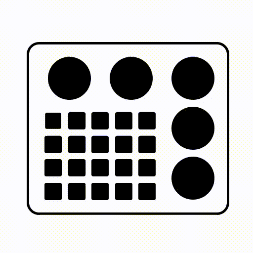

+++
author = "毛哥EM"
title = "載入中… Animation-delay"
date = "2023-10-19"
series = ["不用庫 也能酷 - 玩轉 CSS & Js 特效"]
tags = ["HTML", "CSS", "JS"]
categories = [""]

+++

# Day5 載入中… Animation-delay

假設你今天想製作這個載入動畫…

https://codepen.io/edit-mr/pen/YzdzvdV



可以看出來每個方塊的縮放速度是一樣的，只是越往右下就越有延遲對吧。昨天我們學到可以在 `animation` 設定延遲，其實也可以在 `animation-delay` 個別設定。讓我們來一步步用前面幾天學到的知識做出這個動畫吧。

## 用 flex 切版

在想要怎麼切板時可以尋找找齊排列的矩形來群組。以下是我想到的切版方式。


不知道這樣你知道如何下手了嗎?

我們先寫HTML。emmet縮寫如下。

```bash
main>(.left>(.wheelBox>.wheel*2)+.box>div*25)+.right>.wheel*3
<!-- 外框裡面 左邊 裝滾輪 裡面兩個 再一個裝按鈕 25個 右邊 三個滾輪-->
```

CSS 設定一下寬高、形狀、與排列方式

> 提示: `border-radius` 設定大於等於 `50%` 即可生成圓形
> 

```css
.box div,
.wheel {
  background-color: #000;
}
body {
  height: 100vh;
  display: flex;
  justify-content: center;
  align-items: center;
}
main {
  width: 300px;
  border: 4px solid #000;
  display: flex;
  border-radius: 20px;
  padding: 10px;
}
.wheel {
  width: 70px;
  height: 70px;
  border-radius: 50%;
}
.box,
.right,
.wheelBox {
  display: flex;
  justify-content: center;
  align-items: center;
  gap: 10px;
  flex-wrap: wrap;
  padding: 10px;
}
.wheelBox {
  justify-content: space-between;
  padding: 10px 20px;
}
.box div {
  width: 28px;
  height: 28px;
  border-radius: 3px;
  transform: scale(1);
  animation: 1.5s ease-in-out infinite zoom;
}
```

這樣就有靜態的外觀了


方塊得動畫我們設成

```css
animation: 1.5s ease-in-out infinite zoom;
```

代表他會無限重複，每次1.5秒。我們來建立 zoom 的動畫吧，我們先縮小、放大、然後維持在原尺寸直到動畫結束。

```css
@keyframes zoom {
  0% {
    transform: scale(1);
  }
  20% {
    transform: scale(0.7);
  }
	40% {
    transform: scale(1);
  }
}
```

重複的CSS可以縮寫在一起，像這樣

```css
@keyframes zoom {
  0%,
  40% {
    transform: scale(1);
  }
  20% {
    transform: scale(0.7);
  }
}
```

你就會得到一個同時縮放的動畫。我們希望它可以有海浪滾動的感覺，所以越右下角延遲應該要越大。


我們在 HTML 用行內 CSS 個別設定元素的延遲就可以了。可以使用 Emmet 生成再微調。

```html
<div class=box>
        <div style="animation-delay: .0s"></div>
        <div style="animation-delay: .1s"></div>
        <div style="animation-delay: .2s"></div>
        <div style="animation-delay: .3s"></div>
        <div style="animation-delay: .4s"></div>
        <div style="animation-delay: .1s"></div>
        <div style="animation-delay: .2s"></div>
        <div style="animation-delay: .3s"></div>
        <div style="animation-delay: .4s"></div>
        <div style="animation-delay: .5s"></div>
        <div style="animation-delay: .2s"></div>
        <div style="animation-delay: .3s"></div>
        <div style="animation-delay: .4s"></div>
        <div style="animation-delay: .5s"></div>
        <div style="animation-delay: .6s"></div>
        <div style="animation-delay: .3s"></div>
        <div style="animation-delay: .4s"></div>
        <div style="animation-delay: .5s"></div>
        <div style="animation-delay: .6s"></div>
        <div style="animation-delay: .7s"></div>
      </div>
```

這樣就能夠做出最上面的動畫啦! 如果你跟我一樣使用 Firefox Developer Edition，在偵錯工具可以看到動畫曲線。


再來一個小練習吧，來做一個圓圈載入 loading 動畫

## 圓圈 Loading 動畫

https://codepen.io/edit-mr/pen/LYMZeZE?editors=1100

首先我們先來製作圓圈。我畫了一張圖希望讓你更好理解。


我們把一個正方形放在畫面中間，並在裡面放入一個圓形。只要讓正方形旋轉裡面的圓形就會做圓周運動。我們只需要多疊幾個，並設定動畫的延遲及持續時間即可做出這個動畫。

旋轉動畫很簡單：

```css
@keyframes spin { to { transform: rotate(360deg) } }
```

在正方形上面套用，讓他無限旋轉。預設速度 ease 又漸入漸出效果。

```css
animation: spin 2s infinte
```

我有在正方形裡面再包一層正方形，讓我可以讓每個正方形再旋轉一點，使每一個的開始點和結束點不太一樣。所有的參數你都可以調整看看。

HTML Emmet如下：

```bash
.loading>(div[style="animation-delay: calc(.1s * $)"]>div[style="transform:rotate(calc(-15deg * $))"])*8
```

以上就是我今天的分享，歡迎在 [Instagram](https://www.instagram.com/em.tec.blog) 和 [Google 新聞](https://news.google.com/publications/CAAqBwgKMKXLvgswsubVAw?ceid=TW:zh-Hant&oc=3)追蹤[毛哥EM資訊密技](https://em-tec.github.io/)，也歡迎訂閱我新開的[YouTube頻道：網棧](https://www.youtube.com/@webpallet)。

我是毛哥EM，讓我們明天再見。