+++
author = "毛哥EM"
title = "用 iPhone 開機電腦和查看狀態 - 使用 ESP32 加入 Homekit"
date = "2024-01-09"
tags = ["iOS", "自製","Arduino","ESP32",]
categories = ["製作教學"]
thumbnail = ""
featureImage = ""
shareImage = ""
+++

你有沒有在遠端想要控制電腦，但是電腦沒有開機? 或著是享受一回到家電腦已經開好了的爽快。於是你研究如何使用 Wake On Lan，但是發現一定要用有線網路不能用 Wi-Fi? 看不到狀態就算了有時候還會失效?

<!--more-->

今天，我就要來和你分享如何使用 ESP32 加入 Homekit，讓你可以透過 iPhone 開機電腦和查看狀態。

<iframe src="https://www.facebook.com/plugins/post.php?href=https%3A%2F%2Fwww.facebook.com%2Freel%2F676807707915952&width=300&show_text=false&height=676&appId" width="300" height="676" style="border:none;overflow:hidden" scrolling="no" frameborder="0" allowfullscreen="true" allow="autoplay; clipboard-write; encrypted-media; picture-in-picture; web-share"></iframe>

{}

我們要使用的函式庫是 Homespan，它支援的是 Homekit 而不是 Matter 協議，因此可能無法在安卓裝置使用。你可以尋找其他函式庫或著替代解決方案。

{}

## 原理

讓電腦開機的原理很簡單，就是把按鈕按下就可以了。(廢話) 我們只要讓開機的 pin 腳短路就會傳送開機訊號，所以不管是按鈕、開關、甚至是用螺絲起子碰一下都可以讓他開機。而我們要用一個電晶體來控制它的開關。而讀取狀態也很簡單，只需要讓原本的指示 LED 與 Esp-32 並聯即可。

當然，Homekit 並沒有「開機按鈕」這種裝置，也沒有「電腦狀態感測器」。所以我們要~~騙~~和 Homekit 解釋這兩個分別是「燈泡開關」以及「室內溫度」。

{}

如果你不是一位創客不想要 DIY 的話，在網路上面可以找到直接類似功能的產品。或著是使用智慧開關，並在 BIOS 設定「通電時開機」即可。

{}

## 需要的材料

-   ESP32
-   杜邦線
-   電晶體
-   麵包板

當然，你可以使用任意你手邊可連接 Wi-Fi 的開發板，不過需要自行修改程式喔。

## 組裝

首先，請你確認主機板上面的腳位。可以查詢主機板的說明書，或者是直接看上面的文字標示。以我的老電腦 ASUS B150 pro 為例。PWR_LED 就是電源的指示燈 (Power LED)，PWR_SW 和 RESET 分邊是開關機鍵 (Power Switch) 與重新開機鍵。

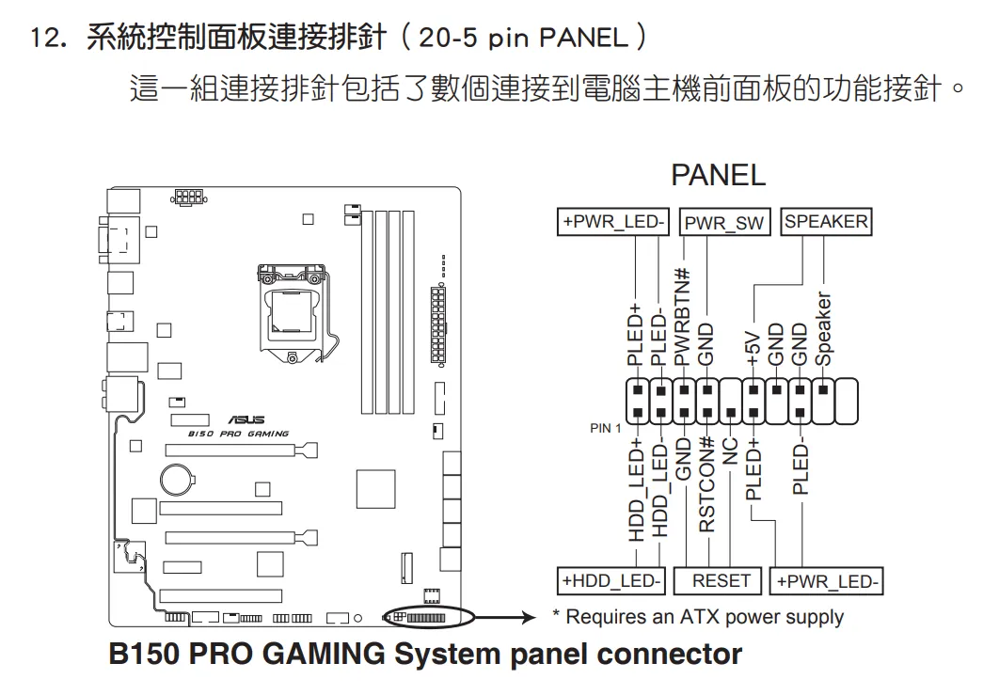

### 拔下原本杜邦線

我們會用到開機按鈕、重新啟動按鈕、和電源指示燈。確認好之後因為我們希望原本的開機鍵和按鈕指示燈都還是可以用，所以在拔下來這些母頭的杜邦線之後我們用公對公的杜邦線連起來讓它等一下可以插上麵包板上。建議可以用標籤或麥克筆標示一下等一下比較不會搞混。

### 連結電腦接口至麵包板

拔下來之後我們用公對公的杜邦線依序把電腦上的接口連接到麵包板上，接下來比較好操作。

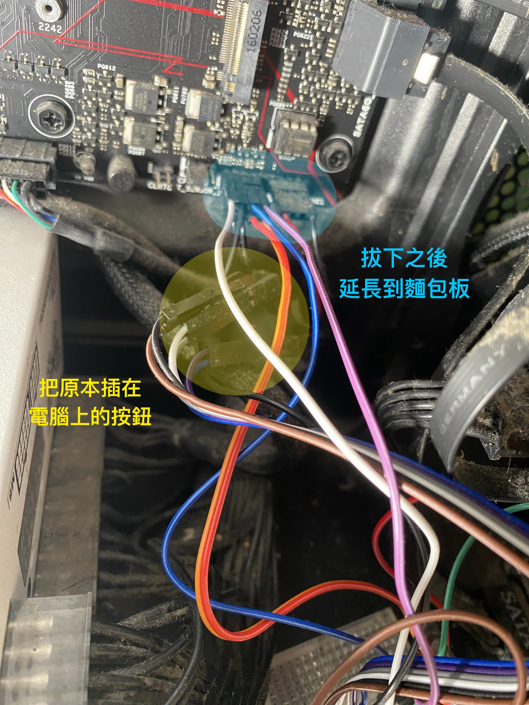

#### 連接 LED 指示燈

我們先插電源指示燈，因為比較簡單。只需與原本的 led 並排接到 esp32 上面即可。

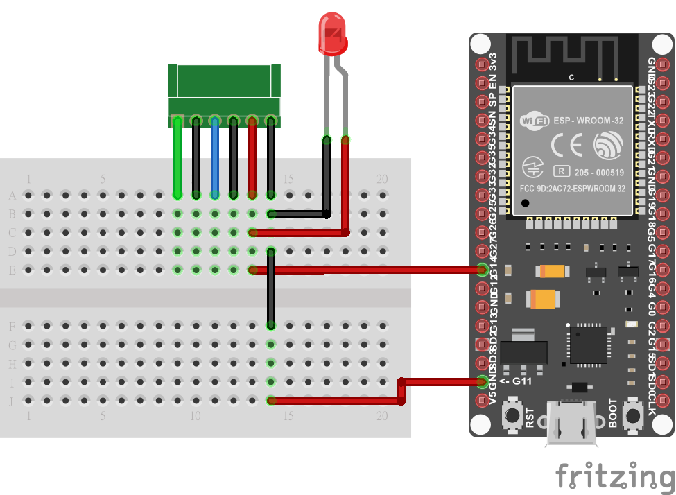

#### 連接開機與重開機按鍵

首先請確認你的電晶體腳位，不同的型號方向不太一樣。接著按照圖片的方式完成接線即可。當 ESP-32 輸出高電壓時按鈕就會通路，相當於按下按鈕。

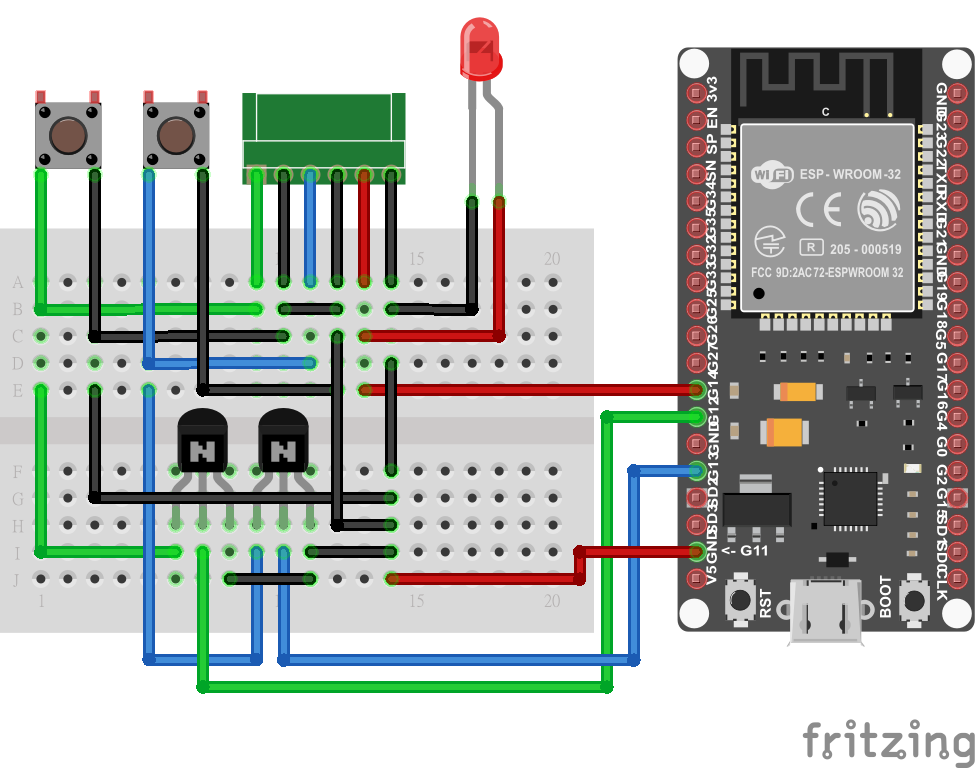

實際接線不會用到這麼多的杜邦線，我有盡量都用直角和不要重疊壤他看起來比較清楚。綠色板子左到右分別代表開機按鈕、GND、重開機按鈕、GND、電源指示燈、指示燈 GND。ESP32 上到下分別是插 14、12、13、GND。

兩顆按鈕的 GND 有可能是共用的。如果你的電腦開機後按鈕失效，理論上把兩顆按鈕的 GND 連接在一起。

這樣硬體組裝的部分，ESP32 建議可以放在主機裡面，然後找洞讓供電的 USB 線通過即可。

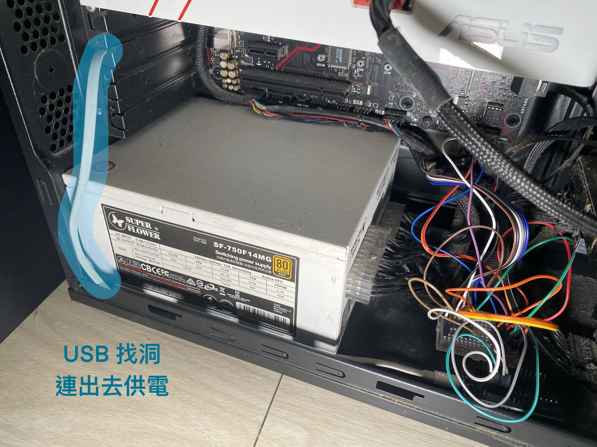

最難的部分已經完成囉。

## 燒錄程式

接下來我們要來把程式燒錄至 ESP32:

1. 請先從官網下載並安裝 Arduino IDE，點開一直下一步即可。
2. 在開始燒錄之前我們要先來安裝 ESP32 驅動函式庫和 Homekit 函式庫。請你開啟軟體點擊左上角的「檔案」，並選擇「偏好設置」。
   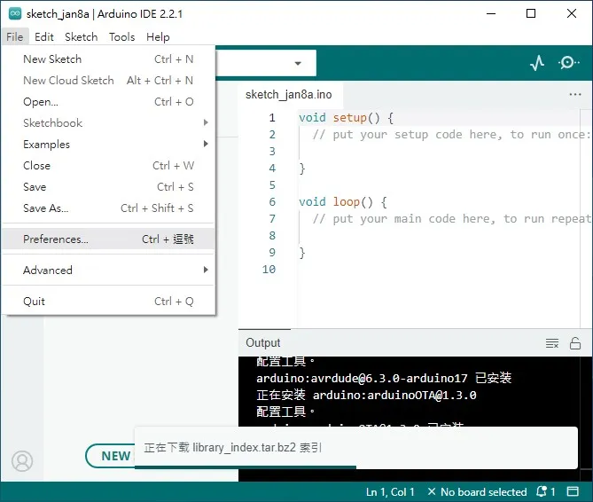
3. 在下面有一排可以讓你自行輸入函式庫網址的輸入框，請你貼上以下網址:
   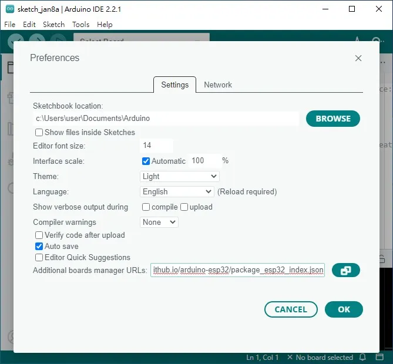
4. 請你進入 BOARDS MANAGER 並搜尋 esp32。安裝 Espressif 開發的的 ESP-32 套件。
   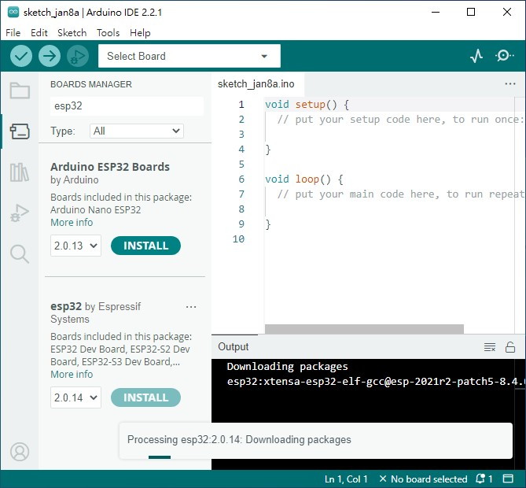
5. 請點擊左邊第三個的圖書標誌並搜尋 HomeSpan 並安裝。
   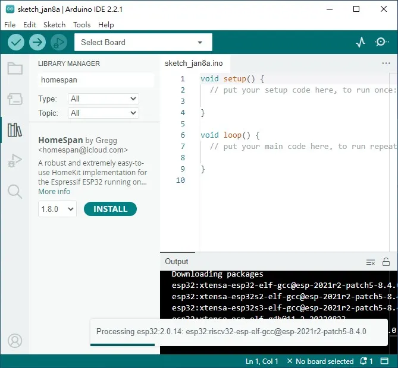
6. 貼上以下程式碼:

```ino
#include "HomeSpan.h"

struct PC : Service::LightBulb {
  int buttonPin;
  SpanCharacteristic *PCPower;
  PC(int buttonPin)
    : Service::LightBulb() {
    PCPower = new Characteristic::On();
    this->buttonPin = buttonPin;
    pinMode(buttonPin, OUTPUT);
  }
  boolean update() {
    digitalWrite(buttonPin, PCPower->getNewVal());
    return (true);
  }
};

struct DEV_TempSensor : Service::TemperatureSensor {
  SpanCharacteristic *temp;
  DEV_TempSensor()
    : Service::TemperatureSensor() {
    temp = new Characteristic::CurrentTemperature(0);
    temp->setRange(0, 1);
  }

  void loop() {
    if (temp->timeVal() > 5000) {
      temp->setVal(digitalRead(14));
    }
  }
};

void setup() {
  pinMode(14, INPUT);
#if ESP8266
  Serial.begin(115200, SERIAL_8N1, SERIAL_TX_ONLY);
#else
  Serial.begin(115200, SERIAL_8N1);
#endif
  homeSpan.begin(Category::Bridges, "HomeSpan 橋梁");
  new SpanAccessory();
  new Service::AccessoryInformation();
  new Characteristic::Identify();
  new SpanAccessory();
  new Service::AccessoryInformation();
  new Characteristic::Identify();
  new Characteristic::Name("電腦狀態");
  new DEV_TempSensor();
  new SpanAccessory();
  new Service::AccessoryInformation();
  new Characteristic::Name("電腦電源");
  new Characteristic::Manufacturer("毛哥EM");
  new Characteristic::FirmwareRevision("1.0");
  new Characteristic::Identify();
  new PC(12);
  new SpanAccessory();
  new Service::AccessoryInformation();
  new Characteristic::Name("電腦重新啟動");
  new Characteristic::Manufacturer("毛哥EM");
  new Characteristic::FirmwareRevision("1.0");
  new Characteristic::Identify();
  new PC(13);
}

void loop() {
  homeSpan.poll();
}
```

7. 設定 COM Port，請你點擊左上角的輸入選擇，接著選擇你的 ESP32 的 COM Port。你可以把 ESP-32 拔掉再插上來看看哪個消失再出現就是了。
   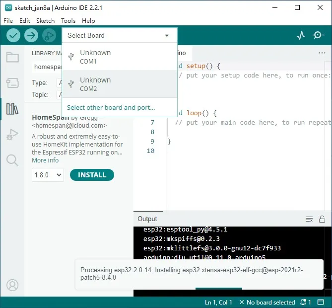
8. 最後，請你點擊左上角的「上傳」按鈕 (往右的箭頭)，並等待燒錄完成即可。如果上傳失敗請點擊 ESP32 上面的 BOOT 按鈕，拔掉重新插上電源並再次上傳。

## 設定

### 設定 Wi-Fi

還沒有完喔，先不要急著把電腦關機測試，我們還需要設定一下 Wi-Fi 才能使用。

請你點擊右上角的放大鏡開啟 Serial Port，並確定傳輸速率是 115200。如果你有看到出現一些文字代表你已經成功了。

接著，請你輸入 `w` 並按下 Enter 進入設定模式。你會看到 ESP32 開始搜尋並列出周圍的 Wi-Fi 名稱。輸入你的 Wi-Fi SSID 左邊的編號並按下 Enter，再輸入 Wi-Fi 密碼並按下 Enter。如果你有看到連接成功就代表你已經成功了。

### 設定 Homekit

請你在 iPhone 或 iPad 開啟家庭 APP，接著點擊右上角的 + 號，新增裝置。選擇我沒有條碼，並輸入 8 位數的 PIN 碼。

```
466-37-726
```
這樣就完成囉!你可以編輯程式來添加更多功能或修改 pin 碼。

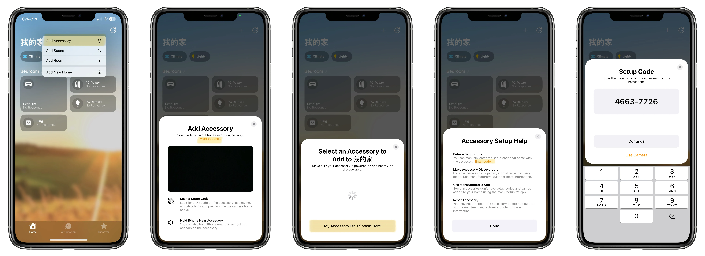

## 結論

現在你可以即時看到電腦的開關機狀態。開機時會顯示 1 度，關機時會顯示 0 度。(嚴格來說是電源指示 LED 有沒有點亮)

將電源開關開啟就會開機或關機了。記得開啟開關就是相當於按下按鈕。所以如果你一直開著就相當於長按開關，如果按太久就會強制關機。

{}

不會。即使是按下電腦電源關機還是走正常關機流程，所以並不會傷害電腦，不過你要確定的是關機前你的文件有先存檔喔。

當然，不建議你使用智能插座直接斷電來關機。

{}

希望這篇文章能夠幫助到你。如果你有任何問題都可以在 IG 留言，也歡迎在 [Instagram](https://www.instagram.com/em.tec.blog) 和 [Google 新聞](https://news.google.com/publications/CAAqBwgKMKXLvgswsubVAw?ceid=TW:zh-Hant&oc=3)追蹤[毛哥 EM 資訊密技](https://em-tec.github.io/)。
