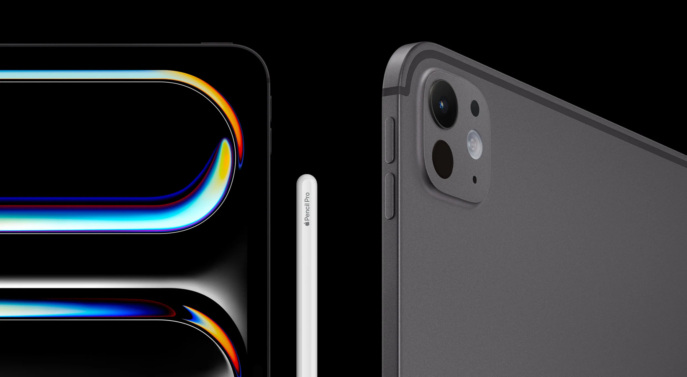
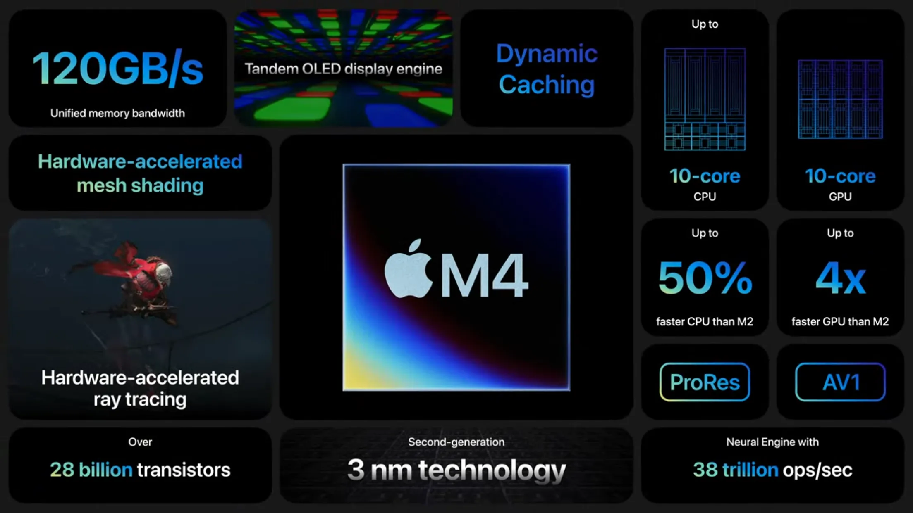
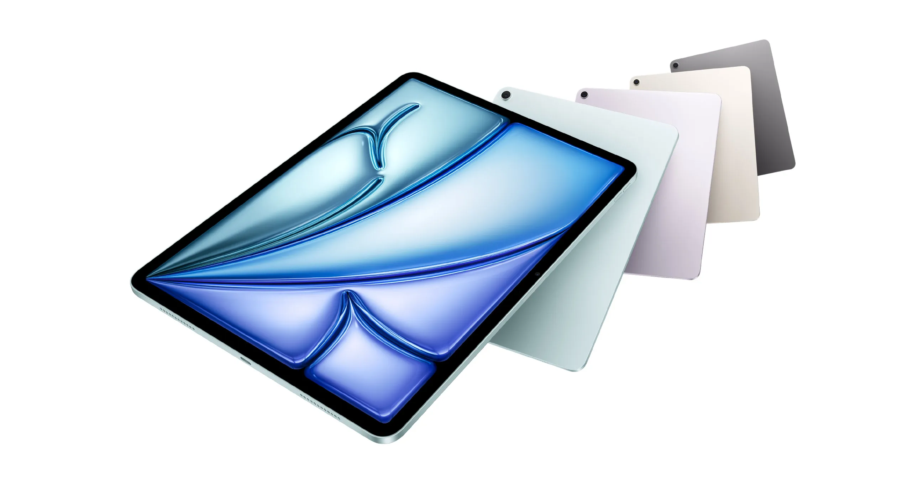
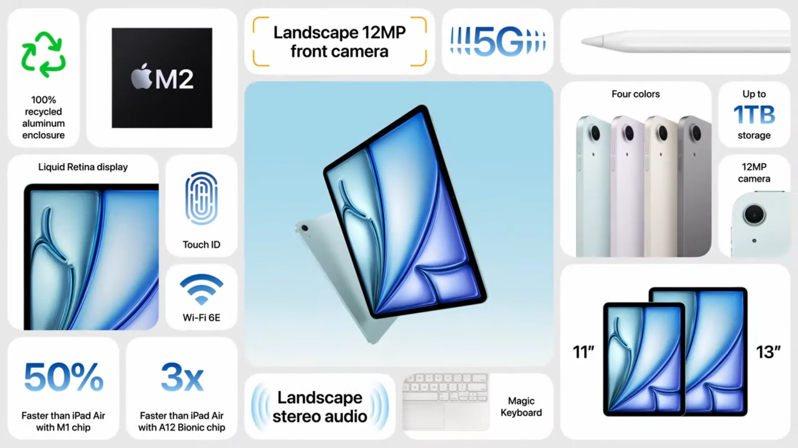
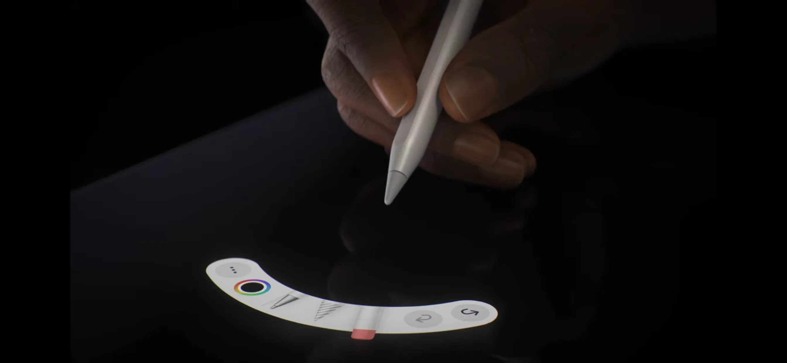
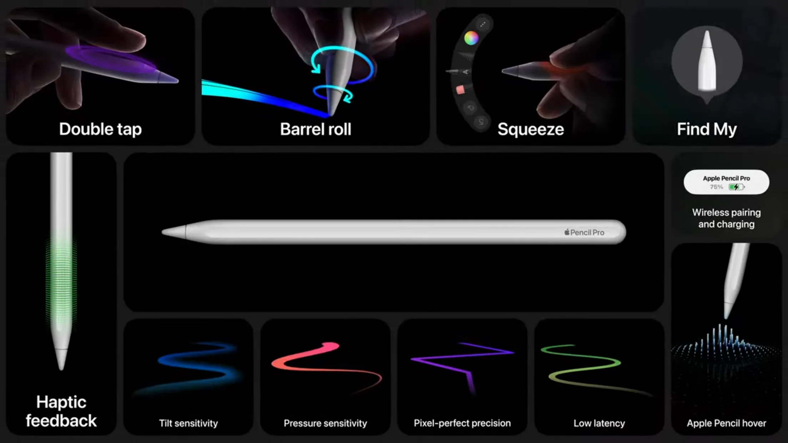
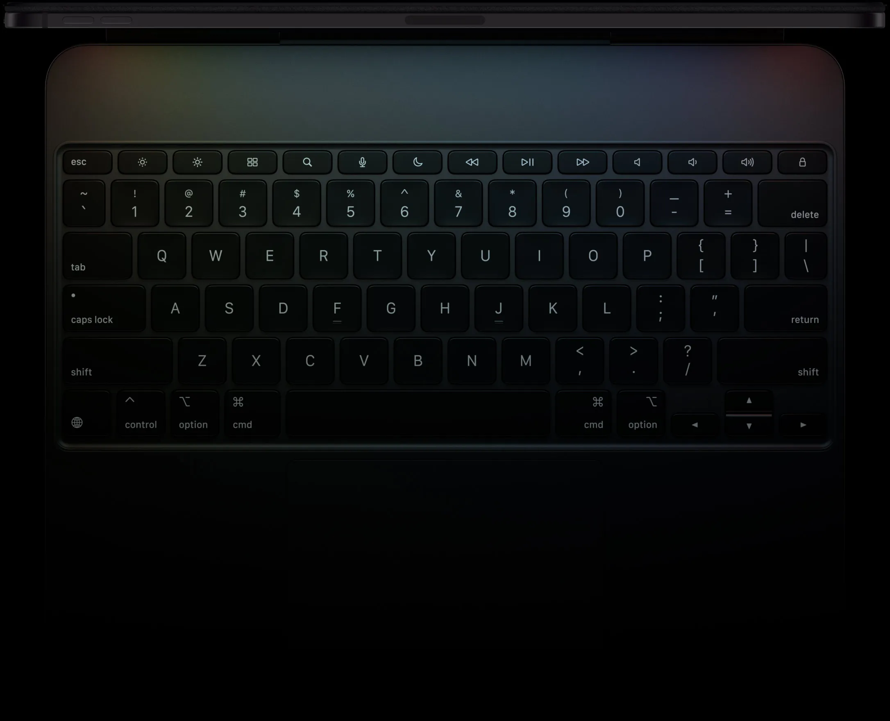

+++
author = "毛哥EM"
title = "蘋果 2024 5月發布會懶人包 - Apple Pencil Pro 有陀螺儀還會震動，iPad Pro 減掉瀏海"
date = "2024-05-07"
categories = ["科技新聞"]
tags = ["ios"]
thumbnail = "https://emtech.cc/post/apple-event-2024-may/look-pro.webp"
featureImage = "https://emtech.cc/post/apple-event-2024-may/look-pro.webp"
shareImage = "https://emtech.cc/post/apple-event-2024-may/look-pro.webp"
+++

在今天 2024 年 5 月 7 日的蘋果發布會 Apple Events 上，他們帶來全新的 iPad Pro、更大的 iPad Air，以及全新的 Apple Pencil Pro。讓我們來看看這次的發布會有哪些亮點，以及沒有在影片中提到的重點。

<!--more-->

## 全新 iPad Pro：超薄、超強

今年的 iPad Pro 不僅在外觀上出奇地輕薄易攜，搭載了全新的 Apple M4 晶片(直接跳過 M3)，使其性能達到了新的高度。讓我們來看看這款iPad Pro的亮點：

* **外觀設計：** 13 吋 iPad Pro 的厚度為 5.1 公釐，目前蘋果歷史以來最薄的產品，比 iPod 還薄。不過 11 吋 iPad Pro 的厚度為 5.3 公釐，稍微厚一點。
* **Ultra Retina XDR 顯示器：** OLED 一層不夠亮，所以蘋果疊了兩層 OLED。最高 1600 尼特亮度。1TB和2TB版可升至奈米玻璃，減少眩光。
* 支援 eSIM、Wi-Fi 6E、5G、藍牙 5.3。
* **USB：** Thunderbolt 4 接口可以傳輸解析度最高可達 6K，還能連結各種儲存裝置。理論最高可達 40Gb/s。
*** Apple M4 晶片：** 3 奈米公藝，CPU 提升 50%，GPU 提升四倍，AI 加速器提升 70%。蘋果還有特別強調它專門處理 AI 的 NPU，強調他們在 A11 就已經有了，性能也是所有 AI 筆電中最強的。
* **材質：** 100% 再生鋁金屬。
* **後鏡頭：** 1200 萬像素廣角相機，4K 的 ProRes 錄影。
* **前鏡頭：** 橫向 1200 萬像素超廣角前置相機，原深感測相機系統。
* **容量：** 256GB ~ 2TB 的儲存空間。
* 支援 Apple Pencil Pro、Apple Pencil (USB-C)。
* **顏色：** 灰色、黑色。

## iPad Air：變大了

* 有 11 吋與全新 13 吋 iPad Air。
* M2 晶片，與上一代相比，速度提升近 50%。
* 支援 eSIM、Wi-Fi 6E、5G、藍牙 5.3。
* 支援 Apple Pencil Pro、Apple Pencil (USB-C)。
* **顏色：** 藍色、灰色、金色、粉色。
* **容量：** 128GB ~ 1TB 的儲存空間。

## Apple Pencil Pro：可以捏，可以轉，會震動

*  捏它：隨即打開新的面板，方便你快速切換工具、線條粗細與顏色。

*  **轉它：** 全新陀螺儀讓你轉動 Apple Pencil Pro，就可精準控制各式硬筆和筆刷工具。
*  **震動：** 當你按它捏它時給你點感覺。
*  **懸浮功能：** 以前覺得這個功能很雞肋，但是如果搭配陀螺儀會非常方便。想像你使用螢光筆或是水彩這種比較粗的筆刷，旋轉不同角度粗細和方向都不同，這時候懸浮功能就非常好用了。
*  **尋找我的 Pencil：** 這麼貴又這麼容易掉，必須的。

Apple Pencil Pro定價為4390元，Apple Pencil 2價格相同，不過Apple Pencil Pro只限定M4版本iPad Pro和M2版本iPad Air使用。

## 巧控鍵盤

* 還是一樣很貴
* 全新 14 鍵功能鍵
* 觸控板加大，會震動

## 軟體

新的 iOS 並沒有被發布，但是蘋果在發布會上展示了一些新的軟體功能。包括 Apple Pencil Pro 與 Procreate 的結合，Final Cut Pro 可以即時查看四台 iPhone 鏡頭畫面並進行焦距及光線調整等。且這次發布會蘋果開始會使用 AI 這個詞了。雖然蘋果在人工智慧或深度學習我認為一直都是不差的，但是大多是整合到功能和你的生活裡面讓你無法察覺，因此沒有那麼高調，不管是客製化聲音模型 (設定內建)、影片去背 (Final Cut Pro)、音樂分出不同樂器 (Logic Pro) 等等，搭配強大的 Apple silicon 晶片，其實都是 AI 的應用。

這次的發布會只有 41 分鐘，手語老師一樣很熱情。以上就是我整理出來的重點，iPad Pro 技術上雖然的確是很有創意且突破，但我的 iPad Pro 第三代目前還堪用。而一直使用副廠筆的我確實有被 Apple Pencil Pro 驚艷到，可以轉還會震動，期待看到第三方 App 的使用，以及這些產品在市場上的表現。最後歡迎在 [Instagram](https://www.instagram.com/emtech.cc) 和 [Google 新聞](https://news.google.com/publications/CAAqBwgKMKXLvgswsubVAw?ceid=TW:zh-Hant&oc=3)追蹤[毛哥 EM 資訊密技](https://emtech.cc/)。

> 資料及圖片來源：[蘋果官網](https://www.apple.com/tw/)