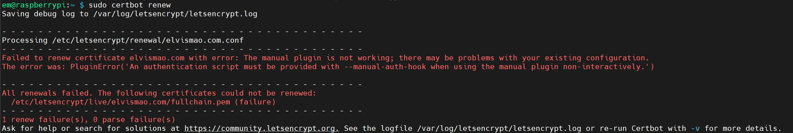

+++
author = "毛哥EM"
title = "解決 Certbot SSL 更新失敗 - The manual plugin is not working"
date = "2024-06-30"
tags = ["DNS"]
categories = ["製作教學"]
thumbnail = "https://emtech.cc/post/certbot-renew/thumbnail.webp"
featureImage = "https://emtech.cc/post/certbot-renew/thumbnail.webp"
shareImage = "https://emtech.cc/post/certbot-renew/thumbnail.webp"
+++

當你的 Certbot SSL 過期時，更新過程可能會出現各種問題，尤其是在使用手動插件時。這篇文章將介紹如何解決 Certbot 手動插件更新失敗的問題，並提供一個完整的解決方案，幫助你順利更新 SSL 憑證。

<!--more-->

{}

如果你還沒有使用過 Certbot 建立 SSL 憑證，可以參考我之前的文章：[如何使用 Certbot 申請免費的 SSL 憑證，並使用 DNS 驗證?](https://emtech.cc/post/setup-ssl-certificate-nginx-certbot/)。
{}


## 問題描述

當你嘗試更新 Certbot SSL 憑證時，可能會遇到以下錯誤訊息：

```plaintext
Failed to renew certificate example.com with error: The manual plugin is not working; there may be problems with your existing configuration. The error was: PluginError('An authentication script must be provided with --manual-auth-hook when using the manual plugin non-interactively.')
```



這表示 Certbot 無法使用手動插件進行非交互式更新，需要提供身份驗證腳本。


### 解決方案

有兩種方法可以解決這個問題：

1. **切換到自動化的網頁伺服器插件**
2. **提供手動身份驗證腳本**

#### 方法一：切換到自動化的網頁伺服器插件

使用自動化的網頁伺服器插件（如 `certbot-apache` 或 `certbot-nginx`）可以簡化更新過程。

##### 1. 安裝插件

對於 Apache 伺服器：
```bash
sudo apt-get install python3-certbot-apache
```

對於 Nginx 伺服器：
```bash
sudo apt-get install python3-certbot-nginx
```

##### 2. 重新簽發憑證

根據你的伺服器類型，運行以下命令：

對於 Apache：
```bash
sudo certbot --apache
```

對於 Nginx：
```bash
sudo certbot --nginx
```

這樣，Certbot 會自動處理 SSL 憑證的更新。以我的樹梅派為例，我使用 Nginx 伺服器，所以我會選擇 `--nginx` 選項。輸入指令後，Certbot 會問我要為哪個域名啟用 HTTPS，我選擇了 `pi.elvismao.com`。更新成功後，會顯示以下訊息：

```plaintext
em@raspberrypi:~ $ sudo certbot --nginx
Saving debug log to /var/log/letsencrypt/letsencrypt.log

Which names would you like to activate HTTPS for?
We recommend selecting either all domains, or all domains in a VirtualHost/server block.
- - - - - - - - - - - - - - - - - - - - - - - - - - - - - - - - - - - - - - - -
1: pc.elvismao.com
2: pi.elvismao.com
- - - - - - - - - - - - - - - - - - - - - - - - - - - - - - - - - - - - - - - -
Select the appropriate numbers separated by commas and/or spaces, or leave input
blank to select all options shown (Enter 'c' to cancel): 2
Requesting a certificate for pi.elvismao.com

Successfully received certificate.
Certificate is saved at: /etc/letsencrypt/live/pi.elvismao.com/fullchain.pem
Key is saved at:         /etc/letsencrypt/live/pi.elvismao.com/privkey.pem
This certificate expires on 2024-09-28.
These files will be updated when the certificate renews.
Certbot has set up a scheduled task to automatically renew this certificate in the background.

Deploying certificate
Successfully deployed certificate for pi.elvismao.com to /etc/nginx/sites-enabled/pi.elvismao.com.conf
Congratulations! You have successfully enabled HTTPS on https://pi.elvismao.com
```

#### 方法二：提供手動身份驗證腳本

如果你需要繼續使用手動方法，則必須提供身份驗證腳本。基本上它就是模擬你手動輸入驗證碼的過程。首先，創建一個腳本來執行 DNS 或 HTTP 驗證步驟，然後使用 `--manual-auth-hook` 選項。

##### 1. 範例身份驗證腳本

以下是一個簡單的 DNS 驗證腳本範例：

```bash
#!/bin/bash
# 這是一個用於 DNS 驗證的簡單範例

# 定義你的 DNS API 憑證並更新 DNS 記錄
API_KEY="你的API密鑰"
DOMAIN="_acme-challenge.yourdomain.com"
TXT_VALUE=$CERTBOT_VALIDATION

# 調用你的 DNS 提供商 API 來更新 TXT 記錄
curl -X POST "https://api.dnsprovider.com/update" \
    -H "Authorization: Bearer $API_KEY" \
    -d "domain=$DOMAIN" \
    -d "txt=$TXT_VALUE"

# 等待 DNS 更改生效
sleep 60
```

確保根據你的 DNS 提供商的 API 要求調整腳本。

##### 2. 使用手動身份驗證腳本更新憑證

運行以下命令來更新憑證：
```bash
sudo certbot renew --manual --manual-auth-hook /path/to/auth-script.sh
```

### 驗證更新結果

更新完成後，通常不需要重啟網頁伺服器，但有時可能需要。對於 Apache 伺服器：

```bash
sudo systemctl restart apache2
```

對於 Nginx 伺服器：
```bash
sudo systemctl restart nginx
```

檢查憑證狀態以確保更新成功：
```bash
sudo certbot certificates
```


### 結論

透過這篇文章，我們介紹了如何解決 Certbot SSL 手動插件更新失敗的問題，包括使用自動化插件和提供手動身份驗證腳本的詳細步驟。希望這些方法能幫助你順利更新 SSL 憑證，確保網站的安全性。如果你有任何問題都可以在 IG 留言，也歡迎在 [Instagram](https://www.instagram.com/emtech.cc) 和 [Google 新聞](https://news.google.com/publications/CAAqBwgKMKXLvgswsubVAw?ceid=TW:zh-Hant&oc=3)追蹤[毛哥EM資訊密技](https://emtech.cc/)。