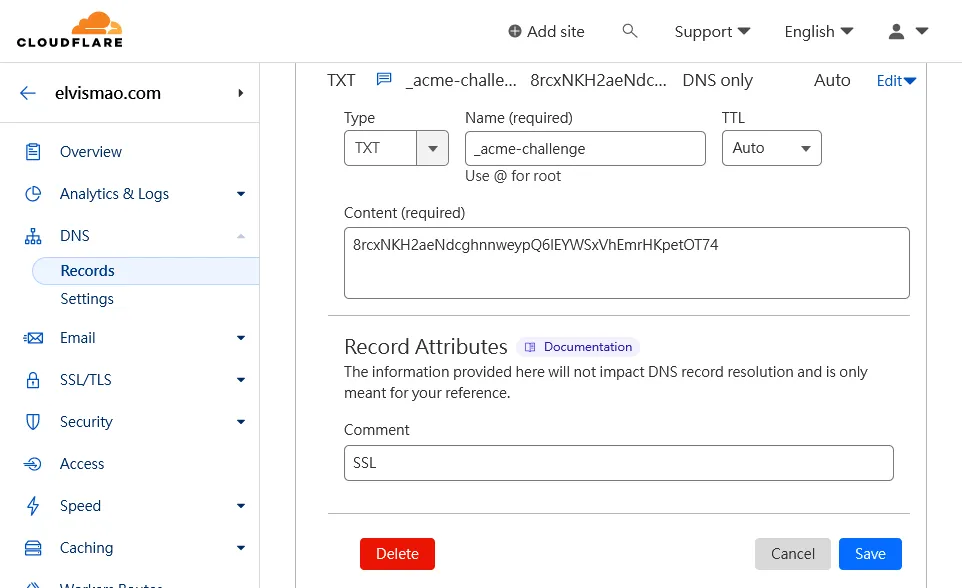

+++
author = "毛哥EM"
title = "如何使用 Certbot 申請免費的 SSL 憑證，並使用 DNS 驗證?"
date = "2024-03-10"
tags = ["DNS"]
categories = ["製作教學"]
thumbnail = "https://avatars.githubusercontent.com/u/17889013"
featureImage = "https://raw.githubusercontent.com/EFForg/design/master/logos/eff-certbot-lockup.png"
shareImage = "https://raw.githubusercontent.com/EFForg/design/master/logos/eff-certbot-lockup.png"
+++

最近我一直在玩我的樹莓派，想要在上面架設一個檔案下載網站。但是沒有 SSL 憑證每次都會被瀏覽器警告說網站不安全，所以我決定使用 Certbot 申請一個免費的 SSL 憑證。在這篇文章中，我將分享如何使用 Certbot 申請免費的 SSL 憑證，並使用 DNS 驗證。

<!--more-->

## 什麼是 Certbot？

Certbot 是一個由 Electronic Frontier Foundation (EFF) 開發的免費、開源的工具，它可以幫助你在網站上安裝 SSL 憑證。Certbot 支援的憑證類型有 Let's Encrypt 和 ACME (Automatic Certificate Management Environment)。

## 為什麼要使用 SSL 憑證？

**簡單來說就是讓你的網址從 `http://` 變成 `https://`。**使用SSL 憑證可以幫助你的網站加密數據，保護用戶的隱私。此外，Google 也將使用 SSL 憑證作為搜索排名的一個指標，所以使用 SSL 憑證也有助於提高你的網站在搜索引擎上的排名。

## 如何使用 Certbot 申請免費的 SSL 憑證？

### 安裝 Certbot

Certbot 可以在大多數的 Linux 發行版上安裝，今天就都用我的樹莓派來示範，但是你也可以在 Ubuntu、Debian、CentOS、Fedora、Arch Linux 上安裝。

```bash
sudo apt-get update
sudo apt-get install certbot
```

### 申請 SSL 憑證

Certbot 支援多種驗證方式，包括 HTTP 驗證、DNS 驗證、TLS-ALPN-01 驗證等。在這裡我們使用 DNS 驗證，這是一種通過 DNS 記錄驗證你對域名的控制權的方式。這條命令中的 `--manual` 表示我們要手動驗證，`--preferred-challenges dns` 表示我們要使用 DNS 驗證，`-d example.com -d *.example.com` 表示我們要申請的域名。

```bash
sudo certbot certonly --manual --preferred-challenges dns -d example.com -d *.example.com
```

這時的輸出如下:

```bash
em@raspberrypi:/ssl $ sudo certbot certonly --manual --preferred-challenges dns -d '*.elvismao.com'
Saving debug log to /var/log/letsencrypt/letsencrypt.log
Enter email address (used for urgent renewal and security notices)
 (Enter 'c' to cancel): 
```

輸入你的郵箱地址，然後按下 Enter 鍵。

```bash
- - - - - - - - - - - - - - - - - - - - - - - - - - - - - - - - - - - - - - - -
Please read the Terms of Service at
https://letsencrypt.org/documents/LE-SA-v1.3-September-21-2022.pdf. You must
agree in order to register with the ACME server. Do you agree?
- - - - - - - - - - - - - - - - - - - - - - - - - - - - - - - - - - - - - - - -
(Y)es/(N)o: Y
```

Certbot 會提示你閱讀 Let's Encrypt 的服務條款，輸入 `Y` 表示你同意這些條款。(相信你一定有認真讀過對吧？)

```bash
- - - - - - - - - - - - - - - - - - - - - - - - - - - - - - - - - - - - - - - -
Would you be willing, once your first certificate is successfully issued, to
share your email address with the Electronic Frontier Foundation, a founding
partner of the Let's Encrypt project and the non-profit organization that
develops Certbot? We'd like to send you email about our work encrypting the web,
EFF news, campaigns, and ways to support digital freedom.
- - - - - - - - - - - - - - - - - - - - - - - - - - - - - - - - - - - - - - - -
(Y)es/(N)o: N
```

Certbot 會問你是否願意與 EFF 分享你的郵箱地址並訂閱電子報，這裡我是輸入 `N` 表示你不願意。

```bash
Account registered.
Requesting a certificate for *.elvismao.com

- - - - - - - - - - - - - - - - - - - - - - - - - - - - - - - - - - - - - - - -
Please deploy a DNS TXT record under the name:

_acme-challenge.elvismao.com.

with the following value:

8rcxNKH2aeNdcghnnweypQ6lEYWSxVhEmrHKpetOT74

Before continuing, verify the TXT record has been deployed. Depending on the DNS
provider, this may take some time, from a few seconds to multiple minutes. You can
check if it has finished deploying with aid of online tools, such as the Google
Admin Toolbox: https://toolbox.googleapps.com/apps/dig/#TXT/_acme-challenge.elvismao.com.
Look for one or more bolded line(s) below the line ';ANSWER'. It should show the
value(s) you've just added.

- - - - - - - - - - - - - - - - - - - - - - - - - - - - - - - - - - - - - - - -
Press Enter to Continue
```

Certbot 會提示你在 DNS 記錄中添加一條 TXT 記錄，這條記錄的名稱是 `_acme-challenge.elvismao.com`，值是 `8rcxNKH2aeNdcghnnweypQ6lEYWSxVhEmrHKpetOT74`。你需要在你的 DNS 服務商的控制面板中添加這條記錄，然後按下 Enter 鍵。

這裡我使用 Cloudflare 作為我的 DNS 服務商，所以我在 Cloudflare 的控制面板中添加了一條 TXT 記錄。



```bash
Successfully received certificate.
Certificate is saved at: /etc/letsencrypt/live/elvismao.com/fullchain.pem
Key is saved at:         /etc/letsencrypt/live/elvismao.com/privkey.pem
This certificate expires on 2024-06-08.
These files will be updated when the certificate renews.
```

當你在 DNS 服務商的控制面板中添加了 TXT 記錄後，按下 Enter 鍵，Certbot 會提示你成功接收到了 SSL 憑證，並告訴你憑證的保存位置。

## 檔案介紹

- `fullchain.pem`：這是你的 SSL 憑證，它包含了你的域名和中間證書。
  - `chain.pem`：這是中間證書。
  - `cert.pem`：這是你的域名憑證。
- `privkey.pem`：這是你的私鑰，它用來加密和解密數據。

通常只會需要用到 `fullchain.pem` 和 `privkey.pem` 這兩個檔案。

## 自動更新 SSL 憑證

Let's Encrypt 的 SSL 憑證有效期只有 90 天，所以你需要定期更新你的 SSL 憑證。你可以使用 Certbot 的 `renew` 命令來更新你的 SSL 憑證。

```bash
sudo certbot renew
```

你可以使用 `crontab` 來設置定時任務，定期更新你的 SSL 憑證。

```bash
sudo crontab -e
```

如果你是第一次開啟 `crontab`，它會提示你選擇一個編輯器，我選擇了 `vim`，你可以選擇你熟悉的編輯器。

然後添加一條定時任務。只需要在文件的最後添加一條定時任務即可。

```bash
0 0 1 * * certbot renew
```

這條定時任務表示每個月的 1 號 0 點 0 分更新 SSL 憑證。

## 下一步

當你成功申請到了 SSL 憑證後，你就可以在你的網站上使用這個憑證了。你可以在你的網站配置文件中添加 SSL 憑證的路徑，然後重啟你的網站服務。

希望這篇文章能夠幫助到你。如果你有任何問題都可以在 IG 留言，也歡迎在 [Instagram](https://www.instagram.com/emtech.cc) 和 [Google 新聞](https://news.google.com/publications/CAAqBwgKMKXLvgswsubVAw?ceid=TW:zh-Hant&oc=3)追蹤[毛哥EM資訊密技](https://emtech.cc/)。