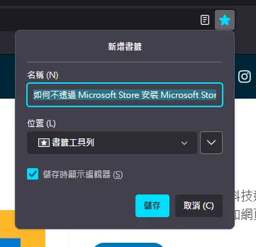
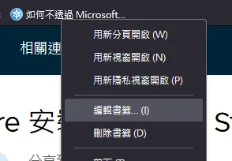
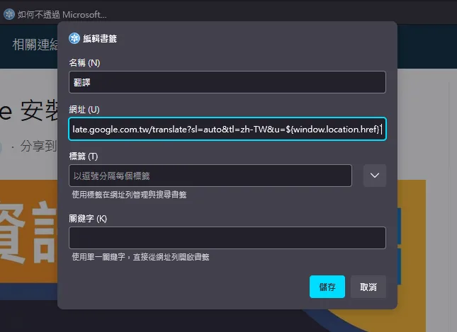
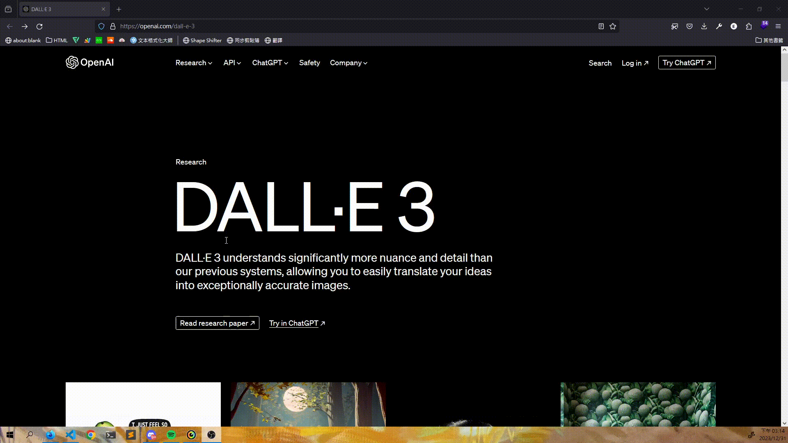

+++
author = "毛哥EM"
title = "FireFox 如何翻譯網站?"
date = "2023-12-31"
tags = ["Firefox", "自製"]
categories = ["網站分享", "製作教學"]
thumbnail = ""
featureImage = ""
shareImage = ""
+++

FireFox 有著卓越的性能及隱私保護，加上他有許多實用的開發者工具，一直是我的愛用的瀏覽器。然而，FireFox 目前還沒有內建中文翻譯功能，因此，今天我要來和你分享如何不透過擴充功能，只需要透過「書籤」就能夠在 FireFox 一鍵翻譯網站。


<!--more-->

## 翻譯網站的方法

使用以下的方法，可以在任何瀏覽器上使用。而且因為沒有使用擴充功能，所以不會有隱私問題，也不會影響你電腦的性能。

### 1. 新增書籤

首先，我們要新增一個書籤，點擊右上角的「書籤」按鈕，選擇「新增書籤」。這個書籤可以是任何網站 (比如說這個網站)，因為我們接下來會修改它。建議把它放在書籤列，這樣就可以一鍵翻譯網站了。



### 2. 編輯書籤

接下來，我們要編輯剛剛新增的書籤。找到剛剛新增的書籤，點擊右鍵，選擇「編輯」。



### 3. 修改網址

在編輯書籤的視窗中，我們要修改網址。把網址改成以下的程式，編輯顯示的標題 (如:翻譯) 然後按下「儲存」。

```js
javascript:window.location.href=`https://translate.google.com.tw/translate?sl=auto&tl=zh-TW&u=${window.location.href}`
```



### 4. 翻譯網站

現在，我們就可以使用這個書籤來翻譯網站了。你可以到任意外國語言的網站並點擊剛剛新增的書籤，就會自動翻譯網站了。



## 結論

透過這個方法，我們可以在 FireFox 上一鍵翻譯網站。而且因為沒有使用擴充功能，所以不會有隱私問題，也不會影響你電腦的性能。

希望這篇文章能夠幫助到你。如果你有任何問題都可以在 IG 留言，也歡迎在 [Instagram](https://www.instagram.com/em.tec.blog) 和 [Google 新聞](https://news.google.com/publications/CAAqBwgKMKXLvgswsubVAw?ceid=TW:zh-Hant&oc=3)追蹤[毛哥EM資訊密技](https://em-tec.github.io/)。
