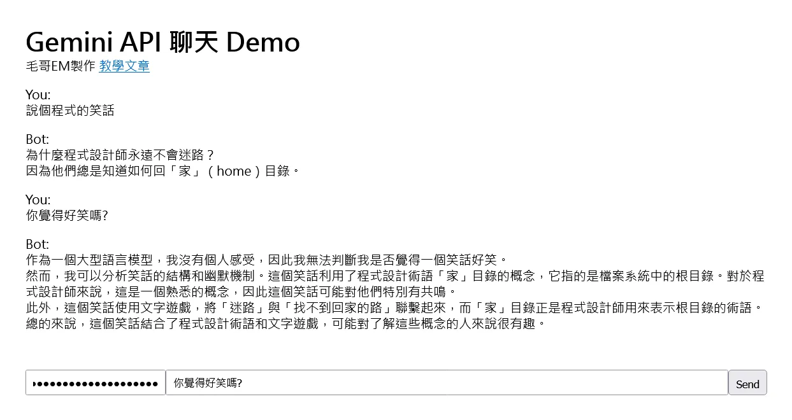
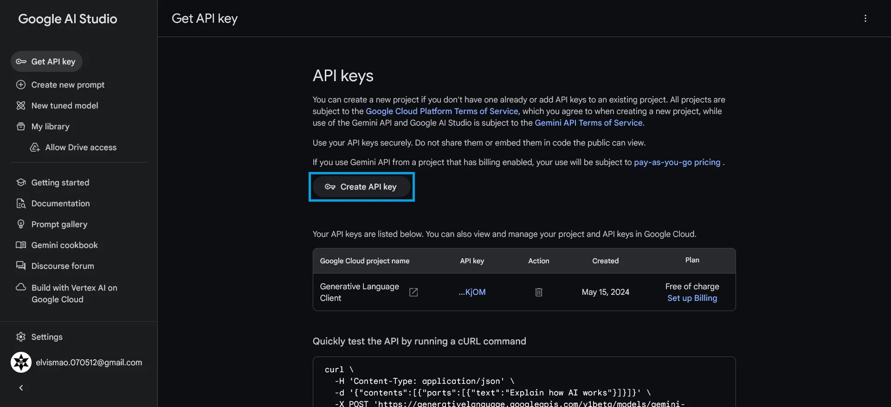
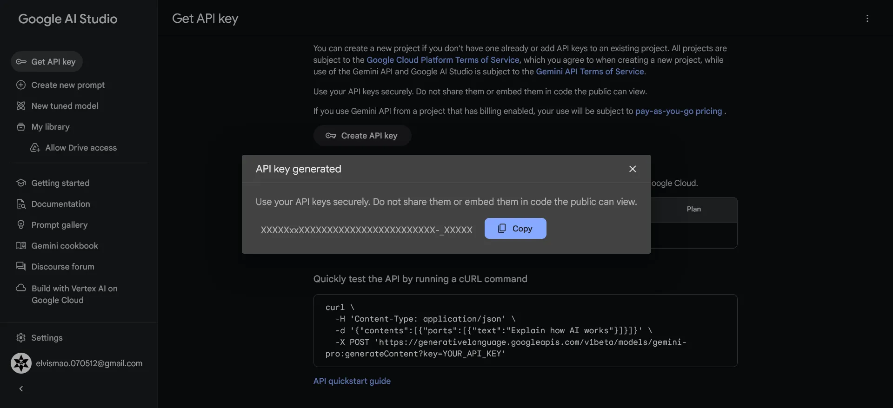

+++
author = "毛哥EM"
title = "Gemini API 快速入門: 來用 Js 做一個線上聊天吧"
date = "2024-05-15"
tags = ["JavaScript", "API","Gemini"]
categories = ["軟體分享"]
+++

Google 的 Gemini 推出了幾個月，雖然我個人覺得能力不及 GPT-4 但是每分鐘免費 60 次呼叫也太大方了吧! 還不趕快來玩一波。今天我們就來使用純 HTML 和 JavaScript 製作一個簡單的線上對話網站來與 Gemini 聊天吧!

<!--more-->



## 1. 申請金鑰

首先請你到 [Google AI Studio ](https://aistudio.google.com/app/apikey) 申請金鑰。



你可以選擇你已經有的專案或是新建一個專案，然後點選 Create API Key。生成後請記得複製下來。



## 2. 呼叫 Gemini API

Gemini 很貼心有預設做好一些 SDK，但是其實我們只需要一個簡單的 HTTP 請求就可以了。完整的 cookbook 可以在 [GitHub](https://github.com/google-gemini/cookbook/tree/main) 查看。

在我們實際開始製作之前，請讓我先簡單介紹一下 Gemini API 的使用方式。

### 2.1. 問問題

以下是一個簡單的範例。

```bash
curl "https://generativelanguage.googleapis.com/v1beta/models/gemini-pro:generateContent?key=$GOOGLE_API_KEY" \
    -H 'Content-Type: application/json' \
    -X POST \
    -d '{
      "contents": [{
        "parts":[{"text": "Give me python code to sort a list."}]
        }]
       }'
```

可以看到我們只需要將問題放在 `text` 中，然後就可以得到回答了。

```json
{
  "candidates": [
    {
      "content": {
        "parts": [
          {
            "text": "```python\n# Example list to be sorted\nlist1 = [5, 3, 1, 2, 4]\n\n# Sort the list in ascending order\nlist1.sort()\n\n# Print the sorted list\nprint(list1)\n```"
          }
        ],
        "role": "model"
      },
      "finishReason": "STOP",
      "index": 0,
      "safetyRatings": [
        {
          "category": "HARM_CATEGORY_SEXUALLY_EXPLICIT",
          "probability": "NEGLIGIBLE"
        },
        {
          "category": "HARM_CATEGORY_HATE_SPEECH",
          "probability": "NEGLIGIBLE"
        },
        {
          "category": "HARM_CATEGORY_HARASSMENT",
          "probability": "NEGLIGIBLE"
        },
        {
          "category": "HARM_CATEGORY_DANGEROUS_CONTENT",
          "probability": "NEGLIGIBLE"
        }
      ]
    }
  ],
  "promptFeedback": {
    "safetyRatings": [
      {
        "category": "HARM_CATEGORY_SEXUALLY_EXPLICIT",
        "probability": "NEGLIGIBLE"
      },
      {
        "category": "HARM_CATEGORY_HATE_SPEECH",
        "probability": "NEGLIGIBLE"
      },
      {
        "category": "HARM_CATEGORY_HARASSMENT",
        "probability": "NEGLIGIBLE"
      },
      {
        "category": "HARM_CATEGORY_DANGEROUS_CONTENT",
        "probability": "NEGLIGIBLE"
      }
    ]
  }
}
```

雖然很長看起來很可怕，但你只需要記得 `data.candidates[0].content.parts[0].text` 就是回答了。

### 2.2 發送圖片

如果你想要發送圖片，只需要稍微修改 `body` 裡的 Json 就可以了。把圖片轉成 base64 放入即可。以下是一個 `body` 的範例。

```json
{
  "contents":[
    {
      "parts":[
        {"text": "This image contains a sketch of a potential product along with some notes. \
        Given the product sketch, describe the product as thoroughly as possible based on what you \
        see in the image, making sure to note all of the product features. Return output in json format: \
        {description: description, features: [feature1, feature2, feature3, etc]}"},
        {
          "inline_data": {
            "mime_type":"image/jpeg",
            "data": "'$(base64 -w0 image.jpg)'"
          }
        }
      ]
    }
  ]
}
```

記得如果你要發送圖片，請記得將模型改成 `gemini-pro-vision`。

```bash
curl "https://generativelanguage.googleapis.com/v1beta/models/gemini-pro-vision:generateContent?key=${GOOGLE_API_KEY}" \
        -H 'Content-Type: application/json' \
        -d @request.json
```

### 2.3. 討論串

聊一句不夠過癮嗎？你可以把整個對話過程發給 Gemini

```bash
curl "https://generativelanguage.googleapis.com/v1beta/models/gemini-pro:generateContent?key=$GOOGLE_API_KEY" \
    -H 'Content-Type: application/json' \
    -X POST \
    -d '{
      "contents": [
        {"role":"user",
         "parts":[{
           "text": "In one sentence, explain how a computer works to a young child."}]},
        {"role": "model",
         "parts":[{
           "text": "A computer is like a smart helper that can store information, do math problems, and follow our instructions to make things happen."}]},
        {"role": "user",
         "parts":[{
           "text": "Okay, how about a more detailed explanation to a high schooler?"}]},
      ]
    }
```

### 2.4. 其他設定

Gemini 還有很多其他的設定，例如 `max_tokens` 用來設定最大回應字數，`temperature` 用來設定回應的多樣性等等。你甚至可以使用一些符號來啟動不同的模式。詳細的設定可以參考 [Gemini API](https://ai.google.dev/gemini-api/docs/models/generative-models?hl=zh-tw#model_parameters)

## 3. 製作線上對話網站

我們使用剛才學到的知識來製作一個簡單的線上對話網站，裡面運用了剛才所提到的連續對話功能。直接上完成程式碼，你也可以在[這裡](https://elvismao.com/code/gemini/)貼上你的 API 來直接體驗。

> Demo: [https://elvismao.com/code/gemini/](https://elvismao.com/code/gemini/)

```html
<!-- @format -->

<!DOCTYPE html>
<html lang="zh-Hant">
    <head>
        <meta charset="UTF-8" />
        <title>Gemini API 聊天 Demo</title>
        <script src="https://cdn.jsdelivr.net/npm/showdown@2.1.0/dist/showdown.min.js
"></script>
        <style>
            * {
                padding: 0;
                margin: 0;
                box-sizing: border-box;
            }
            body {
                font-family: system-ui, -apple-system, BlinkMacSystemFont,
                    "Segoe UI", Roboto, Oxygen, Ubuntu, Cantarell, "Open Sans",
                    "Helvetica Neue", sans-serif;
                padding: 2rem;
                display: flex;
                flex-direction: column;
                height: 100dvh;
            }
            #chatHistory {
                flex-grow: 1;
            }
            .inputs {
                display: flex;
            }
            #messageInput {
                flex-grow: 1;
            }
            .inputs > * {
                height: 2rem;
                padding: 0.5rem;
            }
            #chatHistory > div {
                margin-top: 1rem;
            }
        </style>
    </head>
    <body>
        <h1>Gemini API 聊天 Demo</h1>
<p>毛哥EM製作 <a href="https://emtech.cc/post/gemini-html">教學文章</a></p>
        <div id="chatHistory">
            <!-- Chat history will appear here -->
        </div>
        <div class="inputs">
            <input type="password" id="apiKey" placeholder="API Key" />
            <input
                type="text"
                id="messageInput"
                placeholder="Type your message here..."
            />
            <button onclick="sendMessage()">Send</button>
        </div>
        <script>
            const converter = new showdown.Converter();
            let thread = [];
            function sendMessage() {
                var apiKey = document.getElementById("apiKey").value;
                const message = document.getElementById("messageInput").value;
                document.getElementById("chatHistory").innerHTML +=
                    "<div><div class='author'>You:</div>" + message + "</div>";
                thread.push({
                    role: "user",
                    parts: [{ text: message }],
                });
                console.log(apiKey);
                fetch(
                    "https://generativelanguage.googleapis.com/v1beta/models/gemini-pro:generateContent?key=" +
                        apiKey,
                    {
                        method: "POST",
                        headers: {
                            "Content-Type": "application/json",
                        },
                        body: JSON.stringify({
                            contents: thread,
                        }),
                    }
                )
                    .then(response => response.json())
                    .then(data => {
                        const msg = data.candidates[0].content.parts[0].text;
                        document.getElementById("chatHistory").innerHTML +=
                            "<div><div class='author'>Bot:</div>" +
                            converter.makeHtml(msg) +
                            "</div>";
                        thread.push({
                            role: "model",
                            parts: [
                                {
                                    text: msg,
                                },
                            ],
                        });
                    })
                    .catch(error => {
                        console.error("Error:", error);
                        document.getElementById("chatHistory").innerHTML +=
                            "<div><div class='author'>Bot:</div>Error: " +
                            error +
                            "</div>";
                    });
            }
        </script>
    </body>
</html>
```

你可以看到我們使用了 `fetch` 來發送請求，然後將回應顯示在網頁上。其中設定了變數 `thread` 來保存對話內容，這樣我們就可以連續對話了。由於 Gemini 回覆的格式是 Markdown，所以我們使用了 `showdown` 來將 Markdown 轉換成 HTML。加上一些簡單的 CSS，我們就完成了一個簡單的線上對話網站。


從這一段冷到發寒的對話中，我們可以看到 Gemini 的回答是有根據前面的對話繼續的。下一步我們來把它跟 Line 聊天機器人串再一起吧!

## 結語
以上就是使用 Gemini API 製作線上對話網站的方法，希望你能從中學到一些東西。如果你有任何建議或問題都可以在 IG 留言，也歡迎在 [Instagram](https://www.instagram.com/em.tec.blog) 和 [Google 新聞](https://news.google.com/publications/CAAqBwgKMKXLvgswsubVAw?ceid=TW:zh-Hant&oc=3)追蹤[毛哥EM資訊密技](https://em-tec.github.io/)。