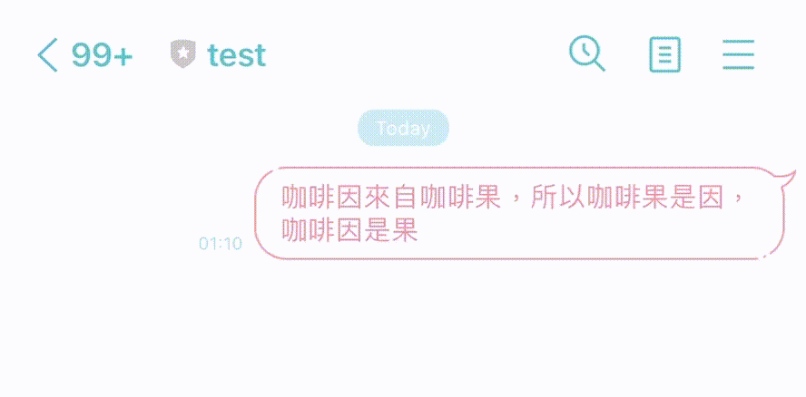
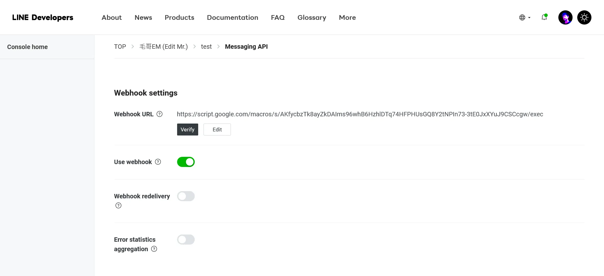

+++
author = "毛哥EM"
title = "新 API! Line Messaging API 顯示思考中動畫"
date = "2024-05-15"
tags = ["JavaScript", "API","Gemini","line"]
categories = ["軟體分享"]
+++

Line 在 2024/04/17 推出了新的 Messaging API，其中一個功能是可以顯示思考中動畫。讓使用者知道機器人正在思考中，並不是已讀不回。對於現在許多機器人會串接 LLM API 的應用來說，這個功能非常實用。為了讓大家更好理解，今天我們先不要急著串接生成式 AI，我們來使用 Google App Script 做一個簡單的 Demo 吧!

<!--more-->



> 其實這個功能在發布當天我就收到通知了，今天終於抽出時間來玩玩看這個新功能。

## 介紹

在用戶和 LINE 官方帳戶之間的一對一聊天中顯示載入動畫。

經過指定的秒數（5 至 60 秒）後或當您的 LINE 官方帳戶收到新訊息時，載入動畫將自動消失。

只有當使用者查看與您的 LINE 官方帳戶的聊天畫面時，才會顯示載入動畫。 如果您要求在使用者未查看聊天畫面時顯示載入動畫，則不會顯示任何通知。 即使用戶稍後打開聊天螢幕，也不會顯示動畫。

如果您要求在載入動畫仍然可見時再次顯示該動畫，則該動畫將繼續顯示，並且動畫消失之前的時間將被第二個請求中指定的秒數覆蓋。


> 適用於 iOS 或 Android 的 LINE：13.16.0 或更高版本

以下是一個範例的呼叫方式

```bash
curl -v -X POST https://api.line.me/v2/bot/chat/loading/start \
-H 'Content-Type: application/json' \
-H 'Authorization: Bearer {channel access token}' \
-d '{
    "chatId": "U4af4980629...",
    "loadingSeconds": 5
}'
```

## 使用

### 1. 建立 Line Bot

首先請你先建立一個 Line Bot，並取得 Channel Access Token。接著我們就可以開始實作了。

> 請到 [Line Developers](https://developers.line.biz/console/) => 新增或選取Provider => Create a new channel => Message API。
> 
> 如果沒有建立過 Line Bot，可以參考 [這個 reels](https://www.instagram.com/reel/Cp9kNc9DWK1/) 的前 20 秒影片。


### 2. 建立 Google App Script

打開 [Google App Script](https://script.google.com/u/0/home/projects/create)，並貼上以下程式碼。

我們希望在使用 doPost 接收到訊息時，回覆使用者一個思考中的動畫。等待 5 秒後，回應說「好喔」。記得將 `token` 替換成你的 Channel Access Token。

```javascript
const token = "XXXXXXXXXXXXXXXXXXXXXXXXXXXx="

function doPost(e) {
  var contents = JSON.parse(e.postData.contents);
  var chatId = contents.events[0].source.userId;
  var replyToken = contents.events[0].replyToken;

  // Start the loading animation
  sendLoading(chatId, 5);

  // Set a timer to end the loading animation and send a reply after 5 seconds
  Utilities.sleep(5000);
  sendReply(replyToken, '好喔');
}

function sendLoading(chatId, seconds) {
  var url = 'https://api.line.me/v2/bot/chat/loading/start';
  var payload = {
    "chatId": chatId,
    "loadingSeconds": seconds
  };
  var options = {
    'method': 'post',
    'contentType': 'application/json',
    'headers': {
      'Authorization': 'Bearer ' + token,
    },
    'payload': JSON.stringify(payload)
  };
  UrlFetchApp.fetch(url, options);
}

function sendReply(replyToken, message) {
  var url = 'https://api.line.me/v2/bot/message/reply';
  var payload = {
    "replyToken": replyToken,
    "messages": [{
      "type": "text",
      "text": message
    }]
  };
  var options = {
    'method': 'post',
    'contentType': 'application/json',
    'headers': {
      'Authorization': 'Bearer ' + token,
    },
    'payload': JSON.stringify(payload)
  };
  UrlFetchApp.fetch(url, options);
}
```

好了之後點擊執行▶️，你會需要授予你的程式 call API 的權限。因為你寫的程式沒有被Google驗證過所以會顯示不安全，但我相信你不會把你的帳號搞爆，對吧。執行後會看到錯誤，這是正常的，因為我們直接執行沒有給他訊息。


### 3. 設定 Webhook

部屬好了之後，你會看到一個網址，請將這個部屬的網址貼到 Line Bot 的 Webhook 的地方就完成了。



### 4. 測試

現在你可以在 Line 上傳送訊息給你的 Line Bot，你會看到 Line Bot 會回覆你一個思考中的動畫，等待 5 秒後，回應說「好喔」。


## 結語
以上就是使用 Line Messaging API 顯示思考中動畫的方法，希望能夠對你有幫助。如果你有任何建議或問題都可以在 IG 留言，也歡迎在 [Instagram](https://www.instagram.com/em.tec.blog) 和 [Google 新聞](https://news.google.com/publications/CAAqBwgKMKXLvgswsubVAw?ceid=TW:zh-Hant&oc=3)追蹤[毛哥EM資訊密技](https://em-tec.github.io/)。

> 參考資料: https://developers.line.biz/en/docs/messaging-api/use-loading-indicator/