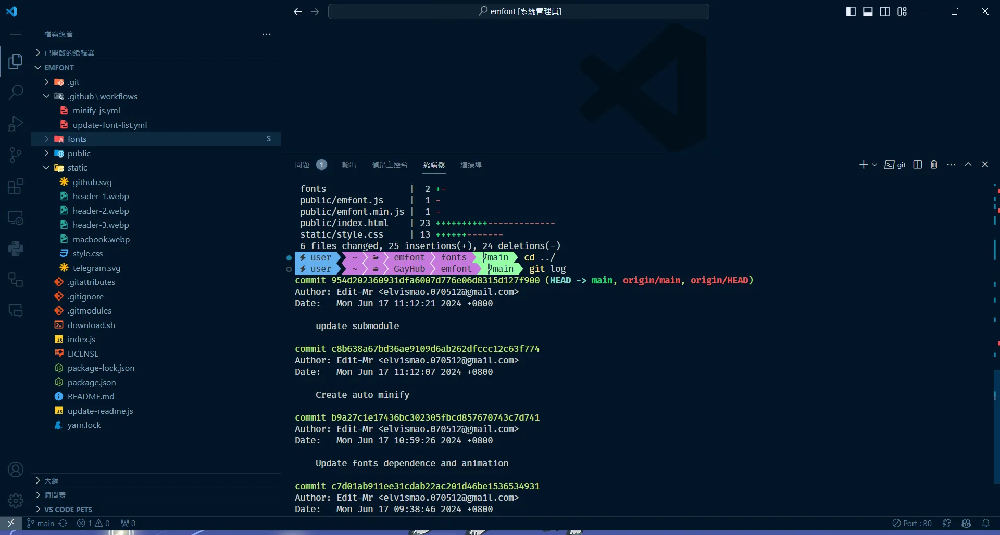
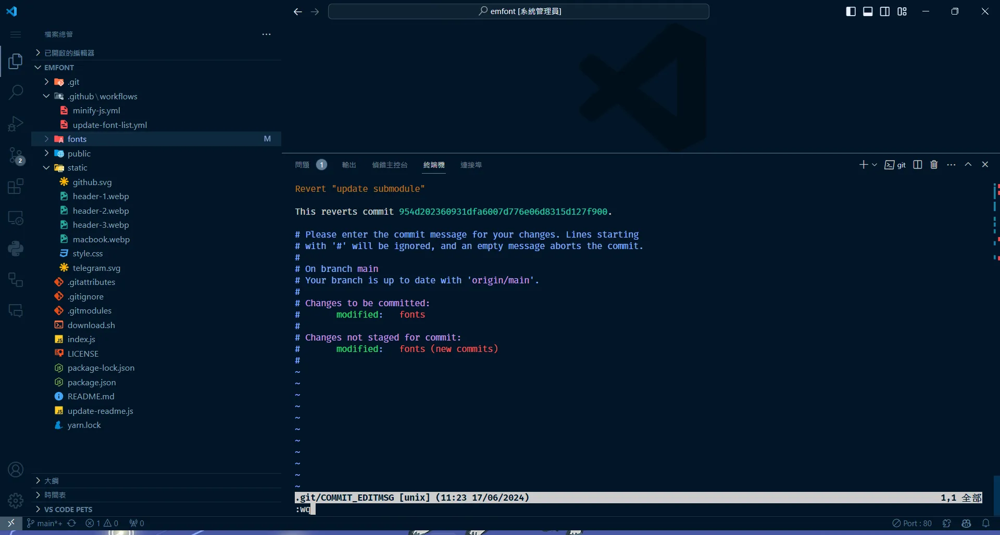
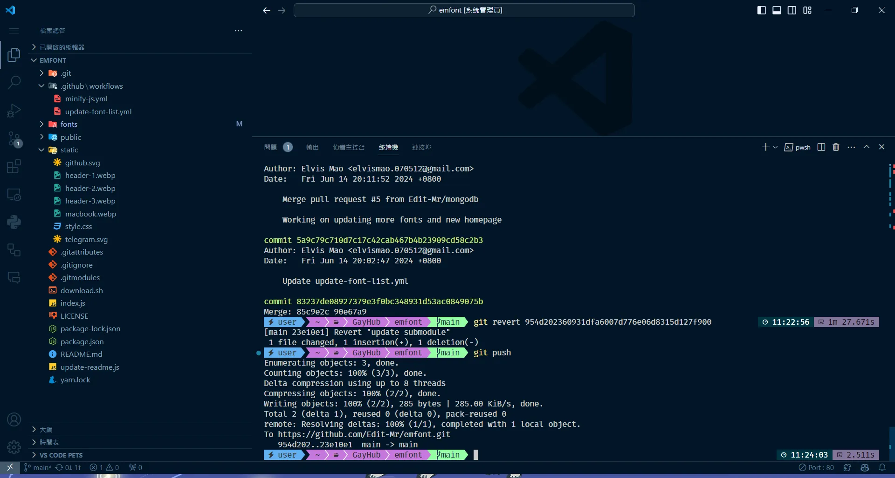

+++
author = "毛哥EM"
title = "啊我剛才 push 錯了! 如何在 Git 中撤銷提交"
date = "2024-06-17"
tags = ["git","GitHub"]
+++

在使用 Git 管理項目的過程中難免會腦霧， push 完了之後才發現有錯誤，或是不小心推送了不應該存在的分支。

今天我要來和你分享幾種常見的做法，包括如何使用 `git revert` 撤銷提交，`git reset` 重設分支，以及刪除新推送的分支。

<!--more-->

## 1. 使用 `git revert` 撤銷提交

這是最常見的情況。當你 (或你的雷隊友) push 上去了一坨狗屎後，你會希望撤銷這次提交，但是又可以留下他的犯罪紀錄 (為了不想影響到其他人的工作造成 conflict)。這時候 `git revert` 就是你的好朋友。它會創建一個新的提交，將你指定的提交的更改撤銷。

- **找到提交的哈希值**：首先使用 `git log` 命令查找你需要撤銷的提交的哈希值。如果你的雷隊友沒有寫好 commit message 沒有的話...那你加油。找到之後複製起來就可以點擊 `q` 退出 `git log`。



以我的範例來說，我要撤銷的是最後一次提交，就直接把最上面那串綠綠的 id ctrl+c 複製起來就好了。
- **撤銷提交**：輸入 `git revert 那串ID` 命令。如果需要一次撤銷多個提交，可以一次列出所有哈希值，然後一起提交。

```bash
git revert xxxxx xxxxx xxxxx
```
- **提交更改**：當你輸入完 `git revert` 命令後，Git 會自動打開你的編輯器請你寫提交信息。如果你想使用默認的提交信息，直接保存退出即可。



- **推送更改**：最後，使用 `git push` 命令將更改推送到遠程倉庫。

```bash
git push
```



## 2. 使用 `git reset` 重設分支

如果需要徹底去除錯誤的提交，你可以使用 `git reset` 命令。這會將分支重設到你指定的狀態，但比較不建議，請小心使用，因為這會改變歷史記錄，很可能會使其他人產生 git 衝突，演變成肢體衝突。通常使用在你做了一些真的很蠢的事情，比如說不小心把 token 公開。

- **軟重設（保留工作目錄中的更改）**：
  ```bash
  git reset --soft HEAD~1
  ```
  此命令將回退最後一次提交，但不會更改你的工作目錄。

- **硬重設（放棄所有更改）**：
  ```bash
  git reset --hard HEAD~1
  ```
  此命令會回退最後一次提交並放棄所有更改，使用時需極其小心。

- **強制推送**：重設後，使用以下命令強制推送到遠程倉庫：
  ```bash
  git push origin [branch-name] --force
  ```

## 3. 刪除新推送的分支
如果不小心推送了一個不應該存在的分支，你可以使用下面的命令來刪除它：
```bash
git push origin --delete [branch-name]
```

## 結論

選擇合適的方法根據你的具體情況來決定。如果你在團隊中工作，通常使用 `git revert` 來避免改變共享的歷史記錄是更安全的選擇。希望這篇文章能幫助你更好地掌握 Git 的使用，有效地管理你的項目版本。

如果你有任何問題都可以在 IG 留言，也歡迎在 [Instagram](https://www.instagram.com/emtech.cc) 和 [Google 新聞](https://news.google.com/publications/CAAqBwgKMKXLvgswsubVAw?ceid=TW:zh-Hant&oc=3)追蹤[毛哥EM資訊密技](https://emtech.cc/)。