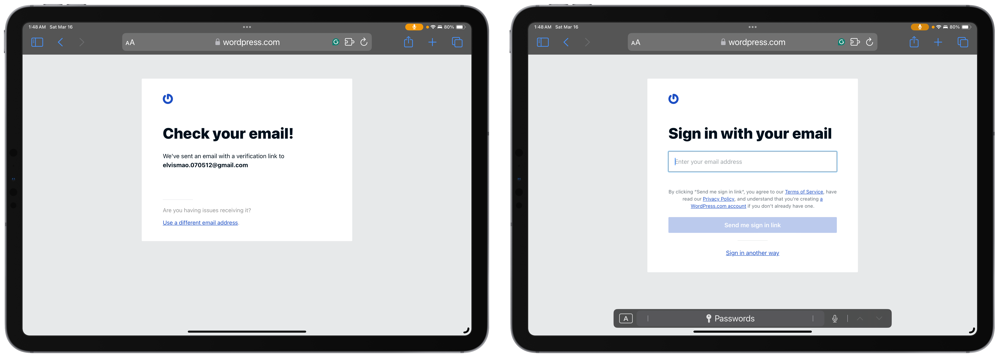
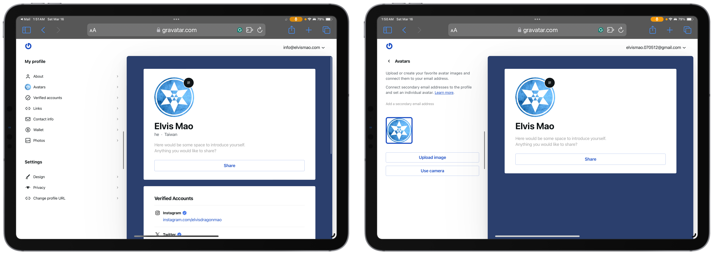
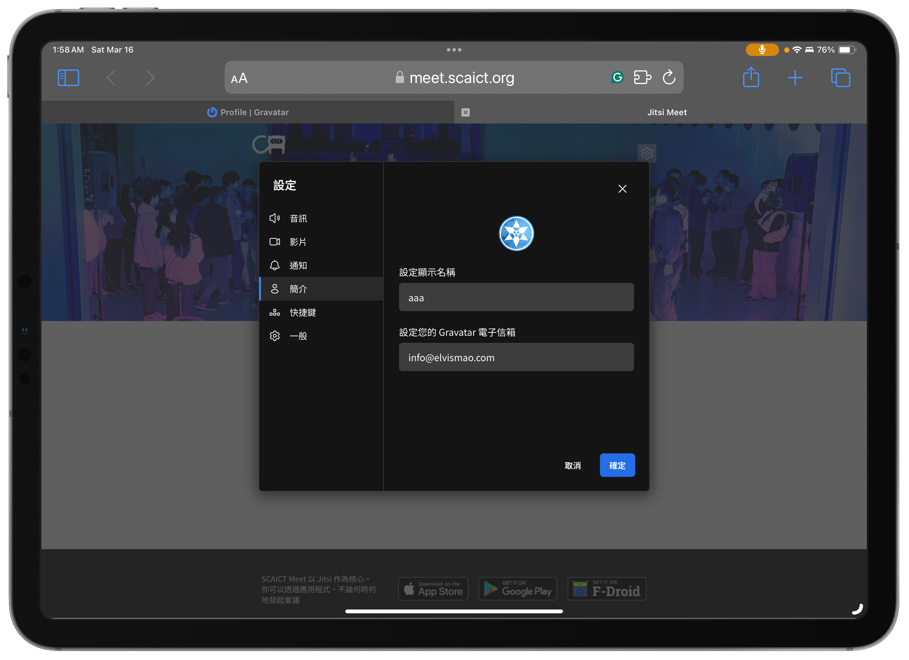
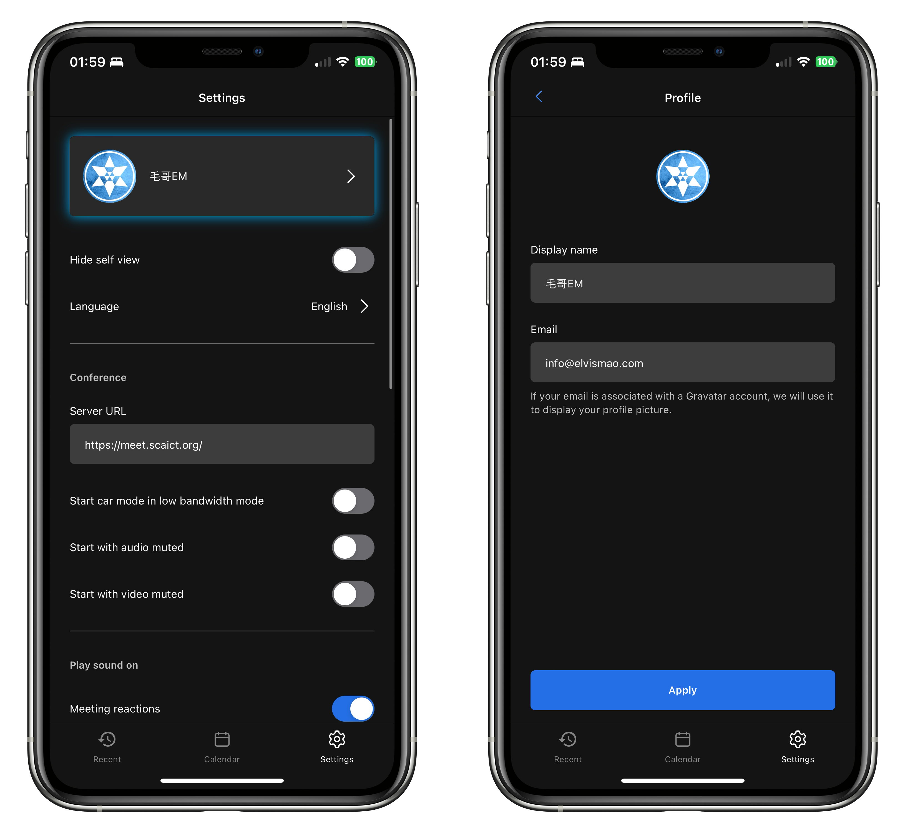

+++
author = "毛哥EM"
title = "如何設定全球通用頭像 Gravatar？以 Jitsi 為例"
date = "2024-03-15"
tags = ["iOS"]
categories = ["網站分享", "製作教學"]
thumbnail = "https://gravatar.com/images/grav-logo-blue.svg"
featureImage = "https://gravatar.com/images/grav-logo-blue.svg"
shareImage = "https://gravatar.com/images/grav-logo-blue.svg"
+++

你是否常常煩惱每次更換頭像每個社群平台都需要一個個更換？或著是你是一位程式發者想要自動獲的頭像不用一個個抓？今天我要來和你分享 Gravatar（全球通用頭像），以及介紹他的使用方式。

<!--more-->

## Gravatar 簡介

每個 Gravatar 個人檔案都和一個電子郵件地址連結。在網路上各個平台使用該電子郵件登入後，就會自動帶入你的完整個人檔案。Gravatar 的支援網站範圍非常廣泛，平常使用的 WordPress、GitHub、Slack、甚至是 OpenAI 都支援。今天這篇文章最後會以 Jitsi Meet 的手機 App 做示範。

### 如何註冊和使用Gravatar

1. **註冊 Gravatar 帳號**：首先，你需要在 Gravatar 官方網站（https://en.gravatar.com/）上註冊一個帳號。這個過程非常簡單，只需要提供你的電子郵件地址。

3. **驗證電子郵件地址**：Gravatar 不需要設定密碼，只會向你的電子郵件地址發送一封驗證郵件來登入。

2. **上傳頭像**：一旦你註冊了 Gravatar 帳號，接下來你需要上傳你的頭像。在 Gravatar 帳號頁面中，你會看到一個選項可以上傳你的頭像。 

4. **關聯電子郵件地址**：其實這樣就完成了。但接下來，你可以將你在不同網站上使用的電子郵件地址與 Gravatar 帳號關聯起來並添加更多自我介紹來製作電子名片，也可以拿來證明你的真實社群媒體帳號。

### 如何在 Jitsi 設定 Gravatar？

在大多數需要等入 Email 的網站 Gravatar 都不需要額外做設定，但像是 Jitsi Meet 這種不需要登入就可以使用的程式就需要額外輸入一下 Email了。

在 Jitsi 中你只需點擊設定並進入簡介分頁就可以輸入 Gravatar 電子郵件。

手機版也一樣。

希望這篇文章能夠幫助到你。如果你有任何問題都可以在 IG 留言，也歡迎在 [Instagram](https://www.instagram.com/em.tec.blog) 和 [Google 新聞](https://news.google.com/publications/CAAqBwgKMKXLvgswsubVAw?ceid=TW:zh-Hant&oc=3)追蹤[毛哥EM資訊密技](https://em-tec.github.io/)。