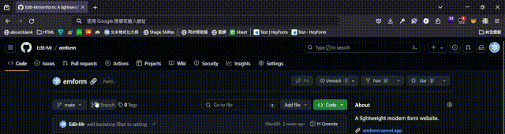
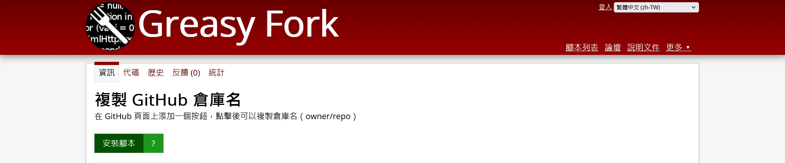

+++
author = "毛哥EM"
title = "Tampermonkey 腳本 - 一鍵複製 GitHub 倉庫名"
date = "2024-05-13"
tags = ["Tampermonkey", "JavaScript"]
categories = ["軟體分享"]
+++

這個腳本能在 GitHub 頁面上添加一個按鈕，點擊後即可複製倉庫名（owner/repo）

<!--more-->

## 背景

有的時候想要複製 GitHub 倉庫名，所以每次都要手動選取，然後複製。如果是這樣還可以接受，但是...

每次複製都會複製到一堆換行和空白，久而久之真的很躁。因次我寫了這個腳本，可以在 GitHub 頁面上倉庫名旁邊添加一個按鈕，點擊後即可複製倉庫名（owner/repo）。

## 安裝

### 1. 安裝 Tampermonkey

如果你的瀏覽器還沒有安裝 Tampermonkey，可以到 [Tampermonkey 官網](https://www.tampermonkey.net/)下載並安裝。

### 2. 安裝腳本
    
點擊 [這裡](https://greasyfork.org/en/scripts/494749-copy-github-repo-name) 進入 Greasy Fork 安裝頁面，點擊安裝即可。

## 使用

安裝完成後，打開 GitHub 頁面，你會看到倉庫名旁邊多了一個複製按鈕，點擊即可複製倉庫名（owner/repo）。

## 結語

這個腳本是我自己寫的，如果你有任何建議或問題都可以在 IG 留言，也歡迎在 [Instagram](https://www.instagram.com/em.tec.blog) 和 [Google 新聞](https://news.google.com/publications/CAAqBwgKMKXLvgswsubVAw?ceid=TW:zh-Hant&oc=3)追蹤[毛哥EM資訊密技](https://em-tec.github.io/)。