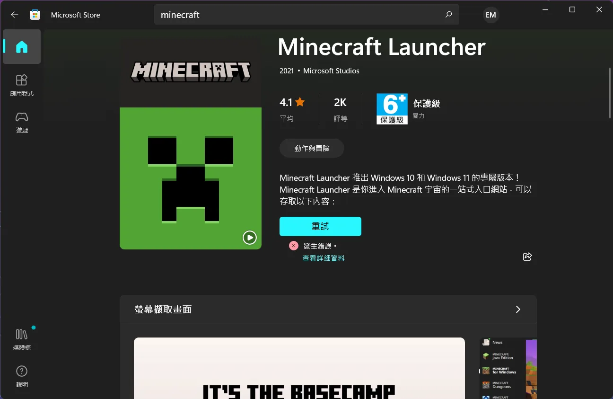
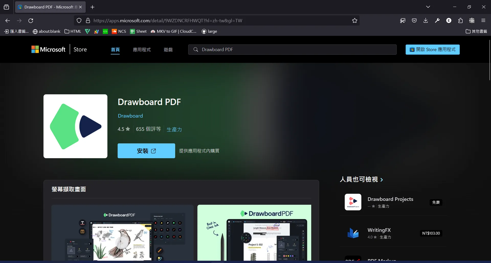
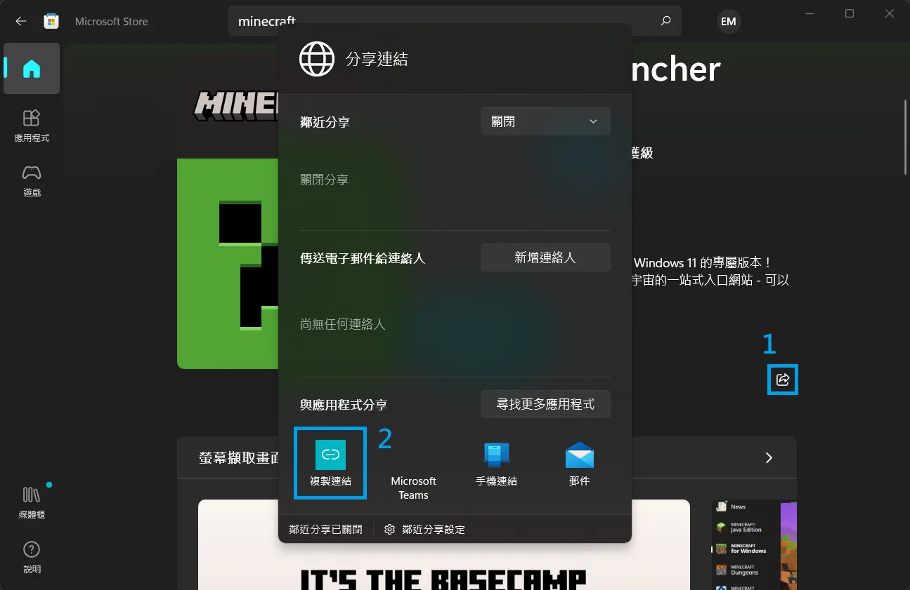
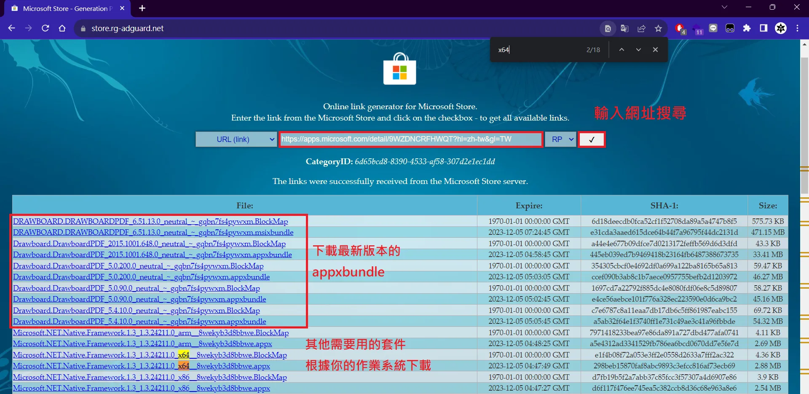
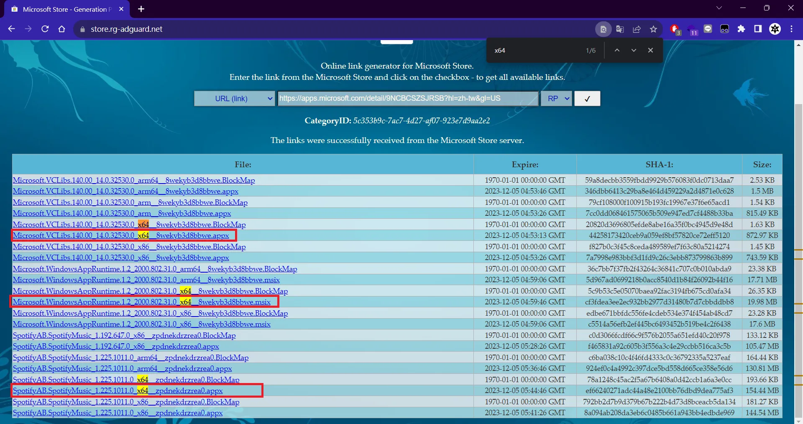
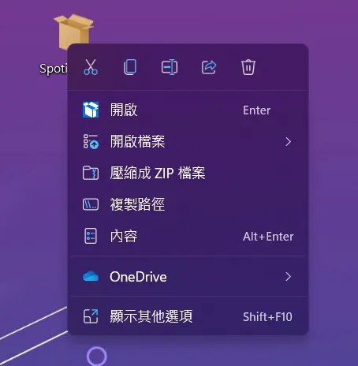

+++
author = "毛哥EM"
title = "如何不透過 Microsoft Store 安裝 Microsoft Store 的應用程式"
date = "2023-12-05"
tags = ["終端機", "Windows"]
categories = [""]
+++

Microsoft Store 是 Windows 內建的應用程式商店。理論上它應該是一個很方便的東西，能夠安全的下載應用程式。但是實際上他的 Bug 很多，很多時候會因為一些奇怪的原因無法使用。最常見的就是 Windows Update 的錯誤會導致 Microsoft Store 無法使用。因此這篇文章將會教你如何不透過 Microsoft Store 安裝 Microsoft Store 的應用程式。

<!--more-->



## 步驟 1: 找到你要的應用程式

你可以在 Microsoft Store 應用程式或著是官網搜尋你要的應用程式。找到之後複製網址。




如果是在應用程式中找到的，請點擊`分享`並選擇`複製連結`。




## 步驟 2: 找到安裝包

接著你要到 [Microsoft Store 安裝包下載器](https://store.rg-adguard.net/)。在網頁中貼上剛剛複製的網址，然後點擊`Generate`。



## 步驟 3: 下載安裝包

你會看到底下出現很多軟體供你下載，我們需要幾個安裝檔。請記得安裝檔的附檔名可能是個 `.appxbundle`、`.appx`、`.maix`、或著 `.msixbundle`。`.BlockMap` 可以不用下載。

### 軟體安裝檔

首先是軟體安裝檔。檔案名稱通常會有軟體的名稱，例如 Spotify 叫做 `SpotifyAB.SpotifyMusic_1.225.1011.0_x64__zpdnekdrzrea0.appx`。

你會看到有很多不同的檔案適用於不同架構的電腦(如 x86、x64、ARM)。下載你的電腦架構的版本當中數字最大最新的版本即可。


{}

如果你不知道你的電腦是什麼架構的，請按下`Win+R`並輸入`msinfo32`。在`系統摘要說明`中你可以看到`系統類型`。如果是`x64-based PC`請下載`x64`的版本，如果是`x86-based PC`請下載`x86`的版本。如果你的電腦是 ARM 架構的，請下載 ARM 的版本。

{}

要下載**請按住 Ctrl 鍵**並點擊軟體安裝檔的連結。或是點擊右鍵選擇在新分頁開啟。

### 依賴套件

有一些軟體會需要安裝依賴套件。例如 Spotify 就需要安裝 

* Microsoft.WindowsAppRuntime.1.2_2000.802.31.0_x64__8wekyb3d8bbwe.msix
* Microsoft.VCLibs.140.00_14.0.32530.0_x64__8wekyb3d8bbwe.appx



建議都可以下載，在安裝時比較沒有問題。一樣你會看到有很多不同的檔案適用於不同架構的電腦(如 x86、x64、ARM)。下載你的電腦架構的版本當中數字最大最新的版本即可。

{}

你可以使用 Ctrl+F 搜尋你要的版本。比如說上面的範例我搜尋 `x64` 來找到我要的版本。

{}

## 步驟 4: 安裝

安裝的方式有兩種，一種是雙擊安裝檔，另一種是使用 PowerShell 安裝。建議先安裝安裝依賴套件，再軟體安裝檔。

### 雙擊安裝檔

雙擊安裝檔，然後按照指示安裝即可。

### 使用 PowerShell 安裝

有一些軟體在安裝時會被要求暫時關閉某些會衝突的軟體，而這些軟體通常都是 Windows 內建的，有時候甚至是 Microsoft Store 本身。

因此建議使用 PowerShell 安裝。首先請以**使用者管理員身分**打開 PowerShell。你可以在開始選單中找到它，或是在任何地方按下`Win+X`並選擇`Windows 終端機 (管理員)`。


使用 PowerShell 安裝。這樣可以避免安裝失敗。指令是:

```powershell
Add-AppxPackage -Path "檔案路徑"
```

你可以對檔案點擊右鍵並選擇`複製路徑`，然後在 PowerShell 中按下右鍵貼上路徑。



例如:

```powershell
Add-AppxPackage -Path "C:\Users\EM\Desktop\SpotifyAB.SpotifyMusic_1.225.1011.0_x64__zpdnekdrzrea0.appx"
```

貼上後按下 Enter 鍵你就會看到安裝的進度。如果經過安裝完甚麼都沒有發生，沒有出現錯誤碼，那就是安裝成功了。

{}

你可以使用 Tab 鍵來自動補全路徑。

{}

#### 批量安裝

如果你要安裝多個應用程式，你可以把安裝檔放在同一個資料夾中，然後在 PowerShell 中使用 `cd` 指令切換到那個資料夾。然後使用 `Get-ChildItem` 指令列出所有檔案，再使用 `Add-AppxPackage` 指令安裝。

例如我在桌面新增一個資料夾，把所有安裝檔放進去，然後在 PowerShell 中輸入:

```powershell
cd "C:\Users\EM\Desktop\新增資料夾"
Get-ChildItem | Add-AppxPackage
```

## 步驟 5: 完成

安裝完成後你就可以在開始選單中找到你的應用程式了。

## 結論

這篇文章教你如何不透過 Microsoft Store 安裝 Microsoft Store 的應用程式。其實在幾年前我就有遇到這個問題，但沒想到過了這麼久這個問題還是存在，且中文部落格還沒有相關教學。希望這篇文章能夠幫助到你。

歡迎在 [Instagram](https://www.instagram.com/em.tec.blog) 和 [Google 新聞](https://news.google.com/publications/CAAqBwgKMKXLvgswsubVAw?ceid=TW:zh-Hant&oc=3)追蹤[毛哥EM資訊密技](https://em-tec.github.io/)。如果你有任何問題，都可以在 IG 留言或私訊我。
