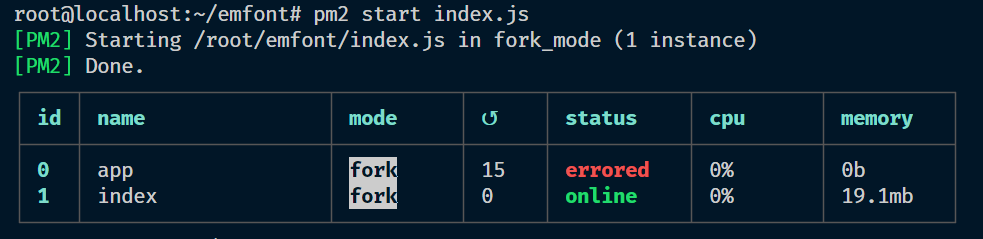
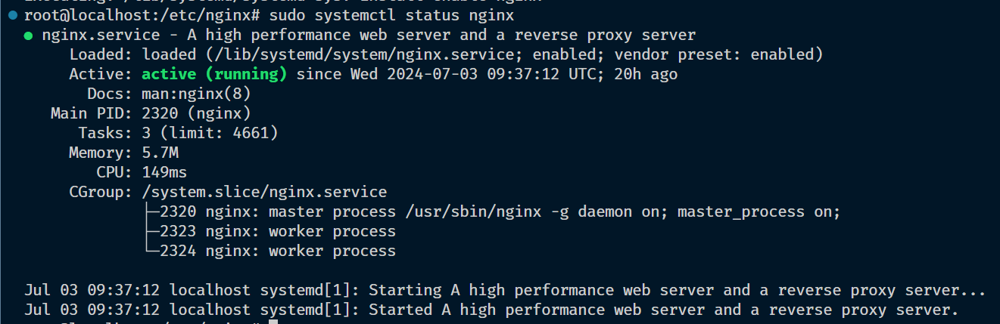
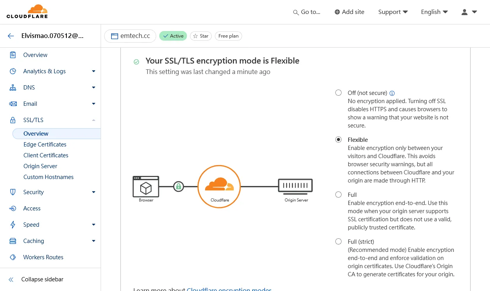

+++
author = "毛哥EM"
title = "部屬 nodejs 專案到虛擬機上 - pm2, nginx, cloudflare DNS, SSL 一次上手"
date = "2024-05-31"
tags = [
    "Linux",
    "Node.js",
    "Nginx",
    "Cloudflare",
    "SSL"
]
categories = ["軟體分享"]
thumbnail = "https://emtech.cc/post/nodejs-deploy-vm/thumbnail.webp"
featureImage = "https://emtech.cc/post/nodejs-deploy-vm/thumbnail.webp"
shareImage = "https://emtech.cc/post/nodejs-deploy-vm/thumbnail.webp"
+++

今天我們寫完了一個 Node.js 專案，接下來要部屬到虛擬機上。這篇文章將會教你如何使用 pm2 來管理 Node.js 專案，nginx 來轉發 HTTP 請求，最後使用 Cloudflare 來設定 DNS 和 SSL。

<!--more-->

## 安裝 Node.js 及 pm2

首先，我們需要在虛擬機上安裝 Node.js。你可以使用以下指令來安裝 Node.js：

```bash
sudo apt update
curl -fsSL https://deb.nodesource.com/setup_20.x | sudo -E bash -
sudo apt-get install -y nodejs
sudo npm install pm2@latest -g
pm2 --version
```

注意，請不要使用 `apt install nodejs` 來安裝，因為通常這樣會安裝很舊版本的 Node.js。在這串指令中，我們使用了 NodeSource 的套件來安裝 Node.js 20.x 版本，並且使用 npm 安裝了 pm2。

## 部屬 Node.js 專案

接下來，我們要部屬 Node.js 專案。首先，將專案上傳到虛擬機上，然後使用以下指令來啟動專案：

```bash
cd /path/to/your/project
pm2 start app.js
```

這樣就可以使用 pm2 來管理你的 Node.js 專案了。你可以使用以下指令來查看專案的狀態：

```bash
pm2 status
```



如果有成功部屬的話你應該已經可以在瀏覽器中看到你的專案了。不過你需要輸入虛擬機的 IP 位址，後面還要加上專案的 port 號。比如說 `http://123.456.789.012:3000`。這樣不太方便，所以我們接下來要使用 Nginx 來轉發 HTTP 請求。

## 安裝 Nginx

接下來，我們要安裝 Nginx 來轉發 HTTP 請求。你可以使用以下指令來安裝 Nginx：

```bash
sudo apt-get install nginx
sudo systemctl start nginx
sudo systemctl enable nginx
```

安裝完成後，你可以使用以下指令來查看 Nginx 的狀態：

```bash
sudo systemctl status nginx
```



## 設定 Nginx

接下來，我們要設定 Nginx 來轉發 HTTP 請求。首先，你需要編輯 Nginx 的設定檔。你可以使用任意你習慣的編輯器，比如說我個人習慣使用 vim。

```bash
sudo vim /etc/nginx/sites-available/font.emtech.cc
```

請你自己修改 `font.emtech.cc` 為你的網域名稱。然後，請將以下內容貼到設定檔中：

```nginx
server {
    listen 80;
    server_name font.emtech.cc;

    location / {
        proxy_pass http://127.0.0.1:3000;
        proxy_http_version 1.1;
        proxy_set_header Upgrade $http_upgrade;
        proxy_set_header Connection 'upgrade';
        proxy_set_header Host $host;
        proxy_cache_bypass $http_upgrade;
    }
}
```

這樣就設定好了 Nginx 的設定檔。接下來，你需要建立一個符號連結，讓 Nginx 能夠讀取這個設定檔：

```bash
sudo ln -s /etc/nginx/sites-available/font.emtech.cc /etc/nginx/sites-enabled/
```

在啟動之前，建議你先使用以下指令來檢查 Nginx 的設定檔是否有語法錯誤：

```bash
sudo nginx -t
```

如果他說

```
nginx: the configuration file /etc/nginx/nginx.conf syntax is ok
nginx: configuration file /etc/nginx/nginx.conf test is successful
```

代表沒有問題，接下來就可以重新啟動 Nginx 了。

```bash
sudo systemctl restart nginx
```

這樣就設定好了 Nginx，不過這還沒有結束，因為我們還需要設定 DNS 和 SSL。

## 設定 Cloudflare DNS

你需要修改你的網域名稱的 DNS 設定，這裡以 Cloudflare 為例。首先，你需要在 Cloudflare 上註冊一個帳號，然後將你的網域名稱加入到 Cloudflare 中。接下來，你需要修改你的 DNS 設定，將你的網域名稱指向你的虛擬機的 IP 位址。

## 設定 Cloudflare SSL

最後，我們需要設定 SSL。在 Cloudflare 上，你可以使用免費的 SSL 證書。你只需要在 Cloudflare 上將 SSL 設定改為 `Flexible` 即可。



這樣就完成了 Node.js 專案的部屬。現在你可以在瀏覽器中輸入你的網域名稱，就可以看到你的專案了。

## 結論

透過這篇文章，我們學習了如何使用 pm2 來管理 Node.js 專案，如何使用 Nginx 來轉發 HTTP 請求，以及如何使用 Cloudflare 來設定 DNS 和 SSL。這樣一來，我們就可以將 Node.js 專案部屬到虛擬機上了。因為我實在太長使用到這些工具，所以我決定記錄下來，希望對你有幫助。建議也可以加入書籤，現在部屬的時候才找得到。如果你有任何問題都可以在 IG 留言，也歡迎在 [Instagram](https://www.instagram.com/em.tec.blog) 和 [Google 新聞](https://news.google.com/publications/CAAqBwgKMKXLvgswsubVAw?ceid=TW:zh-Hant&oc=3)追蹤[毛哥EM資訊密技](https://em-tec.github.io/)。