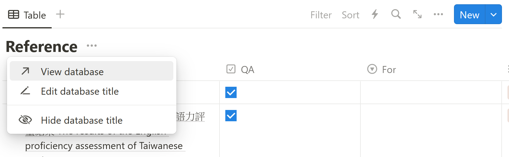

---
author = "毛哥EM"
title = "Notion 資料庫如何免費批量輸出 PDF? 合併?"
date = "2024-02-22"
series = ["別說我教的系列"]
tags = ["Notion", "Python"]
categories = ["製作教學"]
thumbnail = "https://www.notion.so/images/logo-ios.png"
featureImage = "https://www.notion.so/images/logo-ios.png"
shareImage = "https://www.notion.so/images/logo-ios.png"
---

<!-- @format -->

Notion 是一個出色的筆記軟體，但是有一個問題是它的資料庫即使是教育方案依舊無法批量輸出 PDF。這對於我來說非常不方便，因為每次打辯論都需要輸出六七十份頁面，每頁都要花個 15 秒才能下載，還要解壓縮，合併 PDF，實在有夠麻煩! 因此我花了幾天的時間使用 python 寫了一簡單的小工具。只需要給連結就能一次輸出整個資料庫的所有文件，並合併成一份 PDF。過程中使用 Google Colab 的雲端計算，因此不會消耗你的電腦資源及網路。

<!--more-->

## 程式原理

由於 Notion 並沒有提供資料庫輸出 API 的文檔，因此我透過監聽封包以及不斷的測試找到了每次點擊輸出看它轉個幾十秒時背後到底發生了甚麼事。以下是我們的程式流程：

1. 使用官方 API 獲得資料庫分頁列表
2. 使用 Space ID, 頁面 ID, 及 cookie 提出匯出請求，並記錄回應 token
3. 每五秒呼叫 API 確認下載狀態。
4. 完成匯出時，搭配 Cookie 下載 PDF
5. 合併 PDF (可選)
6. 刪除所有 PDF (可選)

## 使用方法

首先請你開啟此 [Google Colab](https://colab.research.google.com/drive/1GxBcJEl8o9fuB-MpTSEjZNIFWInhHlH6?usp=sharing) 專案。執行 Google Colab 專案會需要登入 Google 帳號。

### 設定環境變數

在開始下載之前，請取得以下資料並複製到左邊的 Secret 分頁。標題括號內為環境變數名稱，接下來我們要複製的網址與金鑰們請放到「值」裡面。儲存在這裡的值都不會公開，只有你看得到，不用擔心。

#### 1. 取得資料庫 (database)

開啟資料庫連結並複製網址。記得要點擊 view database 進入整個畫面都是資料庫的頁面喔。

請你複製網址連結，並填入 Google Colab 的 Secret。

## 2. 取得 Space ID

請你對頭像點擊右鍵複製圖片連結，並填入 Google Colab 的 Secret。

## 3. 取得 API Token

請至 [Notion Developers](https://www.notion.so/my-integrations) 取得 API，輸入基本資料並選擇要應用的 Workspace。

請你複製這一串 Integration Token，並填入 Google Colab 的 Secret。

生成完 API 之後，記得要邀請你剛才創建的機器人。點擊右上角的三個點，Connect to，並選擇剛才創建的機器人。

## 4. 取得 Cookie

點擊 F12 (Cmd + Opt + I) 開啟開發者工具，進入開發者工具。選擇儲存空間，並複製 cookie `token_v2` 的值，以及 `file_token` 的值，並填入下方。

# Notion! 啟動!

可以點擊 `>` 縮小一鍵全部執行。再打開 console 察看進度。

以上就是我今天的分享，歡迎在 [Instagram](https://www.instagram.com/emtech.cc) 和 [Google 新聞](https://news.google.com/publications/CAAqBwgKMKXLvgswsubVAw?ceid=TW:zh-Hant&oc=3)追蹤[毛哥 EM 資訊密技](https://emtech.cc/)。
我是毛哥 EM，讓我們明天再見。
