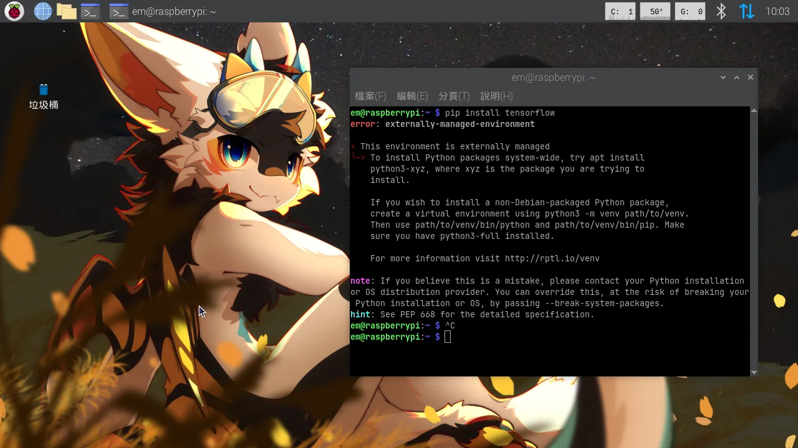
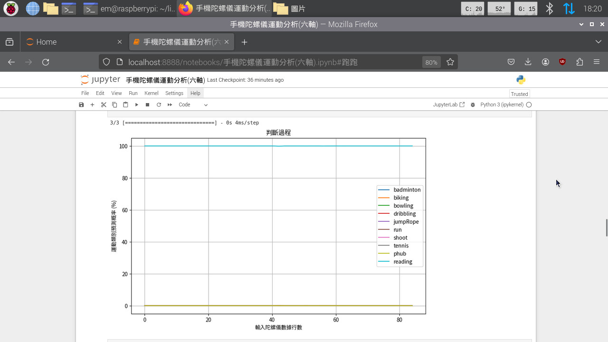
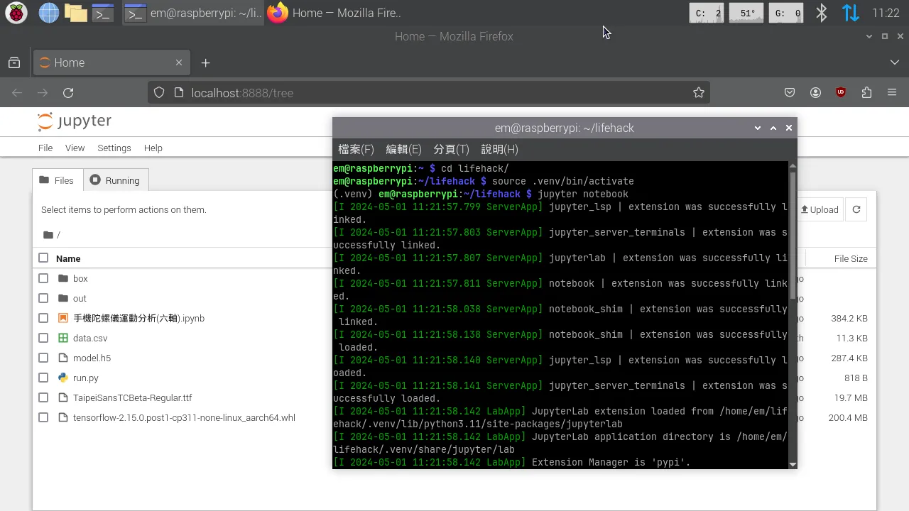

+++
author = "毛哥EM"
title = "如何在 Raspberry Pi 上安裝 Tensorflow?"
date = "2024-05-01"
tags = ["Raspberry Pi", "Tensorflow", "Python", "機器學習"]
categories = ["製作教學"]
thumbnail = "https://upload.wikimedia.org/wikipedia/commons/thumb/1/11/TensorFlowLogo.svg/1200px-TensorFlowLogo.svg.png"
featureImage = "https://upload.wikimedia.org/wikipedia/commons/thumb/1/11/TensorFlowLogo.svg/1200px-TensorFlowLogo.svg.png"
shareImage = "https://upload.wikimedia.org/wikipedia/commons/thumb/1/11/TensorFlowLogo.svg/1200px-TensorFlowLogo.svg.png"
+++

本文將教你如何在 Raspberry Pi (樹莓派) 上安裝 Tensorflow 以及 Jupyter Notebook。

<!--more-->

## 背景

最近在做動作識別的專案，原本都是在 Google Colab 跑，想說可以在最近買的 Raspberry Pi 5 上跑看看。最後成果意外的不錯，識別和訓練速度雖然比不上 Google Colab，但對於小模型來說上傳上去再下載還不如在本地直接跑快。

當時安裝時我就天真的打入 `pip install tensorflow`...



好吧看來沒有那麼簡單。過程中踩到了一些坑，今天就來整理一下安裝的過程。

## 教學

### 1. 建立虛擬環境

回看一下剛才的錯誤，其實他是在提醒你因為有些套件可以用 apt 安裝，也可以用 pip 安裝。因此建議你安裝虛擬環境。

首先我們要建立一個虛擬環境，請先建立並進入一個資料夾。

```bash
mkdir tensorflow
cd tensorflow
```

接著建立虛擬環境。

```bash
python3 -m venv venv
```

之後每次要啟動虛擬環境只要輸入以下指令即可。

```bash
source venv/bin/activate
```

### 2. 安裝 Tensorflow

直接使用 pip 安裝 Tensorflow 會遇到問題，因此我們要手動安裝。請你先到這個 GitHub 頁面查看版本對照表：

<https://github.com/PINTO0309/Tensorflow-bin/#usage>

這裡節錄一小段，你可以看到不同的版本對應的 Python 版本和 Raspberry Pi 版本。

|Device|OS|Distribution|Architecture|Python ver|Note|
|:--|:--|:--|:--|:--|:--|
|RaspberryPi3/4,PiZero|Ubuntu 21.04/Debian/RaspberryPiOS|Hirsute/Bullseye|aarch64 / armv8|3.9.x|64bit, glibc2.33/glibc2.31|
|RaspberryPi3/4|Ubuntu 22.04|Jammy|aarch64 / armv8|3.10.x|64bit, glibc2.35|
|RaspberryPi4/5,PiZero|Debian/RaspberryPiOS|Bookworm|aarch64 / armv8|3.11.x|64bit, glibc2.36|

可以看到我們的 Raspberry Pi 5 要的是 `Python 3.11.x`，因此我們到 [release](https://github.com/PINTO0309/Tensorflow-bin/releases/) 下載最新發布的 `tensorflow-X.X.0.post1-cp311-none-linux_aarch64.whl` 檔案就可以了。

如果你是使用瀏覽器開啟你可以直接點擊連結下載，如果是在終端機上可以使用 `wget` 下載。

```bash
wget https://github.com/PINTO0309/Tensorflow-bin/releases/download/v2.15.0.post1/tensorflow-2.15.0.post1-cp311-none-linux_aarch64.whl
```

接著安裝。(請注意版本號可能會有所不同，請以你下載的檔案為主)

```bash
pip install tensorflow-2.15.0.post1-cp311-none-linux_aarch64.whl
pip install tensorflow
```

接下來如果你需要的話可以安裝 keras。在安裝 keras 時你可能會遇到 Scipy 安裝失敗的問題，因此你一樣可以先手動安裝。

```bash
wget https://www.piwheels.org/simple/scipy/scipy-1.2.1-cp35-cp35m-linux_armv7l.whl
pip install scipy-1.2.1-cp35-cp35m-linux_armv7l.whl
pip install scipy
```
接著安裝 keras。

```bash
pip install keras
```

這樣就完成了 Tensorflow 的安裝。你可以使用以下指令測試是否安裝成功。

```bash
python -c 'import tensorflow as tf; print(tf.__version__)'
python -c 'import keras; print(keras.__version__)'
```

如果你看到版本號就代表安裝成功。

### 3. 安裝 Jupyter Notebook

接下來我們要安裝 Jupyter Notebook，主要氏為了方便 Demo 和預覽圖表。

首先建議你先刪除使用 apt 安裝的 Jupyter Notebook。

```bash
sudo apt remove jupyter-notebook
```

接著安裝 Jupyter Notebook。

```bash
pip install jupyter
```

安裝完成後你可以使用以下指令啟動 Jupyter Notebook。

```bash
jupyter notebook
```

這樣就完成了啦! 你的瀏覽器應該會自動開啟 Jupyter Notebook，以下是我運行我的模型並繪製圖表的結果。可以看到整個過程只花費了 4 毫秒。



之後每次要啟動 Tensorflow 和 Jupyter Notebook 只要輸入以下指令即可。

```bash
cd 資料夾/
source .venv/bin/activate
jupyter notebook
```



希望這篇文章能夠幫助到你。如果你有任何問題都可以在 IG 留言，也歡迎在 [Instagram](https://www.instagram.com/em.tec.blog) 和 [Google 新聞](https://news.google.com/publications/CAAqBwgKMKXLvgswsubVAw?ceid=TW:zh-Hant&oc=3)追蹤[毛哥EM資訊密技](https://em-tec.github.io/)。